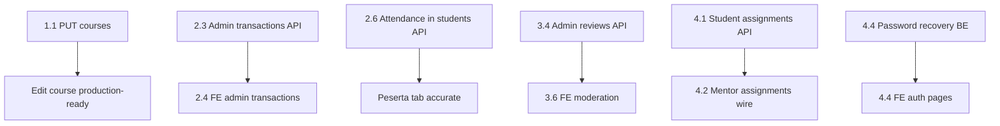

# Backlog Prioritas Integrasi

Dokumen untuk **PM** dan **tim engineering** — urutan pekerjaan berdasarkan dampak user dan dependency antar fitur.

---

## Fase 1 — Blocker (sebelum demo production)

Fitur yang UI-nya sudah ada tetapi **tidak akan jalan** tanpa ini.

| # | Item | Tim | Effort | Halaman terdampak | Kriteria selesai |
|---|------|-----|--------|-------------------|------------------|
| 1.1 | **`PUT /courses/:id`** — update metadata multipart | BE | M | Edit course dialog, detail admin | FE edit kursus tersimpan ke DB |
| 1.2 | Wire **`handleReplyReview`** ke `POST .../review/:id/reply` | FE | S | `admin/DetailCourse`, mentor detail | Balasan review tersimpan |
| 1.3 | Form ganti password kirim **`old_password`** | FE | S | `/profile` | Ganti password sukses tanpa 400 |
| 1.4 | Samakan **`mentor/DetailCourse`** dengan pola admin (API live) | FE | M | `/mentor/courses/:uid` | Mentor lihat kursus & peserta real |
| 1.5 | Samakan **`mentor/Courses`** dengan `GET /courses?mentor_id=` | FE | S | `/mentor/courses` | List kursus mentor dari API |

---

## Fase 2 — Fitur Admin Operasional

| # | Item | Tim | Effort | Kriteria selesai |
|---|------|-----|--------|------------------|
| 2.1 | **`POST /courses/:id/mentors/unassign`** | BE | S | Tombol "Lepas" di `CourseMentorTable` berfungsi |
| 2.2 | Wire unassign di FE | FE | S | Setelah 2.1 |
| 2.3 | **`GET /admin/transactions`** + summary (paid/pending/failed) | BE | L | `admin/Transactions` live |
| 2.4 | Integrasi `admin/Transactions` ke API baru | FE | M | Setelah 2.3 |
| 2.5 | Perbaiki link dashboard: `/admin/finance/transactions` → `/admin/transactions` | FE | XS | Link tidak 404 |
| 2.6 | Tambah attendance fields di **`GET /courses/:id/students`** | BE | M | Bar kehadiran peserta benar |
| 2.7 | Filter **`super_admin`** di halaman administrator | BE/FE | S | Semua staff internal tampil |

---

## Fase 3 — Analytics & Moderation

| # | Item | Tim | Effort | Kriteria selesai |
|---|------|-----|--------|------------------|
| 3.1 | **`GET /admin/dashboard/kpis`** + recent transactions | BE | L | `admin/Dashboard` live |
| 3.2 | **`GET /admin/financial/summary`** | BE | L | `admin/Financial` live |
| 3.3 | Aktifkan route **`/admin/reviews-and-qa`** di `App.tsx` + sidebar | FE | XS | Halaman bisa diakses |
| 3.4 | **`GET /admin/reviews`** lintas kursus | BE | M | Tab reviews live |
| 3.5 | Desain & implementasi **Q&A domain** (baru) | BE | XL | Tab Q&A bukan mock |
| 3.6 | Wire moderation reply/hide | FE | M | Setelah 3.4–3.5 |

---

## Fase 4 — Student & Mentor Experience

| # | Item | Tim | Effort | Kriteria selesai |
|---|------|-----|--------|------------------|
| 4.1 | **`GET /students/me/assignments`** atau aggregate per course | BE | L | `student/Assignments` live |
| 4.2 | Wire `mentor/CourseAssignments` ke lesson assignment API | FE | L | CRUD + grade submission |
| 4.3 | **`GET /courses?category_uid=`** filter | BE | S | Popular & browse filter akurat |
| 4.4 | Forgot / reset password endpoints + wire auth pages | BE + FE | L | Flow recovery password |
| 4.5 | Certificate domain (`GET /certificates/me`, public verify) | BE | XL | `student/Certificates` live |
| 4.6 | Route public **`/certificate/:uid`** | FE | S | Share link valid |

---

## Fase 5 — Nice to Have

| # | Item | Tim | Effort |
|---|------|-----|--------|
| 5.1 | `DELETE /courses/:id` | BE | M |
| 5.2 | `GET /admin/audit-logs` + halaman security | BE + FE | L |
| 5.3 | `GET /mentor/dashboard/stats` + schedules | BE | M |
| 5.4 | Invite user / bulk import admin | BE | L |
| 5.5 | Enrich `GET /user/manage/all` dengan spending, course count, rating | BE | M |
| 5.6 | Landing home features dari CMS/API | BE + FE | M |

---

## Estimasi Effort

| Ukuran | Perkiraan |
|--------|-----------|
| XS | < 0.5 hari |
| S | 0.5–1 hari |
| M | 2–3 hari |
| L | 1 sprint item |
| XL | Multi-sprint / epic baru |

---

## Dependency Graph

---

## Checklist QA per Fase

### Fase 1
- [ ] Edit judul/deskripsi kursus admin → refresh → data berubah di DB
- [ ] Mentor buka detail kursus sendiri → data sama dengan admin (minus assign mentor)
- [ ] Ganti password di profile dengan password lama yang benar → sukses
- [ ] Reply review di tab Review → muncul setelah reload

### Fase 2
- [ ] Assign lalu lepas mentor → list mentor terupdate
- [ ] Admin transactions menampilkan data real + chart ratio
- [ ] Tab peserta: progress dan kehadiran sesuai data enrollment
- [ ] Halaman administrator menampilkan super_admin

### Fase 3
- [ ] Dashboard KPI tidak hardcoded
- [ ] Financial chart dari API
- [ ] Reviews & Q&A bisa diakses dari sidebar

### Fase 4
- [ ] Siswa lihat daftar tugas dari enrollment nyata
- [ ] Mentor grade submission → siswa lihat nilai
- [ ] Forgot password kirim email (staging)
- [ ] Sertifikat muncul setelah course completed
