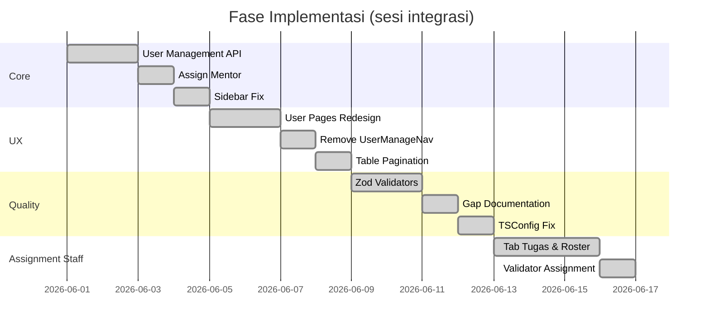

# Implementation Log

Kronologi pekerjaan dari awal sesi integrasi hingga kondisi terkini. Setiap fase punya **tujuan**, **hasil**, dan **catatan untuk QA/PM**.

---

## Fase 0 — Konteks Branch (sebelum/saat awal sesi)

Branch `features/frontend-sapto` sudah memuat refactor besar course-edit dan course-form. Fase ini melanjutkan integrasi admin & hardening.

| Item | Status |
|------|--------|
| Unified `CourseFormDialog` + `CreateCourse` | ✅ Sudah ada |
| Route `/admin/course-categories`, `/admin/course-types` | ✅ Sudah ada |
| Course edit (module/lesson) admin & mentor | ✅ Sudah ada |
| Lesson validator (`lib/validator/lessons/`) | ✅ Sudah ada |

---

## Fase 1 — Integrasi Manajemen User Admin

**Tujuan:** Wire halaman Siswa, Mentor, Administrator ke API BE tanpa mengubah backend.

**Halaman:** `pages/admin/Student.tsx`, `Mentors.tsx`, `Admin.tsx`

**Yang dibuat:**

| Layer | Path |
|-------|------|
| Types & kontrak | `lib/user-manage/types.ts` |
| Mapper UI | `lib/user-manage/mappers.ts`, `view-models.ts` |
| Konfigurasi halaman | `lib/user-manage/page-config.ts`, `layout.ts` |
| Service | `services/user-manage.ts` |
| Hooks | `hooks/use-managed-users.ts`, `use-user-manage-mutations.ts`, `use-admin-user-page.ts` |
| UI | `components/admin/user-manage/*` |

**API yang dipakai:**

```
GET    /user/manage/all?page&per_page&role&search&sort&order
PATCH  /user/role/:uid        { role: admin|mentor|student }
DELETE /user/manage/:uid
```

**Hasil:** Tiga halaman user admin menampilkan data real dengan search & pagination.

**Catatan PM:**
- Promote siswa → mentor / user → admin = ubah role via PATCH (bukan invite user baru).
- Hanya `super_admin` yang boleh assign role `admin` (admin biasa dapat 403 — expected dari BE).
- Halaman Administrator filter `role=admin` — user `super_admin` mungkin tidak muncul.

---

## Fase 2 — Assign Mentor ke Kursus (Admin Detail Course)

**Tujuan:** Admin bisa menugaskan mentor ke kursus dari halaman detail.

**Halaman:** `pages/admin/DetailCourse.tsx` → `DetailCourseComponents.tsx`

**Yang dibuat:**

| Layer | Path |
|-------|------|
| Types | `lib/course-mentor/types.ts` |
| Service | `services/course.ts` → `assignMentorsToCourse()` |
| Hook | `hooks/use-course-mutations.ts` → `useAssignMentorsToCourse()` |
| UI | `components/shared/AssignCourseMentorDialog.tsx` |

**API:**

```
POST /courses/:uid/mentors/assign   { mentor_uids: string[] }
```

**Hasil:** Dialog pilih mentor dari list `GET /user/manage/all?role=mentor`, assign ke kursus.

**Belum:** Tombol "Lepas" di `CourseMentorTable` — UI ada, endpoint BE belum ada.

---

## Fase 3 — Perbaikan Layout Sidebar

**Tujuan:** Sidebar tidak bentrok lebar di breakpoint tablet/desktop kecil.

**File diubah:**

- `hooks/use-mobile.ts` — breakpoint `768` → `1024`
- `components/ui/sidebar.tsx` — class `md:` → `lg:`
- `components/shared/Sidebar.tsx` — `SidebarInset` + `min-w-0`

**Hasil:** Di viewport 768–1024px sidebar berperilaku konsisten (expanded atau mobile-like sesuai desain).

**QA:** Resize browser 768px, 1024px, 1280px — sidebar tidak overflow horizontal pada konten utama.

---

## Fase 4 — Redesign Halaman User Admin

**Tujuan:** UI modern, konsisten dengan course-master (tabel + dialog konfirmasi).

**Perubahan UX:**

| Sebelum | Sesudah |
|---------|---------|
| Card grid | `AdminDataTable` (tabel + footer pagination) |
| Ubah role inline/dropdown | `UserManageRoleDialog` + konfirmasi |
| Promote tanpa dialog khusus | `UserPromoteDialog` |
| Hapus tanpa konfirmasi jelas | `ConfirmDialog` |

**Komponen baru:** `UserManagePanel`, `UserManagePageShell`, `user-manage-columns.tsx`, `UserIdentityCell`, `UserStatusBadge`

**Hasil:** Tiga halaman user punya pola UI seragam, typography & spacing konsisten.

---

## Fase 5 — Hapus Tab Navigasi Horizontal

**Tujuan:** `UserManageNav` (Siswa | Mentor | Administrator) redundan karena sidebar sudah navigasi.

**Dihapus:** `components/admin/user-manage/UserManageNav.tsx`

**Dibersihkan:** Token nav tidak terpakai di `lib/user-manage/layout.ts`

**Hasil:** Navigasi user management hanya lewat sidebar admin.

---

## Fase 6 — Pagination di Dalam Tabel

**Tujuan:** Pagination lebih rapi — di footer tabel, bukan terpisah jauh dari data.

**File diubah:**

- `components/shared/AdminDataTable.tsx` — footer border, teks "Halaman X dari Y"
- `components/shared/Pagination.tsx` — prop `className` opsional

**Hasil:** Tabel user admin punya pagination terintegrasi.

---

## Fase 7 — Validator Payload (Zod) — Strict & Selaras BE

**Tujuan:** Validasi lengkap sebelum request API; selaras kontrak backend.

**Struktur baru:**

```
lib/validator/
  common.ts              ← beResolvableUidSchema, pagination, image file
  user-manage.schema.ts  ← list params, update role
  course-master.schema.ts
  course-mentor.schema.ts
  course-form.schema.ts
  */index.ts             ← parse* helpers
```

**Di-wire ke services:**

- `services/user-manage.ts`
- `services/course-master.ts`
- `services/course.ts` (create, update, status, assign mentor)

**Di-wire ke form UI:**

- `CourseFormDialog.tsx` → `getCourseFormValidationMessage()`
- `lib/course-master/validation.ts` → delegasi ke validator

**Hasil:** Payload invalid ditangkap di FE dengan pesan bahasa Indonesia sebelum hit network.

---

## Fase 8 — Dokumentasi Gap FE ↔ BE

**Tujuan:** PM & BE punya single source of truth untuk apa yang masih kurang.

**File dibuat di `docs/`:**

- `README.md`, `page-coverage.md`, `api-route-gaps.md`, `payload-gaps.md`, `priority-backlog.md`
- Update `routes-pages/admin-*.md` (legacy, dikoreksi status user management)

---

## Fase 9 — Perbaikan TypeScript Config

**Tujuan:** Hilangkan error `Invalid value for '--ignoreDeprecations'` di IDE.

**Perubahan:**

- Hapus `ignoreDeprecations: "6.0"` dan `baseUrl` dari `tsconfig.app.json`
- Tambah `typescript.tsdk` di `.vscode/settings.json`

**Hasil:** IDE & build konsisten memakai TypeScript 6 dari `node_modules`.

---

## Fase 10 — Course Editor UX: Tugas, Tab Save & Rename Inline

**Tujuan:** Lengkapi editor kurikulum dengan panel tugas, aksi save/delete per tab, guard unsaved, perbaikan bug konten, dan rename judul langsung ke API.

**Dokumentasi lengkap:** [course-editor-ux-session.md](./course-editor-ux-session.md)

**Highlight:**

| Item | Status |
|------|--------|
| Admin CRUD assignment per lesson | ✅ |
| Dirty state terpisah (konten vs tugas) | ✅ |
| `UnsavedEditorTabDialog` (Konten ↔ Tugas) | ✅ |
| Fix konten hilang setelah save + pindah tab | ✅ |
| `LessonTitleRenameField` + `PUT /lessons/:uid` | ✅ |
| TipTap toolbar refactor (dua baris) | ✅ |

**Draft commit:**

```
feat(course-editor): tab-aware save, assignment panel, and inline lesson rename
```

---

## Fase 11 — Tab Tugas Staff, Roster & Penilaian Submission

**Tujuan:** Staff (admin/mentor) mengelola pengumpulan tugas dari detail kursus — roster siswa, review jawaban, nilai & feedback inline.

**Dokumentasi lengkap:** [assignment-staff-session.md](./assignment-staff-session.md)  
**TODO & gap:** [todo-backlog.md](./todo-backlog.md)

**Highlight:**

| Item | Status |
|------|--------|
| Tab Tugas di `DetailCourse` (admin + mentor) | ✅ |
| Roster pengumpulan tabel (semua siswa terdaftar) | ✅ |
| Halaman detail submission (navbar only, sidebar siswa) | ✅ |
| Penilaian inline + feedback timpa (bukan modal) | ✅ |
| UI flat tanpa nested card | ✅ |
| Validator `lesson-assignment` + `lesson-attendance` | ✅ |
| Tab Kehadiran admin (update/delete) | 🟡 Partial |
| Profil penilai lengkap di feedback | 🟡 Partial (butuh `graded_by_uid` + session user) |
| `mentor/CourseAssignments` route terpisah | 🔴 Masih mock |
| `student/Assignments` aggregate | 🔴 Masih mock |

**API staff yang baru di-wire:**

```
GET  /lessons/:id/assignment/submissions
PUT  /lessons/:id/assignment/submissions/:submissionUid/grade
GET  /lessons/attendances/lesson/:lesson_id
PUT  /lessons/attendances/:id
DELETE /lessons/attendances/:id
```

---

## Fase 12 — Validator Assignment & Attendance (Zod)

**Tujuan:** Validasi strict request tugas & kehadiran sebelum hit API — selaras kontrak BE.

**Struktur baru:**

```
lib/validator/
  lesson-assignment/
    assignment.schema.ts   ← upsert assignment
    submission.schema.ts   ← submit siswa (konteks assignment)
    grade.schema.ts        ← penilaian staff
    index.ts
  lesson-attendance/
    attendance.schema.ts
    index.ts
```

**Di-wire ke services:**

- `lesson-assignment-admin.ts`
- `lesson-assignment.ts`
- `lesson-assignment-submission.ts`
- `lesson-attendance.ts`

**Hasil:** Payload invalid (score di luar 0–100, file >10MB, status absen invalid, dll.) ditangkap di FE.

---

## Timeline Visual



---

## Fase 13 — Merge Backend J-yriz & Integrasi Post-Merge

**Tujuan:** Wire endpoint baru dari merge `feature/backend-fajar` (commit `d4e9fe7`, `b043d4e`).

**Referensi BE:** [backend-changes-j-yriz-merge.md](../backend-changes-j-yriz-merge.md)

| Item | Status | File utama |
|------|--------|------------|
| `PUT /courses/:id` update metadata | ✅ | `services/course.ts`, `useUpdateCourse` |
| `POST /courses/:id/mentors/unassign` | ✅ | `use-course-mentor-management.ts`, `CourseMentorTable` |
| `GET /courses/:id/assignments` bulk | ✅ | `services/course-assignments.ts`, tab Tugas admin |
| `GET /students/me/assignments` | ✅ | `services/student-assignments.ts`, `student/Assignments.tsx` |
| GET submission format array attempt | ✅ | `lib/lesson-assignment/mappers.ts` |
| `DELETE /courses/:id` | ✅ | Fase 16 — `deleteCourse`, `useDeleteCourse` |
| Admin dashboard / transactions / financial | 🔴 | Masih mock |
| Mentor dashboard | 🔴 | Masih mock |

---

## Fase 14 — Halaman Detail User Admin

**Tujuan:** Admin bisa melihat profil lengkap user, kursus, ulasan, dan transaksi dari satu halaman.

**Halaman:** `pages/admin/StudentDetail.tsx`, `MentorDetail.tsx`, `AdministratorDetail.tsx`

**Yang dibuat:**

| Layer | Path |
|-------|------|
| Types & mapper | `lib/user-manage/user-detail-types.ts`, `map-user-detail.ts`, `user-detail-presenter.ts` |
| Navigasi section | `lib/user-manage/user-detail-navigation.ts` |
| Layout tokens | `lib/user-manage/user-detail-layout.ts` |
| Hook section | `hooks/use-user-detail-section.ts` |
| Service | `services/user-manage.ts` → `fetchManagedUserDetail` |
| UI | `components/admin/user-manage/user-detail/*`, `UserDetailView.tsx` |

**API:**

```
GET /user/:uid   — profil, joined_courses, mentored_courses, reviews, transactions
```

**Hasil:** Satu filter navigasi (`SegmentedFilter`), card modern konsisten, progress bar di kursus diikuti.

---

## Fase 15 — Dokumentasi Status Integrasi

**Tujuan:** Satu dokumen living status FE↔BE untuk PM/QA/BE.

**File:** [integration-status.md](./integration-status.md)

**Isi:** Matriks fitur implemented/belum, API dipakai/belum, gap FE expects vs BE, delta vs backend-changes doc.

---

## Fase 16 — Publish & Hapus Kursus (Selaras BE)

**Tujuan:** Selaraskan status publish FE↔BE, implement soft delete kursus, dan perbaiki UX label aksi publish.

**Referensi BE:** `ActivateCourseStatusFunc`, `DeleteAdminCourseFunc` di `backend/internal/service/course.go`

| Item | Status | File utama |
|------|--------|------------|
| Logika publish terpusat | ✅ | `lib/course-detail/publish-state.ts` → `isCoursePublished()` |
| `PATCH /courses/:id/status` | ✅ | `services/course.ts` → `updateCourseStatus()` |
| BE set `is_published=true` saat activate | ✅ | `course.go` — `ActivateCourseStatusFunc` |
| `DELETE /courses/:id` soft delete | ✅ | `api-path.ts`, `deleteCourse()`, `useDeleteCourse()` |
| Dialog hapus + redirect daftar | ✅ | `use-course-detail-manage-view.ts`, `DetailCourseComponents.tsx` |
| Tombol Terbit (hanya draft) | ✅ | `CourseDetailManageHeader`, `CourseDetailMobileActions`, editor kurikulum |
| Label UI Terbit / Draft | ✅ | Badge `coursePublished` / `courseDraft`, toast, form copy |
| Featured courses filter | ✅ | `lib/landing/featured-courses.ts` pakai `isCoursePublished()` |

**API:**

```
PATCH /courses/:uid/status   → status ACTIVE + is_published true (tanpa body)
DELETE /courses/:uid         → status TIDAK ACTIVE + is_published false
```

**UX publish:**

- Badge status: **Terbit** / **Draft** (bukan Published/Draft)
- Tombol aksi: **Terbit** — disembunyikan setelah kursus sudah publish
- Hapus kursus tetap tersedia untuk admin pada kursus yang sudah terbit

**Catatan PM:**

- Hapus dari halaman **detail** kursus admin (belum ada di kartu daftar `ManageCourse`)
- `PUT /courses/:id` tidak mengubah status / `is_published` — publish hanya lewat PATCH status

---

## Commit Status

Perubahan pada branch **belum di-commit** pada akhir sesi (menunggu permintaan explicit dari developer).
