# Workflows — Alur Fitur yang Sudah Diimplementasikan

Diagram alur untuk QA dan reviewer. Setiap workflow menjelaskan **siapa**, **dari mana**, **ke API mana**, dan **apa yang terjadi di UI**.

---

## 1. Manajemen User Admin — List & Search

**Actor:** Admin  
**Route:** `/admin/users/students` · `/admin/users/mentors` · `/admin/users/administrators`

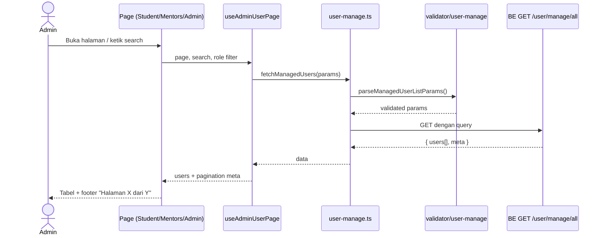

**State di UI:**

| State | Perilaku |
|-------|----------|
| Loading awal | Shell loading sampai baris pertama muncul |
| Search | Reset ke halaman 1, debounce via submit search |
| Empty | Pesan empty state dari `page-config.ts` |
| Error | Query error — perlu reload (belum ada retry UI khusus) |

---

## 2. Ubah Role User

**Actor:** Admin  
**Trigger:** Menu aksi baris → "Ubah role" → `UserManageRoleDialog`

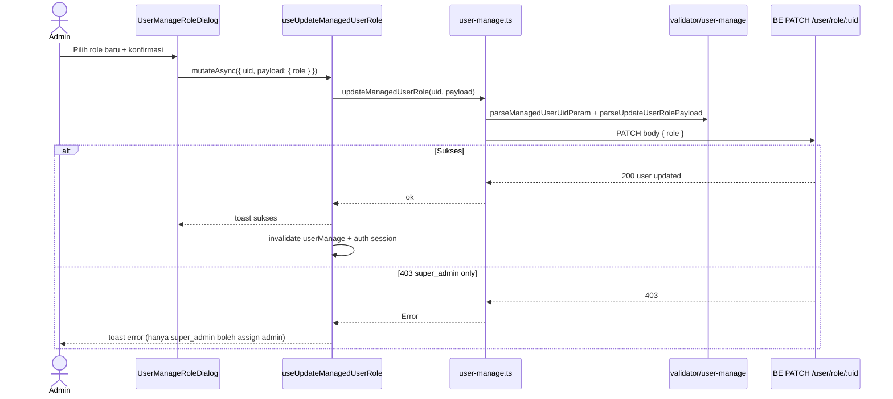

**Role yang valid di FE validator:** `student` · `mentor` · `admin`

---

## 3. Promote User (Siswa → Mentor / User → Admin)

**Actor:** Admin  
**Halaman:** Mentors (promote siswa) · Administrators (promote mentor/siswa)

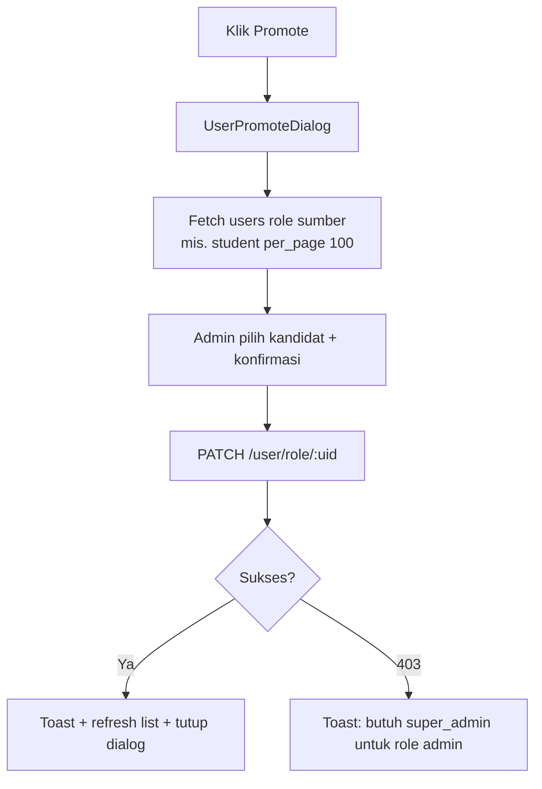

Ini **bukan** endpoint invite terpisah — hanya PATCH role pada user yang sudah terdaftar.

---

## 4. Hapus User

**Actor:** Admin  
**Trigger:** Menu aksi → Hapus → `ConfirmDialog`

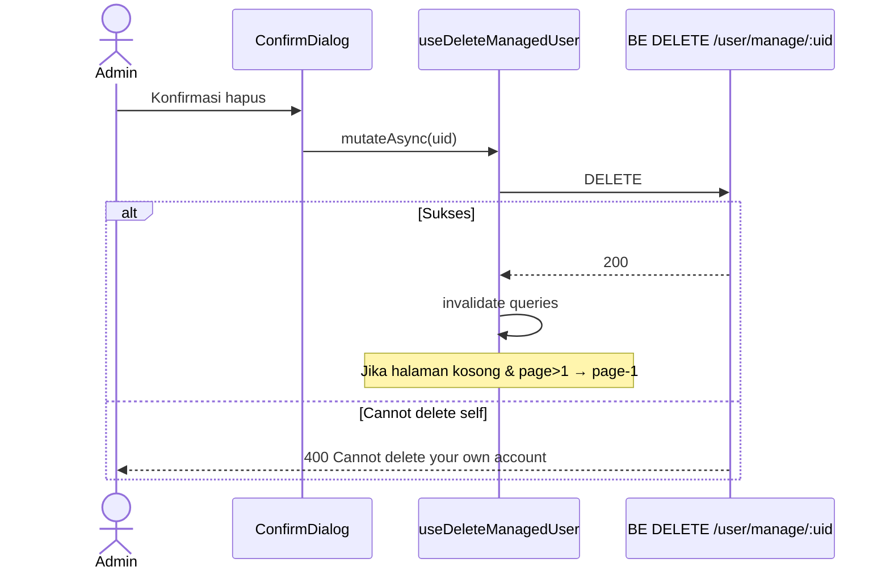

---

## 5. CRUD Kategori & Tipe Kursus

**Actor:** Admin  
**Route:** `/admin/course-categories` · `/admin/course-types`

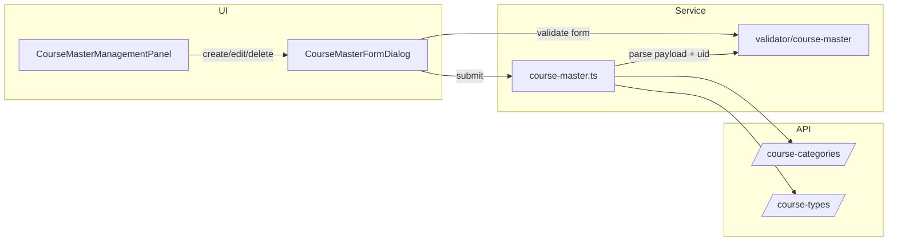

| Aksi | Method | Validasi FE |
|------|--------|-------------|
| Create | POST | nama wajib, max 120 char |
| Update | PUT | min 1 field, nama tidak boleh kosong |
| Delete | DELETE | UID valid |

---

## 6. Buat Kursus (Admin)

**Actor:** Admin  
**Route:** `/admin/courses` → tombol "Tambah Kursus"

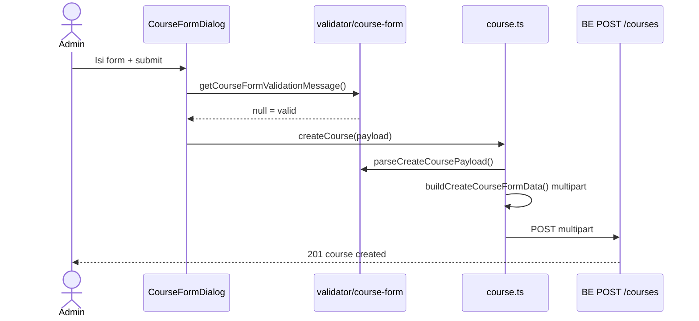

**Catatan:** Create hanya untuk **Super Admin / Admin** di BE. Mentor tidak punya tombol create di flow ini.

---

## 7. Edit Metadata Kursus (Partial — tunggu BE)

**Actor:** Admin  
**Trigger:** Detail course → Edit → `EditCourseDialog`

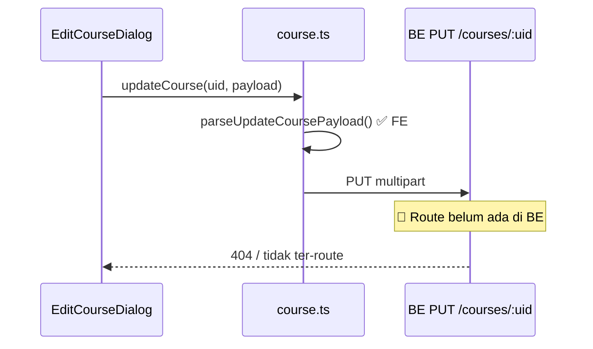

**Status QA:** Form validasi FE jalan; simpan edit metadata **gagal** sampai BE implement `PUT /courses/:id`.

---

## 8. Publish / Aktifkan Kursus

**Actor:** Admin  
**Trigger:** Detail course → Publish → `ConfirmDialog`

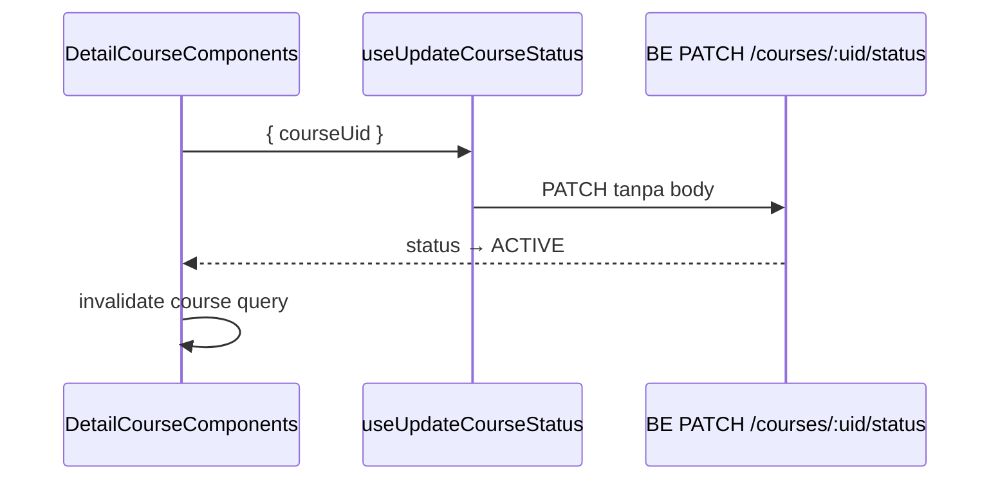

UI membaca publish state dari `status` + `is_published` via `isCoursePublished()`.

---

## 9. Assign Mentor ke Kursus

**Actor:** Admin  
**Tab:** Detail course → Mentor → "Assign mentor"

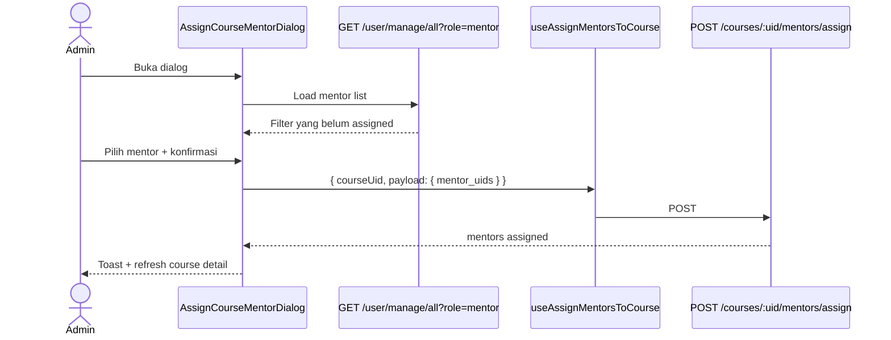

**Filter FE:** Mentor yang sudah di-assign tidak muncul di daftar pilihan.

---

## 10. Editor Kurikulum (Module & Lesson)

**Actor:** Admin / Mentor  
**Route:** `/admin/courses/:uid/edit` · `/mentor/courses/:uid/edit`

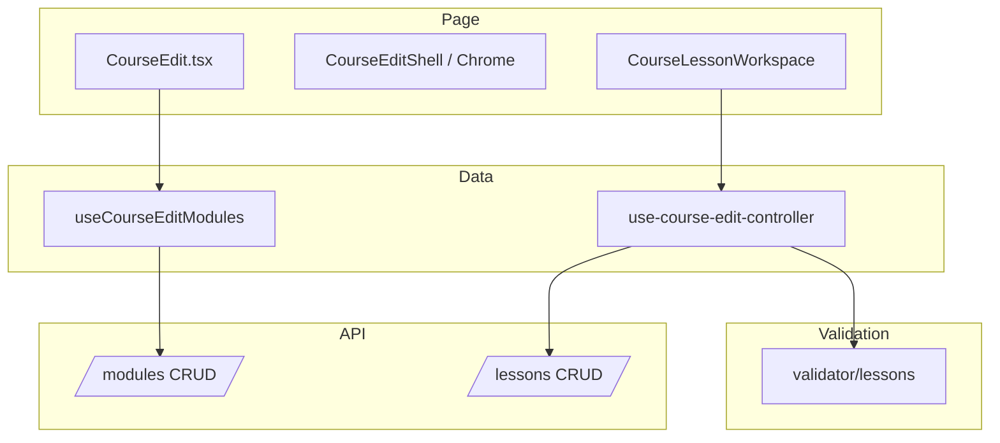

**Fitur editor:** buat/rename module, buat/edit/hapus lesson, switch text/video, unsaved dialog, compact navigation mobile.

---

## 11. Validasi Payload — Pola Umum

Semua service baru mengikuti pola yang sama:

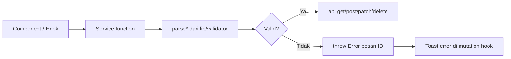

| Domain | Parser entrypoint |
|--------|-------------------|
| User manage | `parseManagedUserListParams`, `parseUpdateUserRolePayload` |
| Course master | `parseCreateCourseMasterPayload`, `parseUpdateCourseMasterPayload` |
| Course form | `parseCreateCoursePayload`, `parseUpdateCoursePayload` |
| Course mentor | `parseAssignMentorsToCoursePayload` |
| Lesson | `parseLessonCreateRequest`, dll. (sudah ada sebelumnya) |
| Lesson assignment | `parseLessonAssignmentUpsertRequest`, `parseLessonAssignmentSubmissionInput`, `parseGradeStaffSubmissionPayload` |
| Lesson attendance | `parseUpdateAttendancePayload`, `parseCreateAttendancePayload` |

---

## 12. Tab Tugas Staff — Detail Course → Roster

**Actor:** Admin / Mentor  
**Tab:** Detail course → **Tugas**

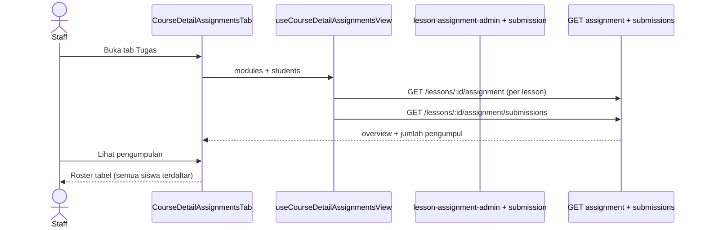

---

## 13. Penilaian & Feedback Submission (Staff)

**Actor:** Admin / Mentor  
**Route:** `.../submissions/:submissionUid`

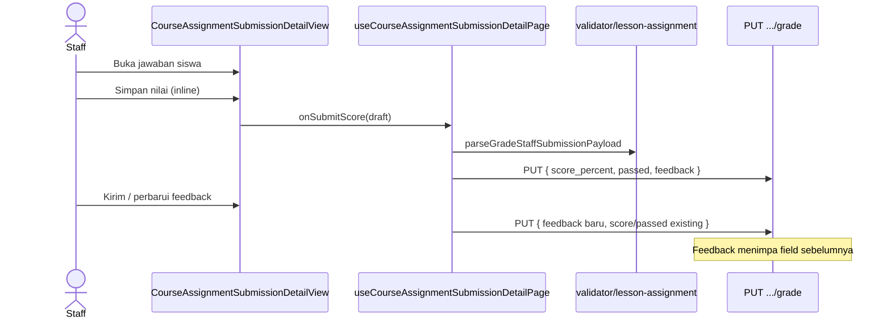

**Profil penilai di feedback:** FE cocokkan `graded_by_uid` dengan user login; selain itu tampil label generik "Penilai".

---

## 14. Tab Kehadiran Admin (Partial)

**Actor:** Admin  
**Tab:** Detail course → **Kehadiran** (`adminOnly`)

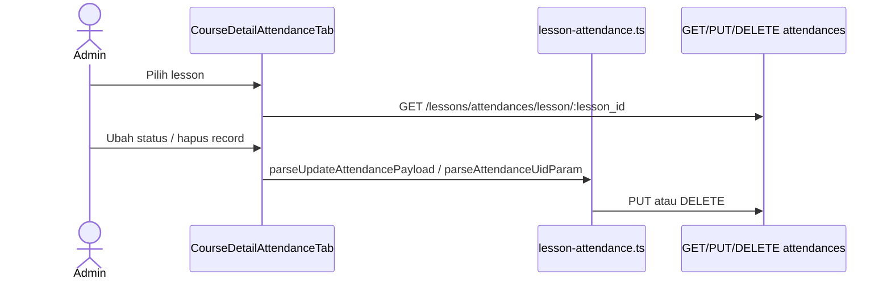

**Belum:** `POST /lessons/attendances` (create manual), input **note** di UI, tab untuk mentor.

---

## 15. Siswa — Submit Tugas (Module Viewer)

**Actor:** Student  
**Route:** `/student/learning/course/:uid` → assignment work

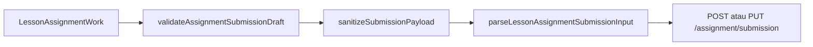

Sudah live sebelum sesi tab staff; validator submission ditambahkan di Fase 12.

---

## 16. Arsitektur Layer (Dependency Flow)

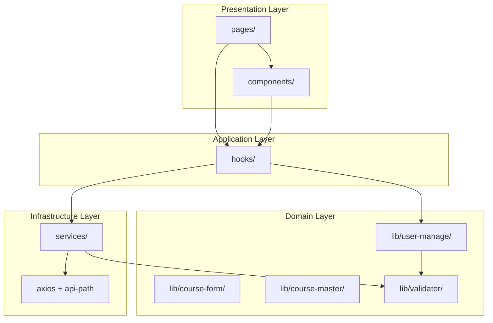

**Aturan:** `services/` tidak import React. `pages/` tipis — komposisi saja.

---

## Workflow yang BELUM / PARTIAL (referensi QA)

| Workflow | Status | Lihat |
|----------|--------|-------|
| Reply review | console.log | [todo-backlog.md](./todo-backlog.md) B8 |
| Mentor list/detail course | mock | [todo-backlog.md](./todo-backlog.md) B16–B17 |
| Mentor `/assignments` route terpisah | mock | [todo-backlog.md](./todo-backlog.md) B19 |
| Siswa check-in absen | belum | [todo-backlog.md](./todo-backlog.md) C2 |
| Admin create absen manual | belum | [todo-backlog.md](./todo-backlog.md) C4 |
| Profil penilai lengkap (bukan user login) | partial | [todo-backlog.md](./todo-backlog.md) A12, D9 |
| Forgot/reset password | mock | page-coverage |
| Admin reviews & Q&A moderasi | mock | [todo-backlog.md](./todo-backlog.md) D12 |
