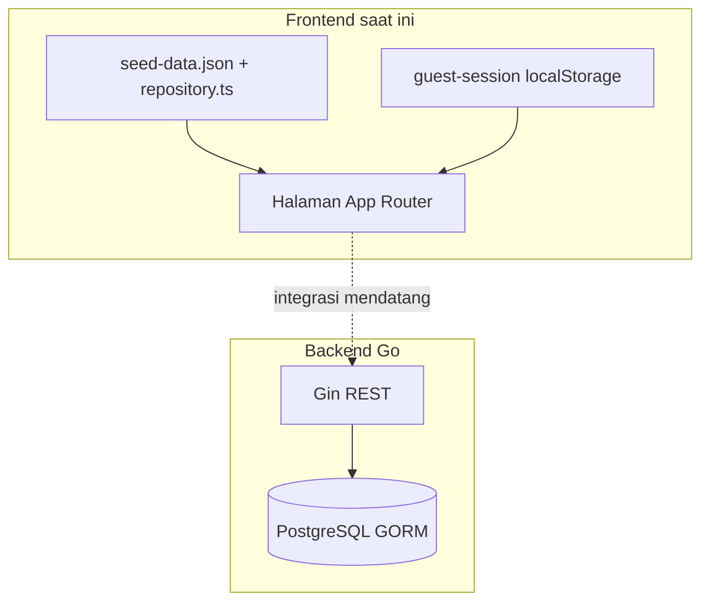

# Dokumentasi Produk & Integrasi — Doscom University (Frontend)

Dokumen ini menjadi **single source of truth** untuk tim frontend, backend, dan QA: fitur yang sudah diimplementasi di [`src/`](../src/), kontrak API yang diharapkan, serta **gap** terhadap skema database backend saat ini.

## Standar isi setiap dokumen fitur

Setiap file di `student/`, `admin/`, `mentor/`, `shared/` mengikuti pola berikut (selaras dengan backend Go):

1. **Envelope respons** — field `success`, `message`, `data`, `error` (lihat [api/response-envelope.md](./api/response-envelope.md)).
2. **Endpoint backend yang sudah ada** — path pasti + method + contoh JSON **request/response** + tabel **status HTTP** (lihat [api/route-map.md](./api/route-map.md)).
3. **Endpoint usulan** — jika fitur masih mock, diberi prefiks jelas + contoh respons lengkap dalam bentuk envelope yang sama.
4. **Diagram** Mermaid (alur atau sequence) bila membantu.

## Struktur folder

| Folder | Isi |
|--------|-----|
| [`api/`](./api/) | Peta route backend, envelope respons, status HTTP — **referensi utama integrasi** |
| [`database/`](./database/) | Skema lengkap (lama), skema target (baru), ENUM, evolusi, ERD — lihat [`database/README.md`](./database/README.md) |
| [`student/`](./student/) | Fitur area siswa (authorized) |
| [`admin/`](./admin/) | Fitur area admin |
| [`mentor/`](./mentor/) | Fitur area mentor |
| [`shared/`](./shared/) | Auth, checkout publik, profil, katalog publik, sertifikat — lintas peran |
| [`lesson/`](./lesson/) | Lesson: DB, TipTap/quiz/video, REST `/lessons` lengkap, matriks HTTP — [`lesson/README.md`](./lesson/README.md) |
| [`features/`](./features/) | Katalog fitur seluruh aplikasi — [`APP-FEATURE-CATALOG.md`](./features/APP-FEATURE-CATALOG.md) |

## Arsitektur data (ringkas)

## Referensi cepat backend

- Entity: [`backend/internal/model/entity/`](../../backend/internal/model/entity/)
- Enum DB: [`backend/internal/database/enum.go`](../../backend/internal/database/enum.go)
- Swagger: [`backend/docs/swagger.yaml`](../../backend/docs/swagger.yaml)

## Indeks dokumen

- [`api/README.md`](./api/README.md) — route map + respons standar
- [`database/README.md`](./database/README.md) — indeks: [current-schema-full](./database/current-schema-full.md), [proposed-schema-target](./database/proposed-schema-target.md), [evolution-old-vs-new](./database/evolution-old-vs-new.md), [lifecycle-and-enums](./database/lifecycle-and-enums.md)
- [`student/README.md`](./student/README.md)
- [`admin/README.md`](./admin/README.md)
- [`mentor/README.md`](./mentor/README.md)
- [`shared/README.md`](./shared/README.md)
- [`lesson/README.md`](./lesson/README.md) — modul, `content` JSONB, WYSIWYG, API lesson
- [`features/APP-FEATURE-CATALOG.md`](./features/APP-FEATURE-CATALOG.md) — ringkasan fitur per area

Diagram teknis memakai **Mermaid** (render di GitHub, VS Code, banyak viewer Markdown).

---

*Versi dokumen mengikuti struktur codebase pada pembuatan; perbarui bersama perubahan API.*
