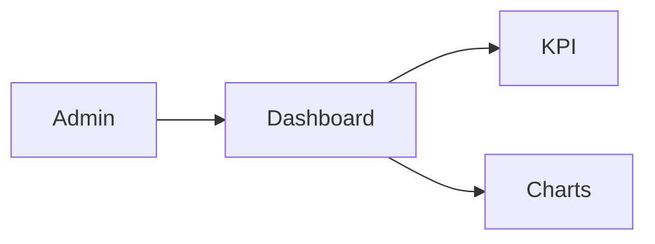

# Admin — Dashboard

## Ringkasan

KPI, grafik, cuplikan tabel pengguna. Data mock: `DashboardData`, `AdminKpi` dari [`repository.ts`](../../src/lib/data/repository.ts).

**Envelope:** [response-envelope.md](../api/response-envelope.md).

## Status

| Aspek | Backend |
|-------|---------|
| Endpoint agregat dashboard | **Belum** — hanya mock / komposisi manual |

---

## Backend — data yang bisa dipakai untuk widget (ada)

### `GET /user/manage/all` (Admin + JWT)

Respons mengikuti implementasi [`GetAllUsersService`](../../../backend/internal/service/user.go) — biasanya envelope:

```json
{
  "success": true,
  "message": "Users retrieved successfully",
  "data": {
    "users": [
      {
        "id": 1,
        "name": "...",
        "email": "...",
        "role": "student",
        "avatar_url": "",
        "is_verified": false,
        "created_at": "2026-01-01T00:00:00Z",
        "updated_at": "2026-01-01T00:00:00Z"
      }
    ],
    "meta": {
      "total": 100,
      "page": 1,
      "per_page": 20,
      "total_pages": 5
    }
  },
  "error": null
}
```

*Field pasti cek handler — pagination/filter dapat berbeda.*

**403** jika bukan admin:

```json
{
  "success": false,
  "message": "Access denied: Admins only",
  "data": null,
  "error": null
}
```

---

## Usulan `GET /api/v1/admin/dashboard`

**Response 200**

```json
{
  "success": true,
  "message": "Admin dashboard loaded",
  "data": {
    "kpi": {
      "total_students": 1200,
      "total_mentors": 45,
      "total_revenue": 999999999,
      "active_courses": 88
    },
    "charts": {
      "revenue_by_month": [{ "label": "2026-01", "value": 1000000 }],
      "enrollments_trend": []
    },
    "recent_users": []
  },
  "error": null
}
```

| HTTP | Kondisi |
|------|---------|
| 401 | JWT invalid |
| 403 | Bukan admin |

---

## Alur


