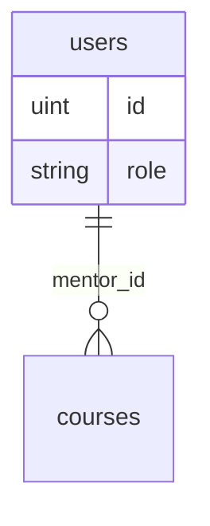

# Admin — Users — Mentors

## Ringkasan

Daftar dan detail mentor. Mock: `AdminMentor`, [`MentorDetailView`](../../src/app/(authorized)/admin/users/mentors/[uid]/_components/MentorDetailView.tsx).

**Envelope:** [response-envelope.md](../api/response-envelope.md).

---

## Backend — user management

Sama seperti siswa: **`GET /user/manage/all`** lalu filter `role=mentor`.

**PATCH /user/manage/:id`**

```json
{ "role": "mentor" }
```

**Respons lengkap** — [02-users-students](./02-users-students.md).

---

## Backend — kursus per mentor (turunan)

**GET** `/courses?mentor_id=2`

**Response 200** — struktur sama seperti [student/02-learning — GET /courses](../student/02-learning.md#get-courses-jwt).

---

## Usulan summary mentor

**GET** `/api/v1/admin/mentors/:id/summary`

**Response 200**

```json
{
  "success": true,
  "message": "OK",
  "data": {
    "user": {
      "id": 2,
      "name": "Dewi",
      "email": "...",
      "role": "mentor"
    },
    "stats": {
      "total_courses": 5,
      "total_students": 120,
      "average_rating": 4.7
    },
    "specializations": ["Development", "UI"]
  },
  "error": null
}
```

*Kolom `specializations` belum ada di entity `User` — lihat [gap DB](../database/gap-and-proposed-extensions.md).*

---

## ERD (konsep)


