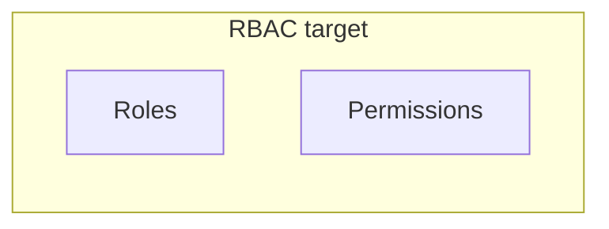

# Admin — Users — Administrators

## Ringkasan

Daftar admin. Mock: seed `users` dengan `role: admin`.

**Envelope:** [response-envelope.md](../api/response-envelope.md).

---

## Backend — `GET /user/manage/all`

Filter **`role=admin`** di klien.

Contoh respons penuh: [admin/01-dashboard](./01-dashboard.md#backend--data-yang-bisa-dipakai-untuk-widget-ada).

---

## RBAC mock vs produk

Seed menyimpan `roles`, `permissions`, `auditLogs` untuk UI. Di PostgreSQL saat ini hanya **`user_role` enum** — lihat [gap](../database/gap-and-proposed-extensions.md).

---

## Usulan audit log

**GET** `/api/v1/admin/audit-logs?page=1`

**Response 200**

```json
{
  "success": true,
  "message": "OK",
  "data": {
    "items": [
      {
        "id": 1,
        "actor_user_id": 1,
        "action": "user.role_update",
        "entity_type": "user",
        "entity_id": "3",
        "payload": {},
        "created_at": "2026-04-19T10:00:00Z"
      }
    ],
    "meta": { "total": 50, "page": 1, "per_page": 20 }
  },
  "error": null
}
```

---

## Diagram (target)


