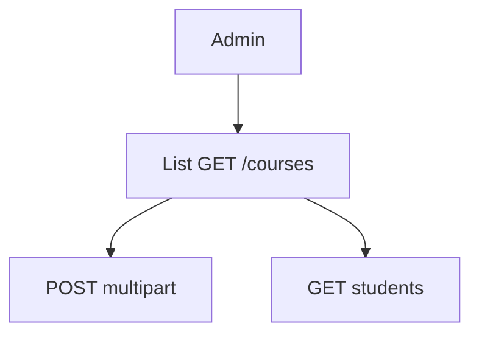

# Admin — Course catalog

## Ringkasan

Grid kursus admin: [`AdminCoursesGrid`](../../src/app/(authorized)/admin/courses/_components/AdminCoursesGrid.tsx).

**Envelope:** [response-envelope.md](../api/response-envelope.md) · **Courses:** [route map](../api/route-map.md) bagian Courses.

---

## Backend — `POST /courses` (Admin only)

**Content-Type:** `multipart/form-data`

| Field | Wajib | Keterangan |
|-------|--------|------------|
| `title` | Ya | |
| `slug` | Ya | unik |
| `description` | Ya | |
| `thumbnail` | Tidak | file → MinIO |
| `price` | Ya | string angka (handler parse ke float) |
| `slot` | Ya | integer string |
| `is_premium` | Ya | `"true"` / `"false"` |
| `is_published` | Ya | `"true"` / `"false"` |

**Response 201**

```json
{
  "success": true,
  "message": "Course created successfully",
  "data": {
    "id": 8,
    "title": "Intro Web",
    "slug": "intro-web",
    "description": "...",
    "thumbnail_url": "https://...",
    "price": 150000,
    "slot": 30,
    "is_premium": true,
    "is_published": false,
    "mentor_id": null,
    "event_id": null,
    "created_at": "2026-04-19T12:00:00Z",
    "updated_at": "2026-04-19T12:00:00Z"
  },
  "error": null
}
```

**403**

```json
{
  "success": false,
  "message": "Create Course Access denied: Admins only",
  "data": null,
  "error": null
}
```

**500** — gagal upload thumbnail / insert DB (lihat handler).

---

## Backend — `GET /courses`

Respons penuh: [student/02-learning — GET /courses](../student/02-learning.md#get-courses-jwt).

---

## Backend — `GET /courses/:id/students` (Admin)

**Query:** `page`, `per_page`

**Response 200**

```json
{
  "success": true,
  "message": "Students retrieved successfully",
  "data": {
    "enrollments": [],
    "meta": {
      "total": 0,
      "per_page": 10,
      "current_page": 1,
      "total_pages": 0
    }
  },
  "error": null
}
```

**403** — bukan admin.

---

## Gap UI

- Seed punya **kategori**, **status workflow** — belum di tabel `courses` — [gap DB](../database/gap-and-proposed-extensions.md).

---

## Alur


