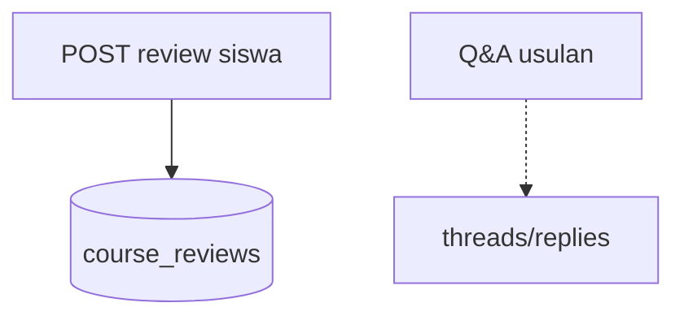

# Admin — Reviews & Q&A

## Ringkasan

Moderasi ulasan dan forum Q&A: [`ReviewsPanel`](../../src/app/(authorized)/admin/courses/reviews-qa/_components/ReviewsPanel.tsx), [`QaForum`](../../src/app/(authorized)/admin/courses/reviews-qa/_components/QaForum.tsx).

**Envelope:** [response-envelope.md](../api/response-envelope.md).

---

## Backend — review kursus (siswa aktif)

### `POST /courses/:id/review` (JWT)

**Body**

```json
{
  "rating": 5,
  "comment": "Materi lengkap"
}
```

**Response 201**

```json
{
  "success": true,
  "message": "Review created successfully",
  "data": {
    "id": 20,
    "user_id": 3,
    "course_id": 5,
    "rating": 5,
    "comment": "Materi lengkap",
    "created_at": "2026-04-19T10:00:00Z"
  },
  "error": null
}
```

| HTTP | Kondisi | Contoh `message` |
|------|---------|------------------|
| 403 | Bukan enrollment **active** | `You must be enrolled in this course to leave a review` |
| 409 | Sudah review | `You have already reviewed this course` |
| 400 | Body invalid | `Invalid request body` |

**Contoh 403**

```json
{
  "success": false,
  "message": "You must be enrolled in this course to leave a review",
  "data": null,
  "error": "User not enrolled in course"
}
```

---

## Admin — baca review (usulan)

Tidak ada `GET /courses/:id/reviews` di route map saat ini — **usulan:**

**GET** `/api/v1/admin/courses/:courseId/reviews`

**Response 200**

```json
{
  "success": true,
  "message": "OK",
  "data": {
    "items": [
      {
        "id": 20,
        "user_id": 3,
        "rating": 5,
        "comment": "...",
        "created_at": "2026-04-19T10:00:00Z"
      }
    ]
  },
  "error": null
}
```

---

## Q&A — belum di backend

Tabel usulan: `course_qa_threads`, `course_qa_replies` — [gap](../database/gap-and-proposed-extensions.md).

### Usulan `GET /api/v1/admin/courses/:courseId/qa-threads`

**Response 200**

```json
{
  "success": true,
  "message": "OK",
  "data": {
    "items": [
      {
        "id": "th-1",
        "course_id": 5,
        "title": "Bagaimana deploy?",
        "status": "unanswered",
        "replies_count": 0,
        "created_at": "2026-04-18T00:00:00Z"
      }
    ]
  },
  "error": null
}
```

### Usulan `POST /api/v1/admin/qa-threads/:threadId/replies`

**Request**

```json
{
  "body": "Jawaban resmi admin..."
}
```

**Response 201**

```json
{
  "success": true,
  "message": "Reply posted",
  "data": { "id": "rep-1", "body": "...", "created_at": "2026-04-19T11:00:00Z" },
  "error": null
}
```

---

## Diagram


