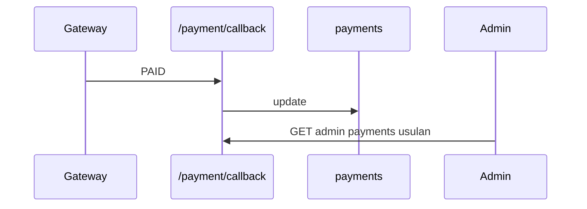

# Admin — Transactions

## Ringkasan

Dashboard transaksi: [`TransactionsDashboard`](../../src/app/(authorized)/admin/transactions/_components/TransactionsDashboard.tsx).

**Envelope:** [response-envelope.md](../api/response-envelope.md) · **Payment:** [route map](../api/route-map.md#6-payment).

---

## Backend — pembayaran tunggal (ada)

Admin dapat memakai **`GET /payment?reference=...`** atau **`GET /payment?enrollmentId=...`** dengan JWT yang sama (tidak ada pemisahan role di handler — pastikan kebijakan produk menambah filter admin).

**Response 200 — contoh penuh**

```json
{
  "success": true,
  "message": "Payment details retrieved successfully",
  "data": {
    "id": 3,
    "enrollment_id": 12,
    "amount": 199000,
    "payment_method": "OVO",
    "payment_status": "success",
    "transaction_id": "TREF-XXX",
    "checkout_url": "https://...",
    "paid_at": "2026-04-19T10:05:00Z",
    "created_at": "2026-04-19T10:00:00Z"
  },
  "error": null
}
```

**404 / 400** — sama seperti [student/07-transactions](../student/07-transactions.md).

---

## Usulan — daftar semua pembayaran (admin)

**GET** `/api/v1/admin/payments?from=2026-04-01&to=2026-04-30&status=success&page=1&per_page=50`

**Response 200**

```json
{
  "success": true,
  "message": "OK",
  "data": {
    "items": [
      {
        "id": 3,
        "enrollment_id": 12,
        "user": { "id": 3, "name": "...", "email": "..." },
        "course": { "id": 5, "title": "React" },
        "amount": 199000,
        "payment_method": "OVO",
        "payment_status": "success",
        "transaction_id": "TREF-XXX",
        "created_at": "2026-04-19T10:00:00Z",
        "paid_at": "2026-04-19T10:05:00Z"
      }
    ],
    "meta": {
      "total": 100,
      "page": 1,
      "per_page": 50,
      "total_pages": 2
    }
  },
  "error": null
}
```

| HTTP | Kondisi |
|------|---------|
| 403 | Bukan admin |

---

## Callback Tripay (referensi)

**POST** `/payment/callback` — tanpa JWT; body & respons: [shared/02-checkout](../shared/02-checkout-and-invoice.md).

---

## Alur


