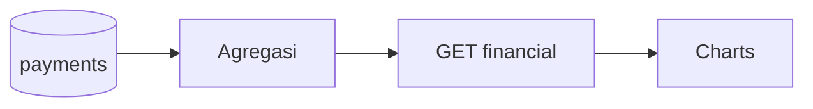

# Admin — Financial reports

## Ringkasan

Laporan keuangan & grafik: [`FinancialCharts`](../../src/app/(authorized)/admin/financial/_components/FinancialCharts.tsx).

**Envelope:** [response-envelope.md](../api/response-envelope.md).

## Status

| Aspek | Backend |
|-------|---------|
| Endpoint analytics keuangan | **Belum** — mock / agregasi manual |

---

## Sumber data riil (turunan)

Agregasi dapat dibangun dari tabel **`payments`** + **`enrollments`** + **`courses`** (join manual atau view SQL).

Entity `Payment` (field contoh): `amount`, `payment_status`, `created_at`, `paid_at`, `enrollment_id`.

---

## Usulan `GET /api/v1/admin/analytics/financial`

**Query:** `range=30d|90d|1y`, `granularity=day|week|month`

**Response 200**

```json
{
  "success": true,
  "message": "OK",
  "data": {
    "summary": {
      "gross_revenue": 50000000,
      "net_revenue": 47500000,
      "refunds": 0,
      "platform_fees": 2500000
    },
    "series": [
      {
        "date": "2026-04-01",
        "gross": 1000000,
        "net": 950000,
        "transaction_count": 12
      }
    ]
  },
  "error": null
}
```

**Response 403**

```json
{
  "success": false,
  "message": "Forbidden",
  "data": null,
  "error": null
}
```

---

## Payout (mock seed)

`AdminPayout` di seed — **tabel payout** belum di entity utama — [gap](../database/gap-and-proposed-extensions.md).

### Usulan `GET /api/v1/admin/payouts`

**Response 200**

```json
{
  "success": true,
  "message": "OK",
  "data": {
    "items": [],
    "meta": { "total": 0, "page": 1, "per_page": 20 }
  },
  "error": null
}
```

---

## Alur


