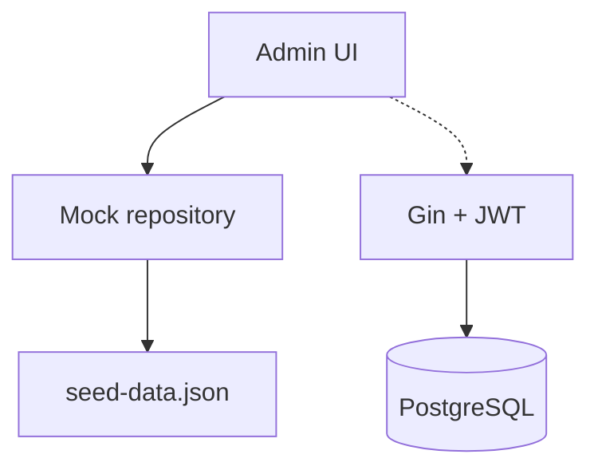

# PRD — Area Admin (Authorized)

**Base path:** `/admin/*`  
**Navigasi:** [`adminNavigation`](../../src/lib/navigation.ts)

**Standar dokumentasi:** [envelope API](../api/response-envelope.md), [route map](../api/route-map.md), contoh JSON lengkap per endpoint backend.

| # | Fitur | Dokumen | Rute utama |
|---|--------|---------|------------|
| 1 | Dashboard | [01-dashboard.md](./01-dashboard.md) | `/admin/dashboard` |
| 2 | Users — Students | [02-users-students.md](./02-users-students.md) | `/admin/users/students` |
| 3 | Users — Mentors | [03-users-mentors.md](./03-users-mentors.md) | `/admin/users/mentors` |
| 4 | Users — Administrators | [04-users-administrators.md](./04-users-administrators.md) | `/admin/users/administrators` |
| 5 | Course catalog | [05-courses-catalog.md](./05-courses-catalog.md) | `/admin/courses` |
| 6 | Reviews & Q&A | [06-reviews-qa.md](./06-reviews-qa.md) | `/admin/courses/reviews-qa` |
| 7 | Transactions | [07-transactions.md](./07-transactions.md) | `/admin/transactions` |
| 8 | Financial reports | [08-financial.md](./08-financial.md) | `/admin/financial` |

## Backend — manajemen user (admin)

| Method | Path | Keterangan |
|--------|------|------------|
| GET | `/user/manage/all` | Daftar user (filter di service — lihat kode) |
| PATCH | `/user/manage/:id` | Body `{ "role": "mentor" }` |
| DELETE | `/user/manage/:id` | Hapus user |

Semua memerlukan JWT user dengan `role=admin` (cek [`UpdateUserRoleService`](../../../backend/internal/service/user.go)).

