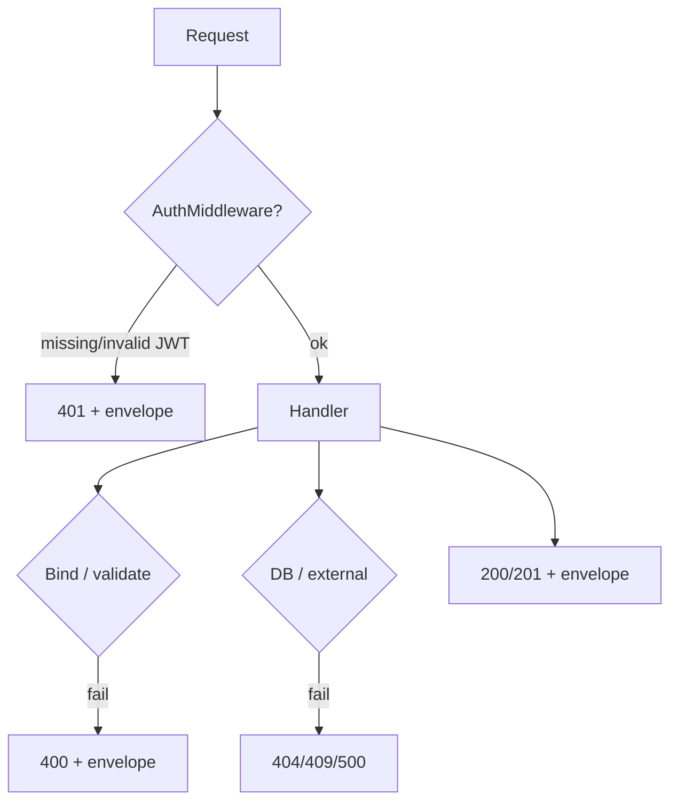

# Envelope respons & status HTTP (backend)

## Pola JSON umum (Gin `gin.H`)

Hampir semua endpoint mengembalikan struktur berikut:

```json
{
  "success": true,
  "message": "Human-readable message",
  "data": {},
  "error": null
}
```

| Field | Tipe | Keterangan |
|-------|------|------------|
| `success` | boolean | `true` jika operasi utama berhasil |
| `message` | string | Pesan untuk UI/logging |
| `data` | object, array, atau `null` | Payload bisnis; bisa berisi entity GORM (snake_case JSON tag pada struct) |
| `error` | string atau `null` | Detail error teknis (mis. `err.Error()` dari validator atau DB); bisa `null` saat gagal bisnis tanpa detail |

**Pengecualian / variasi**

- **Login & register** (`PostLoginFunc`, `PostRegisterFunc`): sama memakai `success`, `message`, `data`, `error`.
- **Tripay payment**: service mengembalikan `dto.APIResponse` dengan `Data` bertipe `CreatePaymentResponse`; handler `CreatePaymentFunc` membungkus `response.Data` ke dalam `data` (bukan seluruh `APIResponse` tripay).

## Header autentikasi

| Header | Nilai |
|--------|--------|
| `Authorization` | `Bearer <JWT>` **atau** token saja tanpa kata `Bearer` (didukung [`AuthMiddleware`](../../../backend/internal/handler/middleware/middleware.go)) |

Tanpa token pada route yang memakai `AuthMiddleware`:

**HTTP 401** — contoh:

```json
{
  "success": false,
  "message": "Authorization header missing",
  "data": null,
  "error": null
}
```

Token invalid/expired:

```json
{
  "success": false,
  "message": "Token is expired",
  "data": null,
  "error": null
}
```

## Tabel status HTTP yang dipakai handler

| Kode | Kapan dipakai (contoh) |
|------|-------------------------|
| **200** | OK — login sukses, GET sukses, PATCH sukses, payment create sukses |
| **201** | Created — course/module/lesson/attendance baru |
| **400** | Body/query invalid (`ShouldBindJSON` gagal), validasi bisnis, signature callback gagal |
| **401** | Auth header hilang/salah format; kredensial login salah |
| **403** | Role tidak diizinkan (bukan admin saat endpoint admin-only) |
| **404** | User/lesson/enrollment/payment/course tidak ditemukan |
| **409** | Konflik — email sudah terdaftar; sudah absen untuk lesson yang sama |
| **413** | Ukuran file avatar > 5MB (`StatusRequestEntityTooLarge`) |
| **500** | Error DB, enkripsi, Tripay, MinIO, dll. |

*Not every code appears on every endpoint; see [route-map.md](./route-map.md) per route.*

## Diagram alur respons



## Konvensi penamaan field

- Request/response JSON di DTO memakai **snake_case** (`old_password`, `enrollment_id`, …) sesuai tag `json` di struct.
- Entity GORM di-serialize ke JSON dengan tag field struct (biasanya **snake_case** untuk kolom DB).
