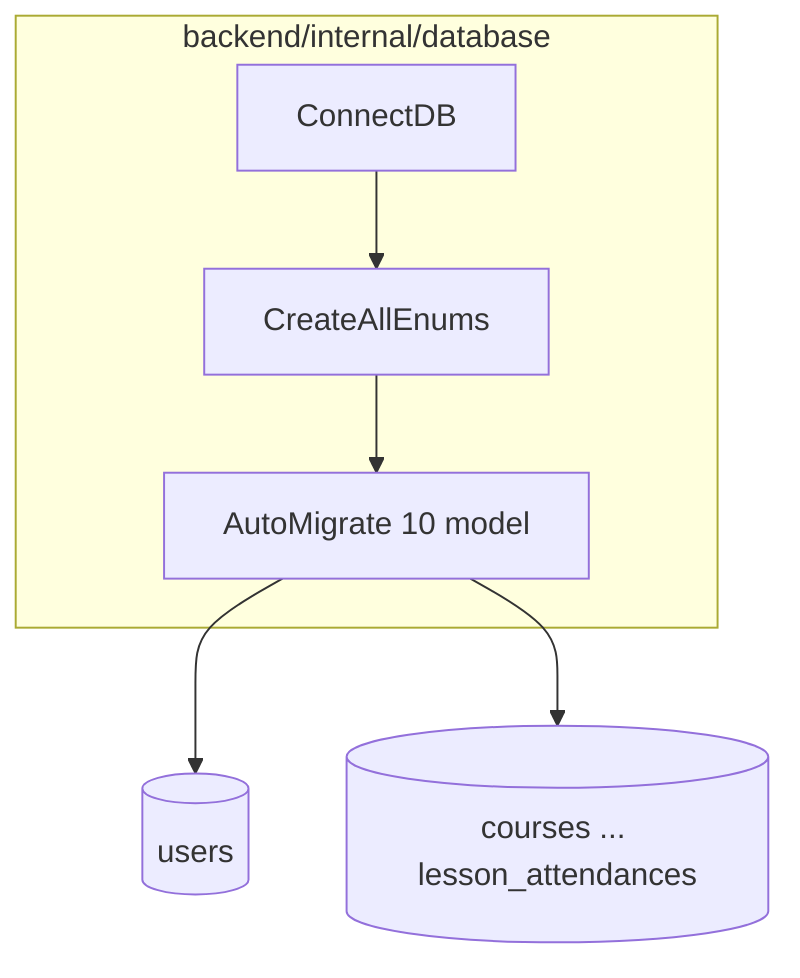

# Dokumentasi database & integrasi backend

Folder ini mendokumentasikan **PostgreSQL** yang dipakai backend Web DU: cara inisialisasi (`internal/database`), **enum**, **tabel & kolom saat ini**, serta **skema target** untuk menyamai kebutuhan frontend (mock `seed-data.json`).

## Cara membaca

| Urutan | Dokumen | Isi |
|--------|---------|-----|
| 1 | [lifecycle-and-enums.md](./lifecycle-and-enums.md) | Alur koneksi DB, `CreateAllEnums`, `AutoMigrate`, catatan seeder — dari [`backend/internal/database/`](../../../backend/internal/database/) |
| 2 | [current-schema-full.md](./current-schema-full.md) | **Skema sekarang**: setiap tabel, kolom, tipe, FK, relasi, ERD lengkap |
| 3 | [proposed-schema-target.md](./proposed-schema-target.md) | **Skema baru (target)**: tabel/kolom tambahan + ERD gabungan |
| 4 | [evolution-old-vs-new.md](./evolution-old-vs-new.md) | **Perbandingan** lama vs baru: peta migrasi, apa yang tetap / berubah |
| 5 | [gap-and-proposed-extensions.md](./gap-and-proposed-extensions.md) | Ringkasan gap bisnis (tetap dipertahankan sebagai checklist) |

**Respons API HTTP** untuk CRUD: [api/response-envelope.md](../api/response-envelope.md) · [api/route-map.md](../api/route-map.md).

## Lokasi kode sumber (backend)

| File | Fungsi |
|------|--------|
| [`connection.go`](../../../backend/internal/database/connection.go) | Koneksi, `CreateDatabase`, `CreateAllEnums`, `AutoMigrate` daftar model |
| [`enum.go`](../../../backend/internal/database/enum.go) | Definisi tipe PostgreSQL `ENUM` + migrasi kolom `lesson_attendances.status` |
| [`seeder.go`](../../../backend/internal/database/seeder.go) | Data awal dev (`SEED=true`) |
| [`entity/*.go`](../../../backend/internal/model/entity/) | Definisi kolom & relasi GORM |

## Istilah

| Istilah | Arti di dokumen ini |
|---------|---------------------|
| **Skema lama / saat ini** | Apa yang **benar-benar** di-`AutoMigrate` hari ini |
| **Skema baru / target** | Usulan tabel & kolom agar API bisa mengganti **mock frontend** |
| **ERD** | Entity Relationship Diagram (Mermaid) |

## Diagram ringkas: alur init DB

