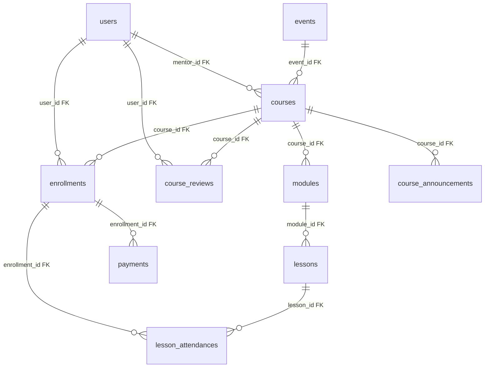

# Skema database saat ini (lengkap)

**Sumber kebenaran:** [`AutoMigrate`](../../../backend/internal/database/connection.go) + struct [`entity`](../../../backend/internal/model/entity/).  
Nama tabel mengikuti **konvensi GORM** (plural snake_case) kecuali dinyatakan lain.

---

## ERD — skema saat ini (10 tabel)

**Keterangan relasi:**

- **`payments`** tidak punya `user_id` / `course_id` langsung — hubungan ke user/course lewat **`enrollments`**.
- **`course_reviews`**: FK implisit `user_id` → `users.id`, `course_id` → `courses.id` (GORM association).

---

## Tabel `users`

| Kolom | Tipe DB (implisit GORM) | Constraint | Keterangan |
|-------|-------------------------|------------|------------|
| `id` | `bigint` / serial PK | PRIMARY KEY | |
| `name` | `varchar(150)` NOT NULL | | Dapat terenkripsi di aplikasi |
| `email` | `varchar(150)` NOT NULL | UNIQUE | |
| `email_hash` | `varchar(150)` NOT NULL | UNIQUE | Blind index untuk lookup |
| `password` | `varchar(255)` | | Tidak dikirim ke JSON API (`json:"-"`) |
| `role` | `user_role` ENUM | NOT NULL, default `'student'` | `admin` / `mentor` / `student` |
| `is_verified` | `boolean` | default false | |
| `avatar_url` | `varchar(255)` | | |
| `description` | `text` | | |
| `created_at` | `timestamp` | | |
| `updated_at` | `timestamp` | | |

**Relasi GORM:** `Courses` (mentor), `Enrollments`, `Reviews` (`course_reviews`).

---

## Tabel `events`

| Kolom | Tipe | Keterangan |
|-------|------|------------|
| `id` | PK | |
| `name` | `varchar(150)` NOT NULL | |
| `description` | `text` | |
| `start_date` | `timestamp` nullable | pointer |
| `end_date` | `timestamp` nullable | |
| `location` | `varchar(150)` | |
| `is_active` | `boolean` default false | |
| `registration_open` | `boolean` default false | |
| `created_at`, `updated_at` | `timestamp` | |

**Relasi:** `Courses` → `event_id` di `courses`.

---

## Tabel `courses`

| Kolom | Tipe | Constraint | Keterangan |
|-------|------|------------|------------|
| `id` | PK | | |
| `event_id` | `uint` nullable | FK → `events.id` | Opsional |
| `mentor_id` | `uint` nullable | FK → `users.id` | Mentor |
| `title` | `varchar(200)` NOT NULL | | |
| `slot` | `int` default 0 | | Kapasitas; 0 = tidak dibatasi di logika quota |
| `slug` | `varchar(255)` NOT NULL | UNIQUE | URL-friendly |
| `description` | `text` | | |
| `thumbnail_url` | `varchar(255)` | | |
| `price` | `decimal(10,2)` | | |
| `is_premium` | `boolean` default false | | |
| `is_published` | `boolean` default false | | |
| `created_at`, `updated_at` | `timestamp` | | |

**Relasi:** `Modules`, `Enrollments`, `Reviews`, `Announcements`, `Event`, `Mentor`.

*Tidak ada* `category_id`, `strike_price`, `uid` UUID — lihat [proposed-schema-target.md](./proposed-schema-target.md).

---

## Tabel `modules`

| Kolom | Tipe | Keterangan |
|-------|------|------------|
| `id` | PK | |
| `course_id` | `uint` NOT NULL | FK → `courses.id` |
| `title` | `varchar(200)` NOT NULL | |
| `order_index` | `int` | |
| `created_at` | `timestamp` | |

**Relasi:** `Lessons`.

---

## Tabel `lessons`

**Dokumentasi mendalam** (bentuk JSON `content`, ERD, kontrak API): [lesson/01-database-and-erd.md](../lesson/01-database-and-erd.md), [lesson/03-rest-api-complete.md](../lesson/03-rest-api-complete.md).

| Kolom | Tipe | Keterangan |
|-------|------|------------|
| `id` | PK | |
| `module_id` | `uint` NOT NULL | FK → `modules.id` |
| `title` | `varchar(200)` NOT NULL | |
| `content` | `jsonb` | Konten fleksibel |
| `video_url` | `varchar(255)` | |
| `start_time`, `end_time` | `timestamp` | Jadwal sesi |
| `order_index` | `int` | |
| `created_at`, `updated_at` | `timestamp` | |

---

## Tabel `enrollments`

| Kolom | Tipe | Keterangan |
|-------|------|------------|
| `id` | PK | |
| `user_id` | `uint` NOT NULL | FK → `users.id` |
| `course_id` | `uint` NOT NULL | FK → `courses.id` |
| `enrolled_at` | `timestamp` | |
| `progress` | `decimal(5,2)` default 0 | 0–100 |
| `status` | `enrollment_status` ENUM | default `'active'` — nilai: pending, active, completed, cancelled |

**Relasi:** `User`, `Course`; dipakai oleh `payments`, `lesson_attendances`.

---

## Tabel `payments`

| Kolom | Tipe | Keterangan |
|-------|------|------------|
| `id` | PK | |
| `enrollment_id` | `uint` nullable | FK → `enrollments.id` |
| `amount` | `decimal(10,2)` | |
| `payment_method` | `payment_method` ENUM | Nilai DB = kode channel (Tripay) |
| `payment_status` | `payment_status` ENUM | pending, success, failed |
| `transaction_id` | `varchar(100)` | Reference gateway |
| `checkout_url` | `text` | |
| `paid_at` | `timestamp` nullable | |
| `created_at` | `timestamp` | |

*Tidak ada* `user_id`, `course_id`, `fee_merchant`, `fee_customer`, `coupon_id`.

---

## Tabel `course_reviews`

| Kolom | Tipe | Keterangan |
|-------|------|------------|
| `id` | PK | |
| `user_id` | `uint` NOT NULL | FK → `users.id` |
| `course_id` | `uint` NOT NULL | FK → `courses.id` |
| `rating` | `int` | CHECK 1–5 (tag GORM) |
| `comment` | `text` | Dapat terenkripsi di service |
| `created_at` | `timestamp` | |

*Tidak ada* kolom balasan mentor.

---

## Tabel `course_announcements`

| Kolom | Tipe | Keterangan |
|-------|------|------------|
| `id` | PK | |
| `course_id` | `uint` NOT NULL | FK → `courses.id` |
| `title` | `varchar(150)` | |
| `message` | `text` | |
| `created_at` | `timestamp` | |

---

## Tabel `lesson_attendances`

Nama tabel eksplisit: `lesson_attendances` ([`TableName()`](../../../backend/internal/model/entity/lesson_attendance.go)).

| Kolom | Tipe | Keterangan |
|-------|------|------------|
| `id` | PK | |
| `lesson_id` | `uint` NOT NULL, index | FK → `lessons.id` |
| `enrollment_id` | `uint` NOT NULL, index | FK → `enrollments.id` |
| `checked_in_at` | `timestamp` | |
| `status` | `attendance_status` ENUM | default `'present'` |
| `note` | `text` | Dapat terenkripsi |
| `created_at`, `updated_at` | `timestamp` | |

**Unikness:** tidak ada UNIQUE `(lesson_id, enrollment_id)` di struct — duplikat dicegah di service (409).

---

## Indeks & FK (catatan GORM)

- Index eksplisit pada struct: `lesson_id`, `enrollment_id` pada `lesson_attendances`.
- FK fisik mengikuti konvensi GORM saat migrasi PostgreSQL (biasanya constraint bernama otomatis).

---

## Dokumen terkait

- [evolution-old-vs-new.md](./evolution-old-vs-new.md) — perbandingan dengan skema target
- [lifecycle-and-enums.md](./lifecycle-and-enums.md) — ENUM & alur init
