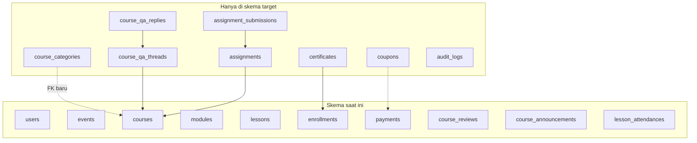
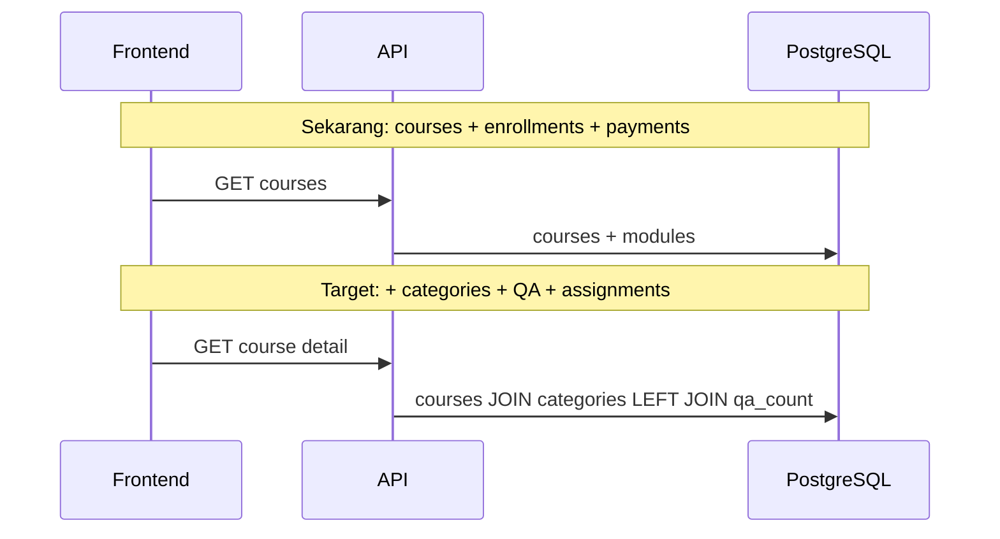

# Evolusi skema: database lama (saat ini) vs database baru (target)

| Istilah | Arti |
|---------|------|
| **Lama / sekarang** | Objek yang sudah di-`AutoMigrate` — detail kolom di [current-schema-full.md](./current-schema-full.md) |
| **Baru / target** | Tambahan di [proposed-schema-target.md](./proposed-schema-target.md) |

---

## Perbandingan jumlah objek

| Aspek | Skema saat ini | Skema target (usulan) |
|-------|----------------|------------------------|
| Tabel inti | 10 | 10 + ~10 (kategori, QA, assignment, submission, certificate, coupon, audit, …) |
| ENUM PostgreSQL | 5 tipe | Sama + ENUM baru opsional (`coupon_type`, `workflow_status`, …) |
| FK utama | User–Course–Enrollment–Payment–LessonAttendance | + Category–Course, Course–QA, Assignment–Submission, dll. |

---

## Peta tabel: ada sekarang vs ditambahkan

**Solid arrow** di DB = FK; garis putus-putus = alter kolom / FK baru pada tabel lama.

---

## Per kolom: `courses`

| Kolom | Skema saat ini | Skema target |
|-------|----------------|--------------|
| `id`, `title`, `slug`, `description`, `price`, … | Ada | Tetap |
| `category_id` | **Tidak** | **Ada** (FK) |
| `strike_price` | **Tidak** | Opsional |
| `workflow_status`, `submitted_at` | **Tidak** | Opsional (alur moderasi) |
| `public_uid` (UUID) | **Tidak** | Opsional (ganti `uid` string di FE) |

---

## Per kolom: `payments`

| Kolom | Skema saat ini | Skema target |
|-------|----------------|--------------|
| `enrollment_id`, `amount`, `method`, `status`, `transaction_id`, `checkout_url`, `paid_at` | Ada | Tetap |
| `coupon_id` | **Tidak** | Opsional |
| `fee_merchant`, `fee_customer` | **Tidak** | Opsional (rekonsiliasi admin) |
| `raw_callback` | **Tidak** | Opsional |

---

## Per fitur: dari tabel mana?

| Fitur frontend (mock) | Skema saat ini | Skema target |
|----------------------|----------------|--------------|
| Kategori & warna | Tidak ada | `course_categories` + FK |
| Q&A forum | Tidak ada | `course_qa_*` |
| Assignment | Tidak ada | `assignments` + `assignment_submissions` |
| Sertifikat | Tidak ada | `certificates` |
| Review + balasan mentor | 1 baris `course_reviews` | Kolom reply atau tabel reply |
| Kupon | Tidak ada | `coupons` + FK di `payments` |
| Audit admin | Tidak ada | `audit_logs` |

---

## Strategi migrasi (disarankan)

1. **Backward compatible:** tambah tabel/kolom nullable dulu; isi data dari admin; deploy API; lalu nonaktifkan mock.
2. **ENUM baru:** ikuti pola [`enum.go`](../../../backend/internal/database/enum.go) — hati-hati `DROP TYPE CASCADE` di production (gunakan migrasi bertahap).
3. **UUID publik:** backfill satu kali dari `slug` atau generate baru; indeks UNIQUE.

---

## Diagram sequence: baca path lama vs baru

---

## Dokumen terkait

- [lifecycle-and-enums.md](./lifecycle-and-enums.md)
- [README.md](./README.md) — indeks folder
