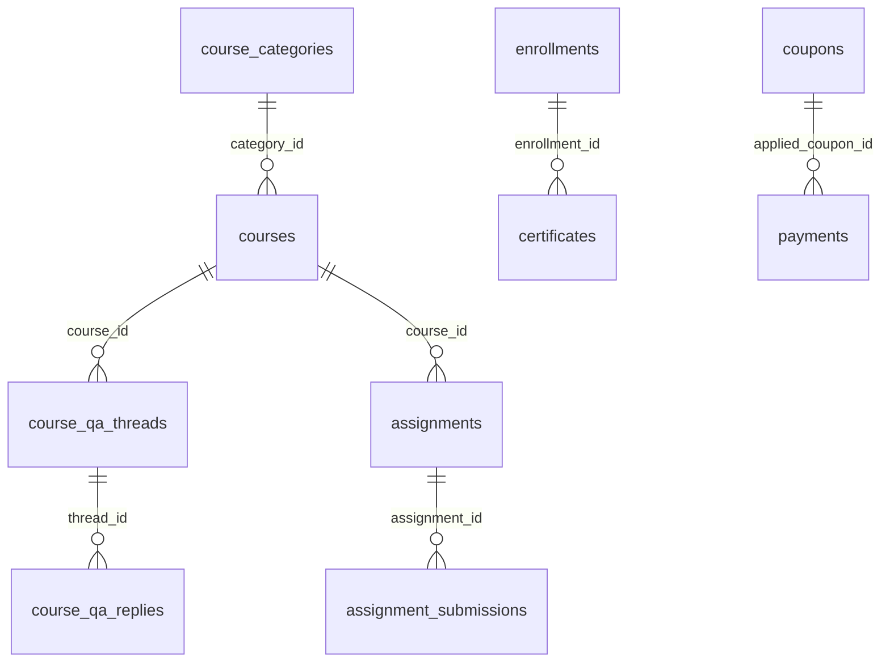

# Gap database: kebutuhan frontend vs backend

> **Dokumentasi visual & skema lengkap:** lihat [current-schema-full.md](./current-schema-full.md) (skema **sekarang**), [proposed-schema-target.md](./proposed-schema-target.md) (skema **target**), [evolution-old-vs-new.md](./evolution-old-vs-new.md) (perbandingan), [lifecycle-and-enums.md](./lifecycle-and-enums.md) (`internal/database`).

Frontend mengonsumsi **`seed-data.json`** (lihat [`repository.ts`](../../src/lib/data/repository.ts)) dengan entitas yang **melampaui** model GORM saat ini. Bagian ini menjadi **PRD teknis** untuk migrasi/schema tambahan agar API bisa menggantikan mock.

## Ringkasan gap

| Area UI | Di seed / UI | Di backend entity saat ini |
|---------|----------------|---------------------------|
| Kategori kursus | `categories[]` dengan `colorVariant`, status | Tidak ada tabel category / FK `category_id` di `courses` |
| Kursus | `uid` string, `variantBadge`, `strikePrice`, status workflow, `submittedAt`, modul bertingkat kompleks | `id` uint, `slug`, tidak ada badge/strike/workflow |
| Review | Balasan mentor (`reply`) | Hanya `course_reviews` satu tingkat |
| Q&A forum | `qaThreads`, replies multi-level, status answered | Tidak ada tabel |
| Assignment / submission | Halaman mentor & student assignments | Tidak ada entity |
| Sertifikat | `certificates` per user | Tidak ada entity |
| Transaksi admin | `AdminTransaction`, fee, gateway, timeline | `payments` lebih sederhana; tidak ada fee breakdown seperti UI |
| Kupon | `AdminCoupon` | Tidak ada |
| RBAC admin | `roles`, `permissions`, `auditLogs` | Hanya `user_role` enum; tidak ada permission terperinci |
| Tiket support | `AdminTicket` | Tidak ada |
| Analytics / KPI | `AdminKpi`, chart series | Tidak ada agregasi persisten |
| Mentor profile marketing | `specializations`, counts | Sebagian bisa di-derive; tidak disimpan terpisah |

## Usulan tabel / kolom (prioritas)

### 1. Kategori kursus

**Tabel `course_categories`**

- `id` (PK, uuid atau serial)
- `name`, `description`, `status` (active/inactive)
- `slug` (unique)
- `color_variant` atau `theme_key` (varchar) — untuk UI
- `created_at`, `updated_at`

**Alter `courses`:** tambah `category_id` (FK nullable).

### 2. Q&A kursus

**Tabel `course_qa_threads`**

- `id`, `course_id`, `author_user_id`
- `title`, `body`, `status` (open/answered/locked)
- `created_at`, `updated_at`

**Tabel `course_qa_replies`**

- `id`, `thread_id`, `author_user_id`, `body`, `created_at`

### 3. Assignment & submission

**Tabel `assignments`**

- `id`, `course_id` (atau `lesson_id`), `title`, `description`, `due_at`, `max_score`, `created_at`

**Tabel `assignment_submissions`**

- `id`, `assignment_id`, `student_user_id` (atau `enrollment_id`)
- `content` / `attachment_urls` (JSONB atau tabel file terpisah)
- `status` (draft/submitted/graded), `score`, `feedback`, `submitted_at`, `graded_at`

### 4. Sertifikat

**Tabel `certificates`**

- `id`, `user_id`, `course_id` (atau `enrollment_id`)
- `certificate_number` (unique), `issued_at`, `pdf_url` atau `storage_key`
- `metadata` (JSONB)

### 5. Kupon & transaksi (selaras UI admin)

**Tabel `coupons`**

- `code`, `type` (percent/fixed), `value`, `max_uses`, `expires_at`, `course_id` nullable, `created_at`

**Kolom tambahan pada `payments` atau tabel `payment_line_items`**

- `fee_merchant`, `fee_customer`, `external_reference`, `raw_callback` (JSONB) — jika perlu rekonsiliasi seperti mock dashboard

### 6. RBAC & audit (jika produk memerlukan)

**Tabel `roles`, `permissions`, `role_permissions`, `user_roles`** — atau tetap enum + kolom JSON untuk permission override.

**Tabel `audit_logs`**

- `id`, `actor_user_id`, `action`, `entity_type`, `entity_id`, `payload` (JSONB), `created_at`

### 7. Identitas publik kursus

Frontend memakai **`uid`** string; backend memakai **integer `id`** dan **`slug`**.

- **Keputusan produk:** expose `GET /courses/by-slug/:slug` atau `uid` sebagai UUID di DB; migrasi data seed → DB harus memetakan slug ↔ uid.

## ERD usulan (tambahan)



## Rekomendasi integrasi API

1. **Tahap 1:** Login/register, user profile, course list/detail by slug, enrollment, payment create, lesson attendance — sudah banyak tersedia di backend (sesuaikan path & JWT).
2. **Tahap 2:** Kategori + Q&A + assignments + certificates sesuai tabel di atas.
3. **Tahap 3:** Admin analytics, coupons, audit — setelah kebutuhan reporting diprioritaskan.

---

## Kontrak respons untuk endpoint baru (disarankan)

Agar konsisten dengan backend Go yang ada, endpoint baru sebaiknya memakai envelope yang sama:

```json
{
  "success": true,
  "message": "Resource created",
  "data": {},
  "error": null
}
```

Contoh **error validasi (400):**

```json
{
  "success": false,
  "message": "Invalid request data",
  "data": null,
  "error": "Key: 'CreateThreadRequest.Title' Error:Field validation for 'Title' failed on the 'required' tag"
}
```

Referensi lengkap: [response-envelope.md](../api/response-envelope.md).
