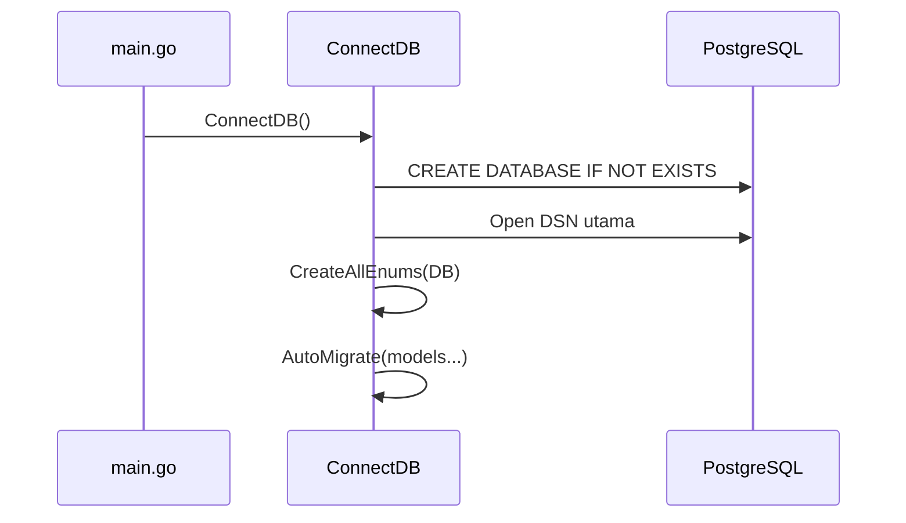
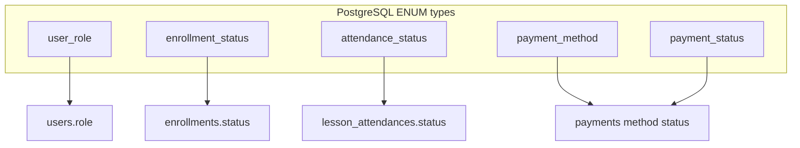

# Siklus hidup database (`backend/internal/database`)

Dokumen ini merangkum **kode** di folder [`backend/internal/database/`](../../../backend/internal/database/) — satu-satunya tempat inisialisasi tipe ENUM dan urutan migrasi GORM.

## 1. Alur `ConnectDB`

**Environment** (dari [`connection.go`](../../../backend/internal/database/connection.go)):

| Variabel | Keterangan |
|----------|------------|
| `DB_HOST`, `DB_PORT`, `DB_USER`, `DB_PASSWORD`, `DB_NAME`, `DB_SSLMODE` | DSN PostgreSQL |

Jika database nama `DB_NAME` belum ada, dibuat lewat koneksi ke database `postgres`.

## 2. `CreateAllEnums` — [`enum.go`](../../../backend/internal/database/enum.go)

Urutan eksekusi:

1. **`dropAllEnums`** — `DROP TYPE IF EXISTS ... CASCADE` untuk:  
   `payment_status`, `payment_method`, `attendance_status`, `enrollment_status`, `user_role`  
   *Catatan:* `CASCADE` dapat mempengaruhi kolom yang memakai tipe tersebut — di dev biasanya diikuti `AutoMigrate` yang membuat ulang kolom.

2. **Buat ulang ENUM** (SQL mentah):

| Nama tipe PostgreSQL | Nilai |
|----------------------|--------|
| `user_role` | `admin`, `mentor`, `student` |
| `enrollment_status` | `pending`, `active`, `completed`, `cancelled` |
| `attendance_status` | `present`, `late`, `absent`, `excused` |
| `payment_method` | `PERMATAVA`, `BNIVA`, `BRIVA`, `MANDIRIVA`, `BCAVA`, `MUAMALATVA`, `CIMBVA`, `BSIVA`, `OCBCVA`, `DANAMONVA`, `OVO`, `DANA`, `QRIS2` |
| `payment_status` | `pending`, `success`, `failed` |

3. **`migrateLessonAttendanceStatusEnum`** — blok `DO $$ ... $$` untuk memastikan kolom `lesson_attendances.status` bertipe `attendance_status` dengan default `'present'`.

**Inkonsistensi yang harus diketahui tim:**

- Komentar di `createPaymentMethodEnum` menyebut `credit_card` / `bank_transfer` / `ewallet`, tetapi **SQL yang dijalankan** memakai kode channel Tripay (baris 152 [`enum.go`](../../../backend/internal/database/enum.go)).
- Di [`entity/payment.go`](../../../backend/internal/model/entity/payment.go) konstanta Go `PaymentMethod` memakai string `credit_card`, `bank_transfer`, `ewallet` — **tidak sama** dengan nilai ENUM PostgreSQL. Service Tripay memakai string channel; pastikan satu sumber kebenaran di layer service/DTO.

## 3. `AutoMigrate` — urutan model

Urutan di [`connection.go`](../../../backend/internal/database/connection.go) baris 53–64:

1. `User`
2. `Event`
3. `Course`
4. `Module`
5. `Lesson`
6. `Enrollment`
7. `Payment`
8. `CourseReview`
9. `CourseAnnouncement`
10. `LessonAttendance`

GORM membuat nama tabel plural default (mis. `users`, `courses`) kecuali `TableName()` override — hanya `LessonAttendance` → `lesson_attendances`.

## 4. Seeder — [`seeder.go`](../../../backend/internal/database/seeder.go)

Dijalankan jika `SEED=true` di environment (dipanggil dari [`main.go`](../../../backend/main.go)).

- `seedUsers` — admin + student contoh (password hash bcrypt).
- `seedCourses`, `seedModules`, `seedLessons` — data demo.

**Bukan** bagian dari migrasi produksi — hanya dev/staging.

## 5. Diagram dependensi ENUM → kolom

Lihat tabel kolom lengkap di [current-schema-full.md](./current-schema-full.md).
