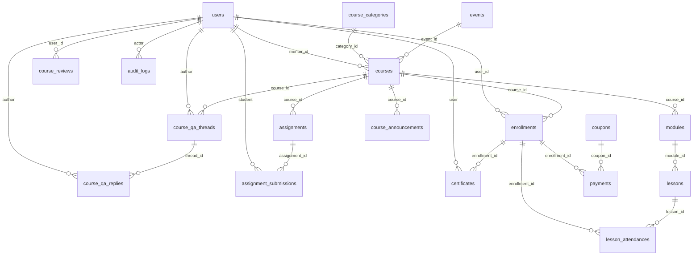
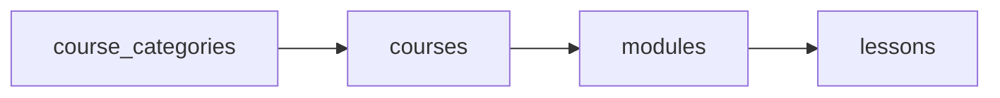

# Skema target (baru) — untuk parity dengan frontend

Dokumen ini mendeskripsikan **skema usulan** = **skema saat ini** + tabel/kolom tambahan agar data bisa menggantikan mock [`seed-data.json`](../../src/lib/data/json/seed-data.json). Ini **bukan** kode yang sudah di-merge — acuan untuk migrasi GORM / SQL.

**Prasyarat:** pahami dulu [current-schema-full.md](./current-schema-full.md).

---

## Prinsip perubahan

| Tujuan | Tindakan |
|--------|----------|
| Kategori kursus | Tabel `course_categories` + FK `courses.category_id` |
| ID publik stabil | Kolom `public_uid` (UUID) pada `users` / `courses` (opsional) atau pakai `slug` saja |
| Q&A | Tabel `course_qa_threads` + `course_qa_replies` |
| Tugas | `assignments` + `assignment_submissions` |
| Sertifikat | `certificates` |
| Review dengan balasan | Perluasan `course_reviews` atau tabel `course_review_replies` |
| Admin: kupon & fee | `coupons` + kolom tambahan di `payments` |
| RBAC | `audit_logs` + opsional normalisasi role |

---

## ERD — gabungan (lama + baru)

**Kotak baru** = entitas yang **belum** ada di `AutoMigrate` sekarang.

---

## Tabel baru — definisi kolom

### `course_categories`

| Kolom | Tipe | Keterangan |
|-------|------|------------|
| `id` | PK (bigserial / uuid) | |
| `name` | `varchar(150)` NOT NULL | |
| `slug` | `varchar(160)` UNIQUE NOT NULL | |
| `description` | `text` | |
| `status` | `varchar(20)` atau ENUM | `active` / `inactive` |
| `color_variant` | `varchar(50)` | Kunci tema UI (mis. `categoryDev`) |
| `created_at`, `updated_at` | `timestamp` | |

### Alter `courses`

| Kolom baru | Tipe | Keterangan |
|------------|------|------------|
| `category_id` | `uint` nullable | FK → `course_categories.id` |
| `strike_price` | `decimal(10,2)` nullable | Harga coret |
| `workflow_status` | `varchar(30)` atau ENUM | draft / pending_approval / published … |
| `submitted_at` | `timestamp` nullable | Untuk alur persetujuan |
| `public_uid` | `uuid` UNIQUE nullable | Alias publik selain `slug` |

### `course_qa_threads`

| Kolom | Tipe |
|-------|------|
| `id` | PK |
| `course_id` | FK → `courses` |
| `author_user_id` | FK → `users` |
| `title` | `varchar(255)` |
| `body` | `text` |
| `status` | `open` / `answered` / `locked` |
| `created_at`, `updated_at` | `timestamp` |

### `course_qa_replies`

| Kolom | Tipe |
|-------|------|
| `id` | PK |
| `thread_id` | FK → `course_qa_threads` |
| `author_user_id` | FK → `users` |
| `body` | `text` |
| `created_at` | `timestamp` |

### `assignments`

| Kolom | Tipe |
|-------|------|
| `id` | PK |
| `course_id` | FK → `courses` (opsional `lesson_id` FK → `lessons`) |
| `title` | `varchar(200)` |
| `description` | `text` |
| `due_at` | `timestamp` |
| `max_score` | `decimal` / `int` |
| `created_at`, `updated_at` | `timestamp` |

### `assignment_submissions`

| Kolom | Tipe |
|-------|------|
| `id` | PK |
| `assignment_id` | FK |
| `enrollment_id` | FK → `enrollments` (menjaga satu enrollment per course) |
| `content` | `text` atau `jsonb` |
| `attachment_urls` | `jsonb` |
| `status` | `draft` / `submitted` / `graded` |
| `score` | nullable |
| `feedback` | `text` |
| `submitted_at`, `graded_at` | `timestamp` |

### `certificates`

| Kolom | Tipe |
|-------|------|
| `id` | PK |
| `enrollment_id` | FK UNIQUE (satu sertifikat per enrollment) atau `user_id`+`course_id` |
| `certificate_number` | `varchar(50)` UNIQUE |
| `issued_at` | `timestamp` |
| `storage_key` atau `pdf_url` | `text` |
| `metadata` | `jsonb` |

### `coupons` (opsional)

| Kolom | Tipe |
|-------|------|
| `id` | PK |
| `code` | `varchar(32)` UNIQUE |
| `type` | `percent` / `fixed` |
| `value` | `decimal` |
| `max_uses`, `used_count` | `int` |
| `expires_at` | `timestamp` |
| `course_id` | nullable FK |

### Alter `payments` (opsional)

| Kolom | Keterangan |
|-------|------------|
| `coupon_id` | FK nullable → `coupons` |
| `fee_merchant`, `fee_customer` | `int` / `decimal` — mirror Tripay |
| `raw_callback` | `jsonb` — audit |

### `audit_logs` (opsional)

| Kolom | Tipe |
|-------|------|
| `id` | PK |
| `actor_user_id` | FK → `users` |
| `action` | `varchar(100)` |
| `entity_type`, `entity_id` | `varchar` + `varchar` |
| `payload` | `jsonb` |
| `created_at` | `timestamp` |

### Perluasan review — opsi A

Tambah di `course_reviews`:

| Kolom | Tipe |
|-------|------|
| `mentor_reply` | `text` nullable |
| `mentor_replied_at` | `timestamp` nullable |

### Opsi B

Tabel `course_review_replies` (1:1 atau 1:N dengan review).

---

## Diagram: alur data kategori → kursus (target)

---

## Referensi

- [evolution-old-vs-new.md](./evolution-old-vs-new.md) — tabel perbandingan migrasi
- [gap-and-proposed-extensions.md](./gap-and-proposed-extensions.md) — checklist gap bisnis
