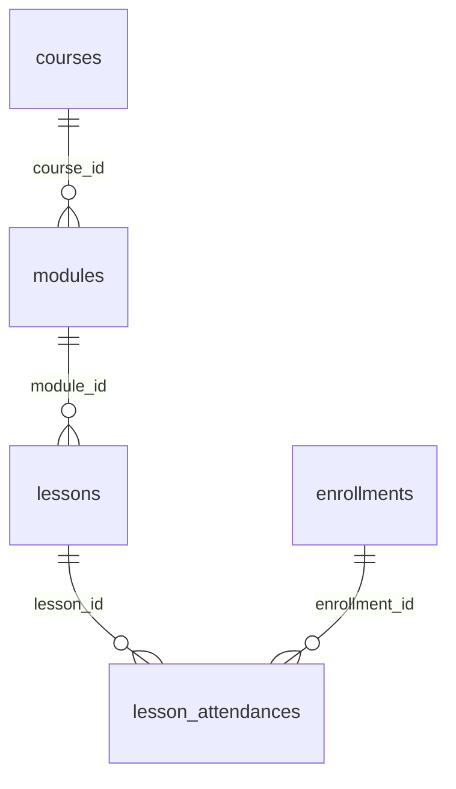
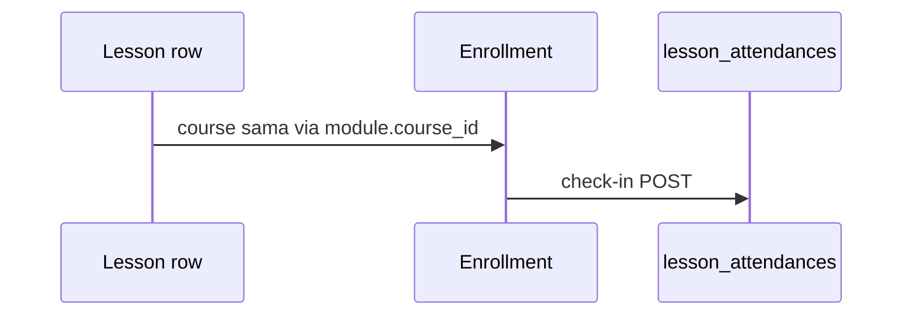

# Lesson — database & ERD

**Sumber:** [`entity/lesson.go`](../../../backend/internal/model/entity/lesson.go), [`connection.go` AutoMigrate](../../../backend/internal/database/connection.go).

---

## Posisi dalam hierarki



- Satu **course** punya banyak **modules**.
- Satu **module** punya banyak **lessons**.
- **Attendance** mengikat **lesson** + **enrollment** (bukan langsung ke user).

---

## Tabel `lessons` (nama GORM plural default)

| Kolom | Tipe (GORM / PostgreSQL) | Null | Keterangan |
|-------|---------------------------|------|------------|
| `id` | PK `uint` | NOT NULL | Auto increment |
| `module_id` | `uint` | NOT NULL | FK → `modules.id` |
| `title` | `varchar(200)` | NOT NULL | Judul lesson |
| `content` | **`jsonb`** | boleh kosong di app | Konten fleksibel — lihat [bentuk JSON](#bentuk-isian-content-jsonb) |
| `video_url` | `varchar(255)` | | URL video eksternal |
| `start_time` | `timestamp` | | Awal sesi (untuk jadwal & logika absensi terlambat) |
| `end_time` | `timestamp` | | Akhir sesi |
| `order_index` | `int` | | Urutan dalam modul |
| `created_at` | `timestamp` | | |
| `updated_at` | `timestamp` | | |

**Index:** tidak ada index tambahan di struct selain PK & implisit FK.

---

## Relasi ke tabel lain

| Tabel | Arah | FK | Keterangan |
|-------|------|-----|------------|
| `modules` | lesson → module | `module_id` | Parent langsung |
| `lesson_attendances` | attendance → lesson | `lesson_id` | Satu baris per pasangan lesson + enrollment (unik disarankan di level aplikasi) |

---

## Bentuk isian `content` (JSONB)

Backend **tidak** memaksa skema tertentu — `interface{}` di DTO → diserialisasi ke JSONB. Untuk **selaraskan dengan frontend** ([`ILesson`](../../src/lib/types/course.ts)), disarankan salah satu pola berikut.

### Opsi A — bungkus versi + payload frontend

```json
{
  "version": 2,
  "contentType": "tiptap",
  "contentHtml": "<p>...</p>"
}
```

```json
{
  "version": 2,
  "contentType": "video",
  "videoUrl": "https://youtube.com/...",
  "contentHtml": "<p>Deskripsi opsional</p>"
}
```

```json
{
  "version": 2,
  "contentType": "quiz",
  "quiz": {
    "passingScore": 70,
    "questions": [
      {
        "id": "q1",
        "prompt": "Apa itu React?",
        "options": [
          { "id": "a", "label": "Library JS" },
          { "id": "b", "label": "Database" }
        ],
        "correctOptionId": "a",
        "explanation": "Opsional"
      }
    ]
  }
}
```

### Opsi B — simpan HTML TipTap / ProseMirror JSON mentah

TipTap bisa menghasilkan **HTML** atau **JSON dokumen**. Simpan sebagai string/HTML di key tunggal jika ingin sederhana:

```json
{
  "html": "<article>...</article>"
}
```

**Catatan integrasi:** sampai API menyimpan struktur di atas, editor mentor memakai **localStorage** (`mentor_course_modules_v2_*`) — lihat [02-frontend](./02-frontend-wysiwyg-quiz-video.md).

---

## Quiz di DB (saat ini)

Tidak ada tabel terpisah `quiz` — data quiz termasuk dalam **`content` JSONB** jika memakai Opsi A.

**Usulan produk:** jika perlu query analitik per soal, normalisasi ke tabel `quiz_questions` (lihat [proposed-schema-target](../database/proposed-schema-target.md)).

---

## Diagram alur data lesson → absensi



---

## Dokumen terkait

- [03-rest-api-complete.md](./03-rest-api-complete.md) — CRUD REST
- [database/current-schema-full.md](../database/current-schema-full.md) — cuplikan tabel `lessons`
