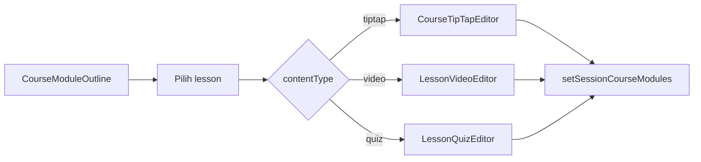

# Lesson — frontend: WYSIWYG, video, quiz

**Sumber tipe:** [`frontend/src/lib/types/course.ts`](../../src/lib/types/course.ts)  
**Editor:** [`TiptapRichTextEditor`](../../src/components/rich-text/TiptapRichTextEditor.tsx)  
**Halaman edit:** [`CourseEditClient`](../../src/app/(authorized)/mentor/courses/[courseUid]/edit/_components/CourseEditClient.tsx)

---

## Model data lesson (`ILesson`)

Lesson adalah **discriminated union** berdasarkan `contentType`:

| `contentType` | Field tambahan | UI |
|---------------|----------------|-----|
| `tiptap` | `contentHtml: string` | TipTap (WYSIWYG): heading, bold, list, quote, code block, align, warna, highlight, YouTube, gambar, link |
| `video` | `videoUrl: string`, `contentHtml?` | Input URL video + teks opsional TipTap |
| `quiz` | `quiz: IQuiz` | [`LessonQuizEditor`](../../src/app/(authorized)/mentor/courses/[courseUid]/edit/_components/LessonQuizEditor.tsx) |

Semua varian memakai basis:

```ts
interface ILessonBase {
  id: string
  title: string
  order: number
  durationMinutes: number
}
```

---

## Quiz (`IQuiz`, `IQuizQuestion`, `IQuizOption`)

```ts
interface IQuizOption {
  id: string
  label: string
}

interface IQuizQuestion {
  id: string
  prompt: string
  options: IQuizOption[]
  correctOptionId: string
  explanation?: string
}

interface IQuiz {
  questions: IQuizQuestion[]
  passingScore?: number   // default UI ~70
}
```

- Setiap pertanyaan punya beberapa opsi; **satu** jawaban benar lewat `correctOptionId`.
- UI editor: passing score 0–100%, tambah/hapus pertanyaan, edit prompt & label opsi.

**Belum ada** penyimpanan hasil pengerjaan quiz siswa di backend — itu bagian assignment/quiz attempt (usulan schema terpisah).

---

## WYSIWYG (TipTap)

Fitur toolbar (ringkas): Heading 1–3, paragraf, bold/italic/underline/strike, inline code, bullet/ordered list, blockquote, code block, HR, align kiri/tengah/kanan/justify, warna teks, highlight, undo/redo, embed **YouTube**, **gambar** (URL), **link**.

Styles: [`tiptap-editor.css`](../../src/styles/tiptap-editor.css).

---

## Penyimpanan saat ini (mock / client)

| Mekanisme | Key / fungsi | Isi |
|-----------|----------------|-----|
| Session modul per kursus | `mentor_course_modules_v2_<courseUid>` | `ICourseModulesState`: `{ version: 2, modules: IModule[] }` |
| Meta kursus | `mentor_course_meta_<courseUid>` | Judul, gambar, published, dll. |
| Merge dengan seed | [`mentorCourseStorage.ts`](../../src/lib/mentorCourseStorage.ts) | Gabung `repository` + local |

**Sinkron ke API:** saat backend siap, map `IModule[]` / `ILesson` → `POST/PUT /modules`, `POST/PUT /lessons` dengan `content` = JSON hasil serialisasi union di atas.

---

## Alur editor mentor



---

## Preview siswa / publik

Komponen preview konten (mis. assignment) memakai kelas `tiptap-preview` — lihat [`SubmissionContentView`](../../src/components/assignments/SubmissionContentView.tsx).

---

## Dokumen terkait

- [01-database-and-erd.md](./01-database-and-erd.md) — JSONB `content`
- [03-rest-api-complete.md](./03-rest-api-complete.md) — API
