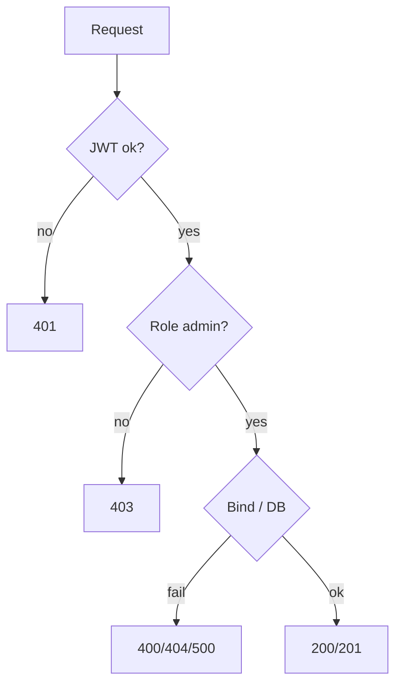

# Lesson — matriks status HTTP

Semua respons memakai envelope `success`, `message`, `data`, `error` ([response-envelope.md](../api/response-envelope.md)).

---

## CRUD `/lessons` (admin only)

### `POST /lessons/`

| HTTP    | Kondisi                            | `message` (contoh)                                     |
| ------- | ---------------------------------- | ------------------------------------------------------ |
| **201** | Lesson tersimpan                   | `Lesson created successfully`                          |
| **400** | Body tidak valid                   | `Invalid request data`                                 |
| **401** | Tanpa JWT / JWT invalid            | `Authorization header missing` / pesan dari middleware |
| **403** | User bukan admin                   | `Access denied: Admins only`                           |
| **404** | User ID dari token tidak ada di DB | `User not found`                                       |
| **500** | Error insert                       | `Failed to create lesson`                              |

---

### `GET /lessons/`

| HTTP    | Kondisi              | `message` (contoh)                                       |
| ------- | -------------------- | -------------------------------------------------------- |
| **200** | OK                   | `Lessons retrieved successfully`                         |
| **401** | Middleware           | —                                                        |
| **403** | Bukan admin          | `Access denied: Admins only`                             |
| **404** | User tidak ditemukan | `User not found`                                         |
| **500** | Count/query gagal    | `Failed to count lessons` / `Failed to retrieve lessons` |

---

### `GET /lessons/:id`

| HTTP    | Kondisi                                  |
| ------- | ---------------------------------------- |
| **200** | `Lesson retrieved successfully`          |
| **401** | Middleware                               |
| **403** | `Access denied: Admins only`             |
| **404** | `User not found` atau `Lesson not found` |
| **500** | Jarang — query gagal                     |

---

### `PUT /lessons/:id`

| HTTP    | Kondisi                          |
| ------- | -------------------------------- |
| **200** | `Lesson updated successfully`    |
| **400** | `Invalid request data`           |
| **401** | Middleware                       |
| **403** | `Access denied: Admins only`     |
| **404** | User atau lesson tidak ditemukan |
| **500** | `Failed to update lesson`        |

---

### `DELETE /lessons/:id`

| HTTP    | Kondisi                                     |
| ------- | ------------------------------------------- |
| **200** | `Lesson deleted successfully`, `data: null` |
| **401** | Middleware                                  |
| **403** | `Access denied: Admins only`                |
| **404** | User atau lesson tidak ditemukan            |
| **500** | `Failed to delete lesson`                   |

---

## Diagram status (CRUD lesson)

