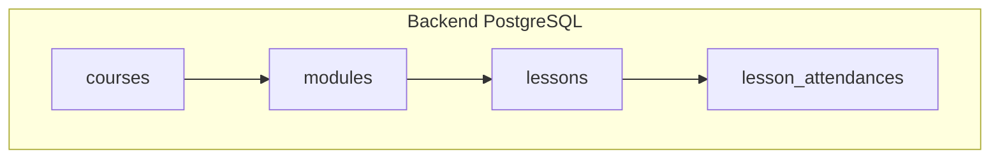

# Lesson — dokumentasi lengkap

Lesson adalah unit pembelajaran di bawah **modul** pada sebuah **kursus**. Di backend disimpan sebagai baris tabel `lessons` dengan **`content` JSONB**; di frontend (editor mentor) lesson dapat berupa **teks kaya (TipTap/WYSIWYG)**, **video**, atau **quiz**.

| # | Dokumen | Isi |
|---|---------|-----|
| 1 | [01-database-and-erd.md](./01-database-and-erd.md) | Tabel `lessons`, relasi ke `modules` & `lesson_attendances`, diagram, bentuk `content` JSON |
| 2 | [02-frontend-wysiwyg-quiz-video.md](./02-frontend-wysiwyg-quiz-video.md) | Tipe `ILesson`, TipTap, quiz (`IQuiz`), penyimpanan `mentorCourseStorage` |
| 3 | [03-rest-api-complete.md](./03-rest-api-complete.md) | Semua endpoint `/lessons/*` — request/response lengkap |
| 4 | [04-http-status-matrix.md](./04-http-status-matrix.md) | Matriks status HTTP per endpoint lesson |

**Referensi umum:** [api/response-envelope.md](../api/response-envelope.md), [api/route-map.md](../api/route-map.md), [database/current-schema-full.md](../database/current-schema-full.md) (bagian `lessons`).

