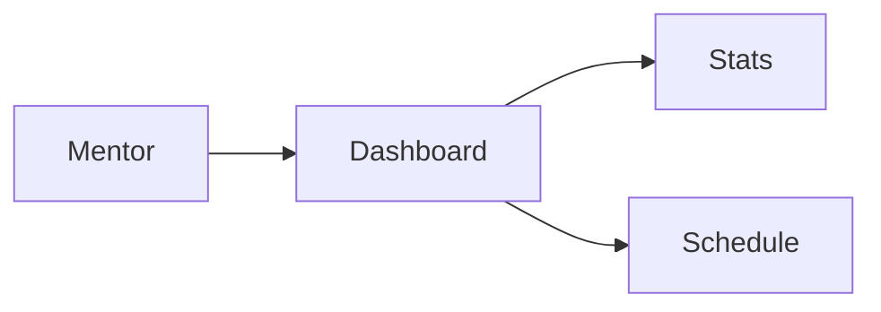

# Mentor — Dashboard

## Ringkasan

Jadwal dan statistik mentor: [`ScheduleList`](../../src/app/(authorized)/mentor/dashboard/_components/ScheduleList.tsx).

**Envelope:** [response-envelope.md](../api/response-envelope.md).

## Status

| Aspek | Backend |
|-------|---------|
| `GET /mentor/dashboard` | **Belum** |

---

## Data turunan yang ada

- **Profil:** `GET /user/data` — [shared/03-profile](../shared/03-profile.md#get-userdata).
- **Kursus milik mentor:** `GET /courses?mentor_id=<id>` — respons penuh [student/02-learning](../student/02-learning.md#get-courses-jwt).

---

## Usulan `GET /api/v1/mentor/dashboard`

**Headers:** `Authorization: Bearer <jwt>`

**Response 200**

```json
{
  "success": true,
  "message": "Mentor dashboard loaded",
  "data": {
    "mentor": {
      "id": 2,
      "name": "Dewi",
      "email": "...",
      "role": "mentor"
    },
    "stats": {
      "active_courses": 3,
      "students_total": 95,
      "pending_reviews": 4
    },
    "schedule": [
      {
        "id": "evt-1",
        "title": "Kelas pagi",
        "starts_at": "2026-04-20T09:00:00Z",
        "course_id": 5
      }
    ]
  },
  "error": null
}
```

**401 / 403**

```json
{
  "success": false,
  "message": "Forbidden",
  "data": null,
  "error": null
}
```

---

## Alur


