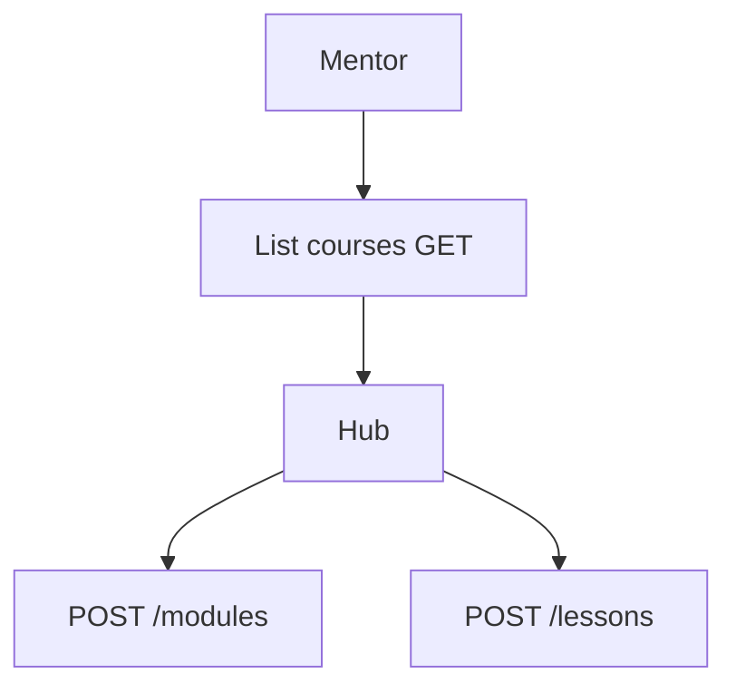

# Mentor — Courses

## Ringkasan

Hub kursus, edit, modul, lesson. Komponen: [`MentorCoursesSection`](../../src/app/(authorized)/mentor/courses/_components/MentorCoursesSection.tsx), [`CourseHubClient`](../../src/app/(authorized)/mentor/courses/[courseUid]/_components/CourseHubClient.tsx).

**Envelope:** [response-envelope.md](../api/response-envelope.md) · **Route map:** [modules & lessons](../api/route-map.md#4-modules-jwt).

---

## Backend — peran saat ini

| Endpoint | Peran di kode | Catatan produk |
|----------|----------------|------------------|
| `POST /courses` | **Admin** | Mentor perlu policy “owner” atau endpoint dedicated |
| `POST /modules/` | **Admin** | |
| `POST /lessons/` | **Admin** | |
| `GET /courses`, `GET /courses/:id` | Semua JWT | Baca |

---

## `POST /modules/` (Admin) — body lengkap

**Content-Type:** `application/json`

```json
{
  "course_id": 5,
  "title": "Pendahuluan",
  "order_index": 1
}
```

**Response 201**

```json
{
  "success": true,
  "message": "Module created successfully",
  "data": {
    "id": 3,
    "course_id": 5,
    "title": "Pendahuluan",
    "order_index": 1,
    "created_at": "2026-04-19T10:00:00Z"
  },
  "error": null
}
```

**403**

```json
{
  "success": false,
  "message": "Access denied: Admins only",
  "data": null,
  "error": null
}
```

---

## `POST /lessons/` (Admin) — body lengkap

```json
{
  "module_id": 3,
  "title": "Video 1",
  "content": { "type": "doc", "body": [] },
  "video_url": "https://...",
  "start_time": "2026-04-20T10:00:00+07:00",
  "end_time": "2026-04-20T11:00:00+07:00",
  "order_index": 1
}
```

**Response 201** — `data` = entity `Lesson`.

---

## `POST /avatar` (upload materi profil)

Lihat [shared/03-profile — avatar](../shared/03-profile.md#post-avatar).

---

## Gap produk

- UI mentor mengharapkan **create course** sebagai mentor — selaraskan middleware atau tambah **`mentor_id`** otomatis dari JWT pada `POST /courses` khusus mentor.

---

## Alur


