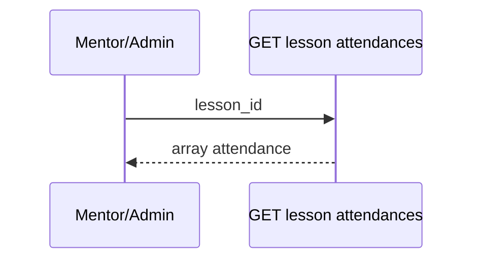

# Mentor — Attendance

## Ringkasan

Monitoring absensi siswa per lesson. Mock/storage: [`mentorAttendanceStorage`](../../src/lib/mentorAttendanceStorage.ts).

**Envelope:** [response-envelope.md](../api/response-envelope.md).

---

## Backend — `GET /lessons/attendances/lesson/:lesson_id` (Admin only)

**Response 200**

```json
{
  "success": true,
  "message": "Attendances retrieved successfully",
  "data": [
    {
      "id": 99,
      "lesson_id": 10,
      "enrollment_id": 12,
      "status": "present",
      "note": "",
      "checked_in_at": "2026-04-19T08:00:00Z",
      "created_at": "2026-04-19T08:00:00Z",
      "updated_at": "2026-04-19T08:00:00Z"
    }
  ],
  "error": null
}
```

**403** — bukan admin:

```json
{
  "success": false,
  "message": "Access denied: Admins only",
  "data": null,
  "error": null
}
```

*Saat ini mentor **bukan** admin di handler ini — **usulan:** izinkan `mentor` jika `course.mentor_id == user.id`.*

---

## Backend — `PUT /lessons/attendances/:id` (Admin only)

**Body**

```json
{
  "status": "present",
  "note": "Disetujui"
}
```

**Response 200**

```json
{
  "success": true,
  "message": "Attendance updated successfully",
  "data": {
    "id": 99,
    "lesson_id": 10,
    "enrollment_id": 12,
    "status": "present",
    "note": "Disetujui",
    "updated_at": "2026-04-19T09:00:00Z"
  },
  "error": null
}
```

---

## Siswa — referensi

Create/check-in: [student/04-attendance](../student/04-attendance.md).

---

## Alur


