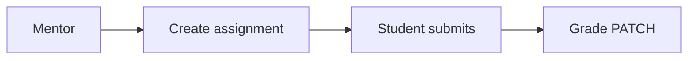

# Mentor — Assignments

## Ringkasan

Kelola tugas dan penilaian: [`MentorAssignmentsHubClient`](../../src/app/(authorized)/mentor/assignments/_components/MentorAssignmentsHubClient.tsx).

**Envelope:** [response-envelope.md](../api/response-envelope.md).

## Status

| Aspek | Backend |
|-------|---------|
| CRUD assignment | **Belum** |

---

## Usulan — buat tugas

**POST** `/api/v1/mentor/courses/:courseId/assignments`

**Request**

```json
{
  "title": "Tugas 1",
  "description": "Kerjakan modul 3",
  "due_at": "2026-04-30T23:59:59Z",
  "max_score": 100
}
```

**Response 201**

```json
{
  "success": true,
  "message": "Assignment created",
  "data": {
    "id": "asg-001",
    "course_id": 5,
    "title": "Tugas 1",
    "due_at": "2026-04-30T23:59:59Z",
    "max_score": 100,
    "created_at": "2026-04-19T10:00:00Z"
  },
  "error": null
}
```

---

## Usulan — daftar submission

**GET** `/api/v1/mentor/assignments/:assignmentId/submissions`

**Response 200**

```json
{
  "success": true,
  "message": "OK",
  "data": {
    "items": [
      {
        "submission_id": "sub-1",
        "student": { "id": 3, "name": "Rafi" },
        "status": "submitted",
        "submitted_at": "2026-04-19T12:00:00Z",
        "score": null
      }
    ]
  },
  "error": null
}
```

---

## Usulan — nilai

**PATCH** `/api/v1/mentor/submissions/:submissionId/grade`

**Request**

```json
{
  "score": 85,
  "feedback": "Bagus, perbaiki bagian routing."
}
```

**Response 200**

```json
{
  "success": true,
  "message": "Graded",
  "data": {
    "submission_id": "sub-1",
    "score": 85,
    "graded_at": "2026-04-19T15:00:00Z"
  },
  "error": null
}
```

| HTTP | Kondisi |
|------|---------|
| 403 | Bukan mentor course ini |
| 404 | Submission tidak ada |

---

## Siswa — mirror

[student/03-assignments](../student/03-assignments.md).

---

## Alur


