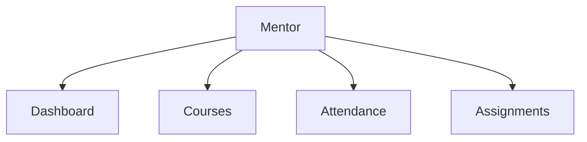

# PRD — Area Mentor (Authorized)

**Base path:** `/mentor/*`  
**Navigasi:** [`mentorNavigation`](../../src/lib/navigation.ts)

**Standar dokumentasi:** [envelope](../api/response-envelope.md), [route map](../api/route-map.md), contoh JSON lengkap.

| # | Fitur | Dokumen | Rute utama |
|---|--------|---------|------------|
| 1 | Dashboard | [01-dashboard.md](./01-dashboard.md) | `/mentor/dashboard` |
| 2 | Courses | [02-courses.md](./02-courses.md) | `/mentor/courses`, `/mentor/courses/[courseUid]/*` |
| 3 | Attendance | [03-attendance.md](./03-attendance.md) | `/mentor/attendance` |
| 4 | Assignments | [04-assignments.md](./04-assignments.md) | `/mentor/assignments` |

