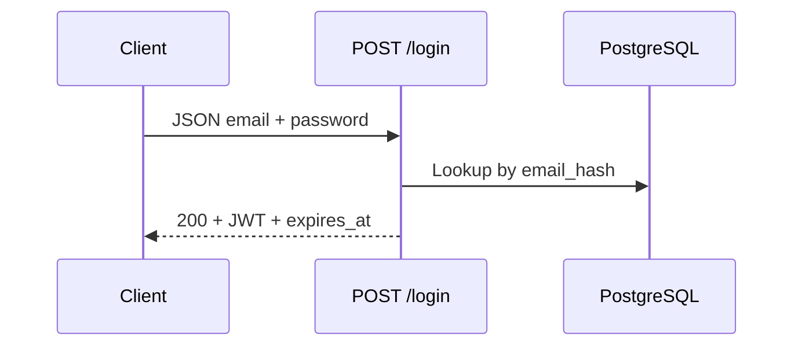

# Shared — Authentication

## Ringkasan

Login dan registrasi memakai endpoint backend **tanpa** prefix `/api` — path pasti: `POST /login` dan `POST /register` (lihat [`routes/login.go`](../../../backend/internal/handler/routes/login.go), [`register.go`](../../../backend/internal/handler/routes/register.go)).

**Envelope respons** standar backend:

```json
{
  "success": true,
  "message": "...",
  "data": {},
  "error": null
}
```

Detail: [response-envelope.md](../api/response-envelope.md).

## Rute frontend

| Path | File |
|------|------|
| `/auth/login` | [`auth/login/page.tsx`](../../src/app/auth/login/page.tsx) |
| `/auth/register` | [`auth/register/page.tsx`](../../src/app/auth/register/page.tsx) |
| `/auth/forgot-password` | [`auth/forgot-password/page.tsx`](../../src/app/auth/forgot-password/page.tsx) |
| `/auth/reset-password` | [`auth/reset-password/page.tsx`](../../src/app/auth/reset-password/page.tsx) |

OAuth backend: `GET /oauth/google/login`, `GET /oauth/google/callback`.

---

## `POST /login`

| Properti | Nilai |
|----------|--------|
| **Auth** | Tidak |
| **Content-Type** | `application/json` |

### Request body

```json
{
  "email": "user@example.com",
  "password": "StrongPassword123"
}
```

| Field | Tipe | Aturan |
|-------|------|--------|
| `email` | string | Wajib, format email |
| `password` | string | Wajib |

### Response sukses — **200 OK**

```json
{
  "success": true,
  "message": "User logged in successfully!",
  "data": {
    "token": "<JWT>",
    "expires_at": "2026-04-20T15:00:00+07:00"
  },
  "error": null
}
```

- Simpan `token` untuk header `Authorization: Bearer <token>` (atau kirim token saja — keduanya didukung middleware).
- `expires_at` dalam **RFC3339** (24 jam dari login).

### Response error

| HTTP | Kapan | Contoh `message` | `error` |
|------|--------|------------------|---------|
| **400** | JSON tidak valid / validasi Gin | `Invalid request data` | string validator, mis. `Key: 'LoginRequest.Email' Error:Field validation for 'Email' failed on the 'email' tag` |
| **401** | Email tidak terdaftar atau password salah | `Invalid credentials` | `"Authentication failed"` |
| **500** | Gagal signing JWT | `Failed to generate token` | detail error |

**Contoh 401**

```json
{
  "success": false,
  "message": "Invalid credentials",
  "data": null,
  "error": "Authentication failed"
}
```

---

## `POST /register`

| Properti | Nilai |
|----------|--------|
| **Auth** | Tidak |
| **Content-Type** | `application/json` |

### Request body

```json
{
  "name": "User DU",
  "email": "user@example.com",
  "password": "StrongPassword123"
}
```

| Field | Tipe | Aturan |
|-------|------|--------|
| `name` | string | Wajib |
| `email` | string | Wajib, email |
| `password` | string | Wajib |

### Response sukses — **200 OK**

Sama struktur dengan login: `data.token`, `data.expires_at`, role default **`student`** di database.

### Response error

| HTTP | Kapan | `message` | `error` |
|------|--------|-----------|---------|
| **400** | Validasi gagal | `Invalid request data` | string |
| **409** | Email sudah ada (unik DB) | `Email already registered` | **null** |
| **500** | Hash password gagal / create user gagal / JWT gagal | Sesuai handler | string atau null |

**Contoh 409**

```json
{
  "success": false,
  "message": "Email already registered",
  "data": null,
  "error": null
}
```

---

## Forgot / reset password (UI)

Form di frontend dapat memanggil endpoint backend **jika/waktu** tersedia (saat ini tidak tercantum di `handler/routes`). Kontrak yang disarankan:

- `POST /auth/forgot-password` — body `{ "email": "..." }` — **202** atau **200** dengan pesan generik (jangan expose apakah email terdaftar).
- `POST /auth/reset-password` — body `{ "token": "...", "new_password": "..." }`.

---

## Diagram



---

## Referensi

- [API route map — login/register](../api/route-map.md#1-autentikasi-publik)
- Implementasi: [`PostLoginFunc`](../../../backend/internal/service/login.go), [`PostRegisterFunc`](../../../backend/internal/service/register.go)
