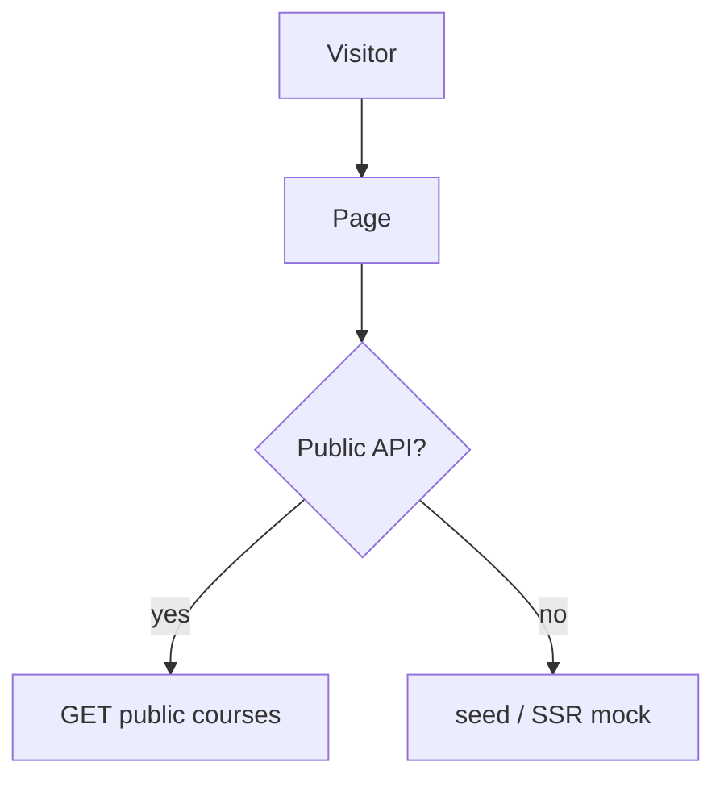

# Shared — Public course (katalog & detail)

## Ringkasan

Halaman kursus untuk pengunjung: [`course/[uid]/page.tsx`](../../src/app/course/[uid]/page.tsx), [`course/[uid]/view/page.tsx`](../../src/app/course/[uid]/view/page.tsx), [`CourseDetailHero`](../../src/components/course/detail/CourseDetailHero.tsx).

**Envelope:** [response-envelope.md](../api/response-envelope.md).

## Rute frontend

| Path | Keterangan |
|------|------------|
| `/course/[uid]` | Landing detail |
| `/course/[uid]/view` | Preview konten |

---

## Backend saat ini — tidak publik

**GET** `/courses` dan **GET** `/courses/:id` memakai **JWT** ([`AuthMiddleware`](../../../backend/internal/handler/middleware/middleware.go)).

**Response 401 tanpa token:**

```json
{
  "success": false,
  "message": "Authorization header missing",
  "data": null,
  "error": null
}
```

Dengan token, respons **200** mengikuti [student/02-learning — GET /courses & GET by id](../student/02-learning.md).

---

## Usulan — katalog publik

### `GET /api/v1/public/courses`

Tanpa JWT (atah middleware terpisah).

**Query:** `page`, `per_page`, `q`, `category_slug`

**Response 200**

```json
{
  "success": true,
  "message": "Public courses listed",
  "data": {
    "courses": [
      {
        "id": 5,
        "slug": "react-fundamentals",
        "title": "React Fundamentals",
        "description": "...",
        "thumbnail_url": "https://...",
        "price": 199000,
        "is_premium": true,
        "mentor": {
          "id": 2,
          "name": "Dewi",
          "avatar_url": "https://..."
        },
        "rating_avg": 4.8,
        "review_count": 120
      }
    ],
    "meta": {
      "total": 50,
      "page": 1,
      "per_page": 12,
      "total_pages": 5
    }
  },
  "error": null
}
```

---

### `GET /api/v1/public/courses/:slug`

**Response 200**

```json
{
  "success": true,
  "message": "OK",
  "data": {
    "id": 5,
    "slug": "react-fundamentals",
    "title": "React Fundamentals",
    "description": "Long text...",
    "thumbnail_url": "https://...",
    "price": 199000,
    "strike_price": null,
    "mentor": {
      "id": 2,
      "name": "Dewi",
      "bio": "...",
      "avatar_url": "https://..."
    },
    "modules_preview": [
      { "id": 1, "title": "Modul 1", "lesson_count": 4 }
    ],
    "rating_avg": 4.8,
    "review_count": 120
  },
  "error": null
}
```

**Response 404**

```json
{
  "success": false,
  "message": "Course not found",
  "data": null,
  "error": null
}
```

---

## Gap identitas

- UI memakai **`[uid]`** di path; backend memakai **`id`** numerik dan **`slug`**. Sandingkan: `uid` = slug atau UUID kolom baru.

---

## Diagram


