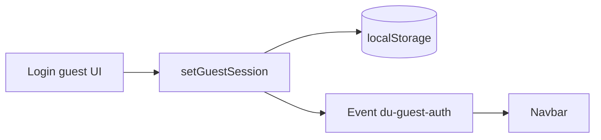

# Shared — Not found & guest session

## Not found (Next.js)

Halaman: [`not-found.tsx`](../../src/app/not-found.tsx), [`(authorized)/not-found.tsx`](../../src/app/(authorized)/not-found.tsx), [`NotFoundContent`](../../src/components/feedback/NotFoundContent.tsx).

### Respons HTTP

| Aspek | Nilai |
|-------|--------|
| Status | **404** (dikirim oleh App Router untuk segment tidak dikenal) |
| Body | HTML halaman Next.js — **bukan** envelope JSON Gin |

**Tidak ada** body JSON standar `success/message/data` untuk 404 Next — itu khusus **API route** jika Anda buat sendiri:

### Usulan API 404 (jika ada BFF)

**GET** `/api/v1/...` resource tidak ada:

```json
{
  "success": false,
  "message": "Not found",
  "data": null,
  "error": "resource not found"
}
```

---

## Guest session (klien saja)

[`guest-session.ts`](../../src/lib/auth/guest-session.ts):

| Properti | Nilai |
|----------|--------|
| Key | `du_guest_session_v1` |
| Nilai aktif | `'1'` |
| Event | `du-guest-auth` (dispatch saat set/clear) |

### API

Tidak memanggil backend — hanya `localStorage` + event.

### Usulan session server (opsional)

**POST** `/api/v1/guest/session`

**Response 200**

```json
{
  "success": true,
  "message": "Guest session created",
  "data": {
    "guest_token": "<opaque>",
    "expires_at": "2026-04-20T10:00:00Z"
  },
  "error": null
}
```

**Response 401** — tidak dipakai untuk guest anonim; sesuaikan kebijakan produk.

---

## Alur guest



## PRD keamanan

- Guest flag **bukan** pengganti JWT untuk data sensitif.
- Untuk checkout tanpa akun, gunakan flow pembayaran guest di gateway + email struk — definisikan di backend.
