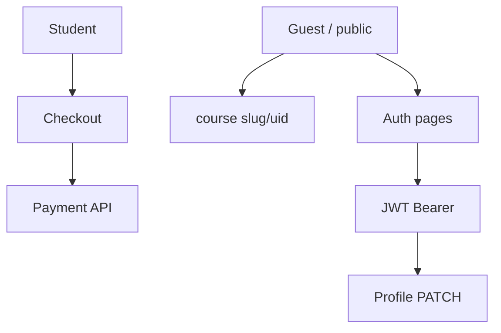

# PRD — Fitur bersama (Auth, Checkout, Publik, Profil)

Dokumen untuk alur **tidak terikat satu peran** atau melintasi guest/student.

| # | Fitur | Dokumen |
|---|--------|---------|
| 1 | Autentikasi (login, register, forgot/reset password) | [01-authentication.md](./01-authentication.md) — request/response & status dari backend |
| 2 | Checkout & invoice | [02-checkout-and-invoice.md](./02-checkout-and-invoice.md) — payment + invoice |
| 3 | Profil pengguna | [03-profile.md](./03-profile.md) — `/user/*`, `/avatar` |

**Referensi teknis terpusat:** [API route map](../api/route-map.md), [response envelope](../api/response-envelope.md).
| 4 | Katalog publik & detail kursus | [04-public-course-catalog.md](./04-public-course-catalog.md) |
| 5 | Not found & guest session | [05-not-found-and-guest.md](./05-not-found-and-guest.md) |

