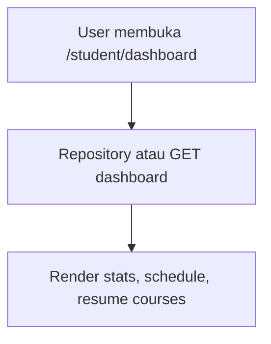

# Student — Dashboard

## Ringkasan

Halaman ringkasan pembelajaran siswa: statistik, jadwal/deadline, kursus yang dilanjutkan, dan insight cepat.

| Sumber | Lokasi |
|--------|--------|
| UI | [`student/dashboard/page.tsx`](../../src/app/(authorized)/student/dashboard/page.tsx) |
| Data mock | [`getDashboardData()`](../../src/lib/data/repository.ts), tipe [`DashboardData`](../../src/lib/types/index.ts) |

**Envelope backend** (seluruh API): [response-envelope.md](../api/response-envelope.md).

## Status implementasi

| Aspek | Status |
|-------|--------|
| UI | Terpasang |
| Data | **Mock** — `seed-data.json` via repository |
| API | **Belum** ada `GET /student/dashboard` di backend — gunakan komposisi endpoint di bawah atau endpoint agregat usulan |

---

## Backend yang bisa dikombinasikan (ada hari ini)

Tidak ada satu endpoint “dashboard siswa”. Data dapat disusun dari:

| Kebutuhan UI | Endpoint backend | Catatan |
|--------------|------------------|---------|
| Profil + enrollment | `GET /user/data` | Lihat [route map — User](../api/route-map.md#2-user--avatar-jwt) |
| Daftar kursus | `GET /courses` | Query `page`, `per_page`, filter |
| Satu kursus + modul | `GET /courses/:id` | Preload `Modules` |

### Contoh: `GET /user/data` (respons penuh — 200 OK)

```json
{
  "success": true,
  "message": "User data retrieved successfully",
  "data": {
    "id": 3,
    "name": "Rafi Pratama",
    "email": "rafi@student.dsu.ac.id",
    "avatar_url": "https://...",
    "role": "student",
    "is_verified": true,
    "description": "",
    "enrollments": [
      {
        "id": 10,
        "user_id": 3,
        "course_id": 5,
        "enrolled_at": "2026-04-10T08:00:00Z",
        "progress": 35.5,
        "status": "active",
        "course": {
          "id": 5,
          "title": "React Fundamentals",
          "slug": "react-fundamentals",
          "thumbnail_url": "https://...",
          "price": 199000,
          "mentor_id": 2,
          "modules": []
        }
      }
    ],
    "created_at": "2026-01-01T00:00:00Z",
    "updated_at": "2026-04-18T12:00:00Z"
  },
  "error": null
}
```

| HTTP | Kondisi |
|------|---------|
| 401 | Header `Authorization` hilang / JWT invalid |
| 500 | Gagal query user |

---

## Usulan endpoint agregat (belum di backend)

**GET** `/api/v1/student/dashboard` (atau nama setara)

**Headers:** `Authorization: Bearer <jwt>`

### Response 200 (envelope — usulan)

```json
{
  "success": true,
  "message": "Student dashboard loaded",
  "data": {
    "stats": {
      "active_courses": 3,
      "completed_lessons": 42,
      "assignments_due": 2,
      "attendance_rate": 0.94
    },
    "schedule": [
      {
        "id": "sch-1",
        "title": "Live session",
        "course_title": "React",
        "starts_at": "2026-04-20T10:00:00Z",
        "type": "live"
      }
    ],
    "resume_courses": [
      {
        "course_id": 5,
        "course_slug": "react-fundamentals",
        "title": "React Fundamentals",
        "progress_percent": 35,
        "last_visited_at": "2026-04-18T08:00:00Z"
      }
    ],
    "deadlines": [],
    "feedback": []
  },
  "error": null
}
```

### Response error (usulan)

```json
{
  "success": false,
  "message": "Unauthorized",
  "data": null,
  "error": null
}
```

| HTTP | Kondisi |
|------|---------|
| 401 | Token tidak valid |
| 403 | Bukan peran `student` |

---

## Alur pengguna



## Catatan PRD

- KPI harus disepakati dengan produk (sumber: agregasi SQL vs cache Redis).
- Setelah integrasi, samakan **snake_case** vs **camelCase** dengan konvensi frontend (`repository` bisa tetap memetakan).
