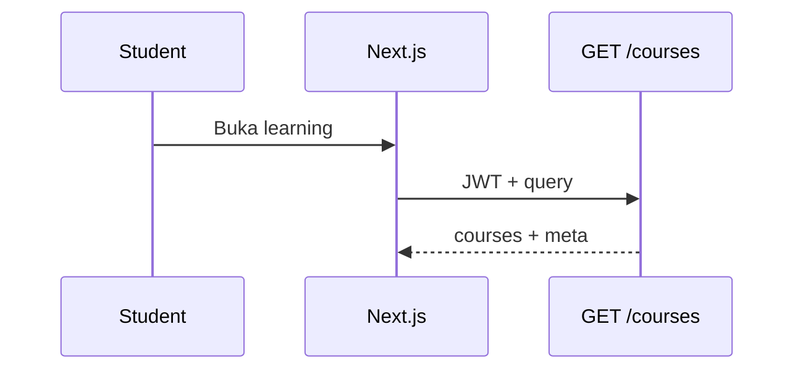

# Student — My Learning

## Ringkasan

Kursus yang diikuti siswa dan detail pembelajaran per kursus (modul, lesson).

| Sumber | Lokasi |
|--------|--------|
| UI | [`student/learning/page.tsx`](../../src/app/(authorized)/student/learning/page.tsx), [`student/learning/[courseUid]/page.tsx`](../../src/app/(authorized)/student/learning/[courseUid]/page.tsx) |
| Mock | [`repository.ts`](../../src/lib/data/repository.ts), `StudentEnrolledCourse`, `IModule` |

**Envelope:** [response-envelope.md](../api/response-envelope.md) · **Route map:** [route-map.md](../api/route-map.md).

---

## Backend — endpoint terkait

### `GET /courses` (JWT)

**Query (opsional):** `page`, `per_page` (max 100), `mentor_id`, `title`, `price`, `is_premium`

**Response 200 — contoh penuh**

```json
{
  "success": true,
  "message": "Courses retrieved successfully",
  "data": {
    "courses": [
      {
        "id": 5,
        "event_id": null,
        "mentor_id": 2,
        "title": "React Fundamentals",
        "slot": 30,
        "slug": "react-fundamentals",
        "description": "...",
        "thumbnail_url": "https://...",
        "price": 199000,
        "is_premium": true,
        "is_published": true,
        "created_at": "2026-01-01T00:00:00Z",
        "updated_at": "2026-04-01T00:00:00Z",
        "modules": []
      }
    ],
    "meta": {
      "total": 12,
      "per_page": 10,
      "current_page": 1,
      "total_pages": 2
    }
  },
  "error": null
}
```

| HTTP | Kondisi |
|------|---------|
| 401 | JWT |
| 404 | User dari token tidak ditemukan (handler saat ini) |
| 500 | Gagal count/query |

---

### `GET /courses/:id` (JWT)

**Response 200 — contoh**

```json
{
  "success": true,
  "message": "Course retrieved successfully",
  "data": {
    "id": 5,
    "title": "React Fundamentals",
    "slug": "react-fundamentals",
    "description": "...",
    "thumbnail_url": "https://...",
    "price": 199000,
    "mentor_id": 2,
    "modules": [
      {
        "id": 1,
        "course_id": 5,
        "title": "Pendahuluan",
        "order_index": 1,
        "created_at": "2026-01-01T00:00:00Z",
        "lessons": []
      }
    ]
  },
  "error": null
}
```

**Response 404**

```json
{
  "success": false,
  "message": "Course not found",
  "data": null,
  "error": "record not found"
}
```

---

### `GET /modules/course/:course_id` (JWT)

Preload **`Lessons`** per modul.

**Response 200**

```json
{
  "success": true,
  "message": "Modules retrieved successfully",
  "data": [
    {
      "id": 1,
      "course_id": 5,
      "title": "Modul 1",
      "order_index": 1,
      "created_at": "2026-01-01T00:00:00Z",
      "lessons": [
        {
          "id": 10,
          "module_id": 1,
          "title": "Video pengantar",
          "content": {},
          "video_url": "https://...",
          "start_time": "2026-04-20T10:00:00Z",
          "end_time": "2026-04-20T11:00:00Z",
          "order_index": 1,
          "created_at": "2026-01-01T00:00:00Z",
          "updated_at": "2026-01-01T00:00:00Z"
        }
      ]
    }
  ],
  "error": null
}
```

---

### `POST /courses/:id/join` (JWT — hanya `student`)

**Body:** `{}` (kosong).

**Response 201 — sukses**

```json
{
  "success": true,
  "message": "Successfully enrolled in course",
  "data": {
    "enrollment": {
      "id": 12,
      "user_id": 3,
      "course_id": 5,
      "enrolled_at": "2026-04-19T10:00:00Z",
      "progress": 0,
      "status": "pending",
      "user": {},
      "course": {}
    },
    "invoice_url": "https://minio.../invoices/12T3T5T20260419.pdf"
  },
  "error": null
}
```

| HTTP | `message` (contoh) |
|------|---------------------|
| 403 | `Join Course Access denied: Students only...` |
| 400 | `Already enrolled in this course` / `Class is full` |
| 404 | `Course not found` |

---

## Gap frontend ↔ backend

- Path UI memakai **`courseUid` string**; API memakai **`id` numerik** dan **`slug`**. Integrasi: resolve `slug` → `GET /courses?title=` atau tambah `GET /courses/by-slug/:slug`.
- Enrollment untuk review: `POST /courses/:id/review` mensyaratkan enrollment **`active`** — lihat [06-reviews di admin](../admin/06-reviews-qa.md).

---

## Alur


