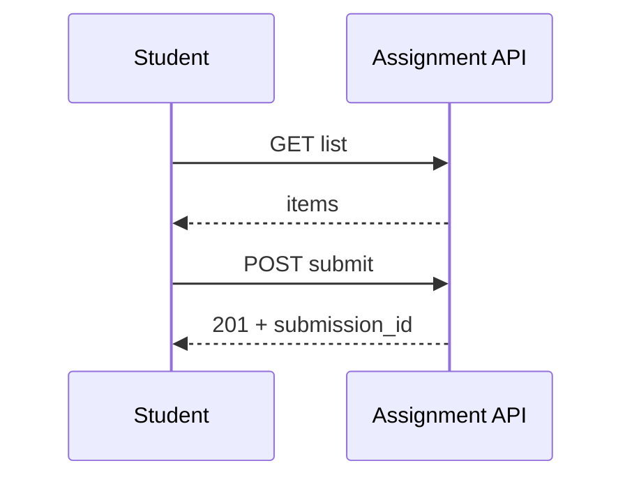

# Student — Assignments

## Ringkasan

Daftar tugas dan halaman pengumpulan per `assignmentUid`. Data mock: [`studentAssignmentsData`](../../src/lib/studentAssignmentsData.ts) / komponen terkait.

**Envelope:** [response-envelope.md](../api/response-envelope.md).

## Status

| Aspek | Status |
|-------|--------|
| UI | Ada |
| Backend DB | **Belum** — tidak ada tabel `assignments` / `assignment_submissions` |
| API | **Usulan** di bawah |

---

## Usulan API (envelope konsisten dengan backend)

### `GET /api/v1/student/assignments`

**Headers:** `Authorization: Bearer <jwt>`

**Query (opsional):** `course_id`, `status=open|submitted|graded`

**Response 200**

```json
{
  "success": true,
  "message": "Assignments retrieved",
  "data": {
    "items": [
      {
        "id": "asg-001",
        "course_id": 5,
        "title": "Tugas 1 — Komponen React",
        "description": "Buat komponen...",
        "due_at": "2026-04-30T23:59:59Z",
        "max_score": 100,
        "status": "open",
        "submission": null
      }
    ],
    "meta": {
      "total": 1,
      "page": 1,
      "per_page": 20
    }
  },
  "error": null
}
```

---

### `GET /api/v1/student/assignments/:assignmentUid`

**Response 200**

```json
{
  "success": true,
  "message": "Assignment detail",
  "data": {
    "id": "asg-001",
    "course_id": 5,
    "course_title": "React Fundamentals",
    "title": "Tugas 1",
    "description": "...",
    "due_at": "2026-04-30T23:59:59Z",
    "max_score": 100,
    "attachments": [],
    "my_submission": null
  },
  "error": null
}
```

**Response 404**

```json
{
  "success": false,
  "message": "Assignment not found",
  "data": null,
  "error": null
}
```

---

### `POST /api/v1/student/assignments/:assignmentUid/submit`

#### Opsi A — `multipart/form-data`

| Field | Tipe | Wajib |
|-------|------|--------|
| `text` | string | Opsional jika ada file |
| `files` | file[] | Opsional |

**Response 201**

```json
{
  "success": true,
  "message": "Submission received",
  "data": {
    "submission_id": "sub-001",
    "assignment_id": "asg-001",
    "status": "submitted",
    "submitted_at": "2026-04-19T14:00:00Z",
    "attachment_urls": ["https://storage.../a.pdf"]
  },
  "error": null
}
```

#### Opsi B — `application/json`

**Request**

```json
{
  "text": "Jawaban essay...",
  "attachment_urls": []
}
```

**Response** sama struktur seperti di atas.

| HTTP | Kondisi |
|------|---------|
| 400 | Validasi / terlambat (jika aturan bisnis) |
| 401 | JWT |
| 403 | Bukan peserta course |
| 409 | Sudah submit (jika tidak boleh revisi) |

---

## Skema DB usulan

Lihat [gap database](../database/gap-and-proposed-extensions.md#3-assignment--submission).

---

## Alur


