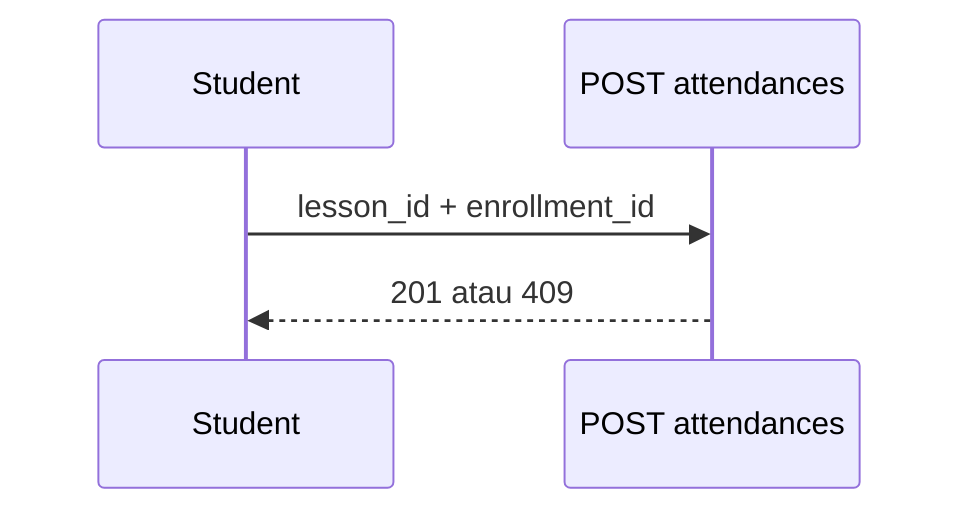

# Student — Attendance

## Ringkasan

Ringkasan dan detail kehadiran siswa. Backend menyediakan absensi per **lesson** + **enrollment**.

**Envelope:** [response-envelope.md](../api/response-envelope.md) · **Route map:** [attendance](../api/route-map.md#5-lessons--attendances-jwt).

---

## Backend — endpoint siswa

Base path grup: **`/lessons/attendances`** (JWT).

### `POST /lessons/attendances/`

**Content-Type:** `application/json`

**Request body** (`dto.LessonAttendanceCreateRequest`)

```json
{
  "lesson_id": 10,
  "enrollment_id": 12,
  "status": "present",
  "note": ""
}
```

| Field | Tipe | Wajib | Keterangan |
|-------|------|--------|------------|
| `lesson_id` | uint | Ya | |
| `enrollment_id` | uint | Ya | |
| `status` | string | Perlu valid `oneof` | `present` \| `late` \| `absent` \| `excused` |
| `note` | string | Tidak | Akan dienkripsi di DB |

**Response 201 — sukses**

```json
{
  "success": true,
  "message": "Attendance recorded successfully",
  "data": {
    "id": 99,
    "lesson_id": 10,
    "enrollment_id": 12,
    "checked_in_at": "2026-04-19T08:00:00Z",
    "status": "present",
    "note": "",
    "created_at": "2026-04-19T08:00:00Z",
    "updated_at": "2026-04-19T08:00:00Z"
  },
  "error": null
}
```

*Handler dapat mengatur `status` ke `late` jika waktu sekarang setelah `lesson.StartTime`.*

**Response 409 — duplikat**

```json
{
  "success": false,
  "message": "Already checked in for this lesson",
  "data": null,
  "error": null
}
```

| HTTP | Kondisi |
|------|---------|
| 400 | Bind JSON gagal |
| 404 | Lesson atau enrollment tidak ditemukan |
| 500 | Gagal encrypt / insert |

---

### `GET /lessons/attendances/check-status`

**Query wajib:** `lesson_id`, `enrollment_id`

**Response 200**

```json
{
  "success": true,
  "message": "Attendance status retrieved successfully",
  "data": {
    "id": 99,
    "lesson_id": 10,
    "enrollment_id": 12,
    "checked_in_at": "2026-04-19T08:00:00Z",
    "status": "present",
    "note": "",
    "lesson": {},
    "enrollment": {}
  },
  "error": null
}
```

**Response 404**

```json
{
  "success": false,
  "message": "No attendance record found for this lesson",
  "data": null,
  "error": null
}
```

---

### `GET /lessons/attendances/my-history`

**Query opsional:** `enrollment_id`

**Response 200**

```json
{
  "success": true,
  "message": "Attendance history retrieved",
  "data": [
    {
      "id": 99,
      "lesson_id": 10,
      "enrollment_id": 12,
      "status": "present",
      "checked_in_at": "2026-04-19T08:00:00Z",
      "note": ""
    }
  ],
  "error": null
}
```

---

## UI mock

Halaman student dapat memakai storage lokal / seed — selaraskan **`lesson_id`** dan **`enrollment_id`** dari `GET /user/data` + `GET /courses/:id` / `GET /modules/course/:id`.

---

## Alur


