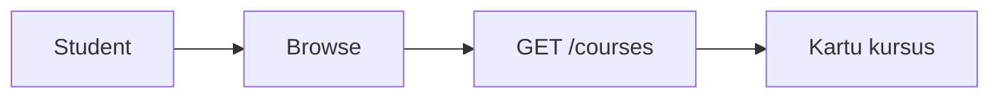

# Student — Browse courses

## Ringkasan

Discovery kursus (filter, kartu). Data mock dari [`getCourses()`](../../src/lib/data/repository.ts) + kategori seed.

**Envelope:** [response-envelope.md](../api/response-envelope.md).

---

## Backend — `GET /courses` (JWT)

Endpoint yang sama dipakai untuk browse (setelah login). Lihat respons **lengkap** di [02-learning — GET /courses](./02-learning.md#get-courses-jwt).

**Query yang didukung handler:**

| Query | Contoh | Keterangan |
|-------|--------|------------|
| `page` | `1` | Default 1 |
| `per_page` | `10` | Max 100 |
| `mentor_id` | `2` | Filter mentor |
| `title` | `react` | LIKE case-insensitive |
| `price` | `199000` | Exact match |
| `is_premium` | `true` | Boolean |

**Tidak ada** filter `category_id` di backend saat ini — lihat [gap database](../database/gap-and-proposed-extensions.md).

---

## Response error umum

```json
{
  "success": false,
  "message": "Failed to retrieve courses",
  "data": null,
  "error": "dial tcp ..."
}
```

| HTTP | Kondisi |
|------|---------|
| 401 | JWT |
| 500 | DB error |

---

## Usulan browse publik (tanpa JWT)

Jika produk menginginkan katalog tanpa login:

**GET** `/api/v1/public/courses`

**Response 200 (usulan)**

```json
{
  "success": true,
  "message": "OK",
  "data": {
    "courses": [],
    "meta": { "total": 0, "page": 1, "per_page": 12 }
  },
  "error": null
}
```

*Perlu route baru di backend + kebijakan field yang boleh diekspos.*

---

## Alur


