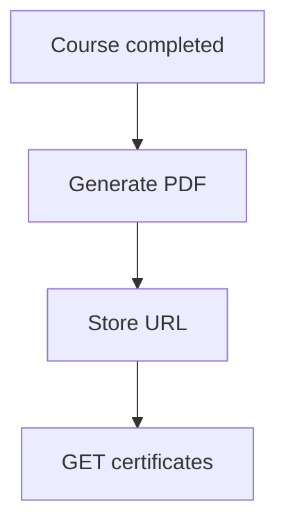

# Student — Certificates

## Ringkasan

Daftar sertifikat penyelesaian kursus. Mock: tipe [`ICertificate`](../../src/lib/types/index.ts) / seed.

**Envelope:** [response-envelope.md](../api/response-envelope.md).

## Status

| Aspek | Backend |
|-------|---------|
| Tabel `certificates` | **Belum ada** — [gap](../database/gap-and-proposed-extensions.md#4-sertifikat) |

---

## Usulan API

### `GET /api/v1/student/certificates`

**Headers:** `Authorization: Bearer <jwt>`

**Response 200**

```json
{
  "success": true,
  "message": "Certificates listed",
  "data": {
    "items": [
      {
        "id": "cert-001",
        "course_id": 5,
        "course_title": "React Fundamentals",
        "certificate_number": "DSU-2026-0001",
        "issued_at": "2026-04-01T00:00:00Z",
        "download_url": "https://storage.../cert-001.pdf"
      }
    ]
  },
  "error": null
}
```

**Response 401**

```json
{
  "success": false,
  "message": "Authorization header missing",
  "data": null,
  "error": null
}
```

---

### `GET /api/v1/student/certificates/:id/download`

**Response 302** — redirect ke signed URL, atau **200** `application/pdf` stream.

---

## Alur (target)


