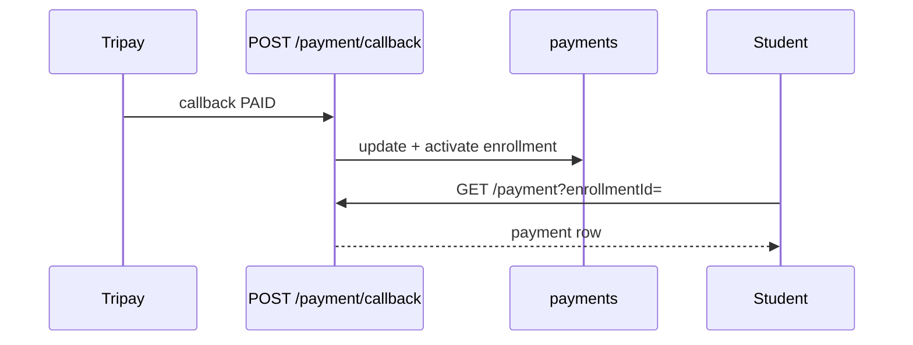

# Student — Transactions

## Ringkasan

Riwayat pembayaran siswa. UI: [`TransactionsTable`](../../src/app/(authorized)/student/transactions/_components/TransactionsTable.tsx).

**Envelope:** [response-envelope.md](../api/response-envelope.md) · **Payment:** [route map — Payment](../api/route-map.md#6-payment).

---

## Backend — `GET /payment` (JWT)

**Query (salah satu wajib):**

- `reference=<transaction_id>` (Tripay reference / disimpan di `payments.transaction_id`)
- `enrollmentId=<uint>` (camelCase sesuai handler)

### Response 200 — sukses

`data` berisi entity **Payment** (GORM), contoh:

```json
{
  "success": true,
  "message": "Payment details retrieved successfully",
  "data": {
    "id": 3,
    "enrollment_id": 12,
    "amount": 199000,
    "payment_method": "OVO",
    "payment_status": "success",
    "transaction_id": "TREF-XXXX",
    "checkout_url": "https://tripay...",
    "paid_at": "2026-04-19T10:05:00Z",
    "created_at": "2026-04-19T10:00:00Z"
  },
  "error": null
}
```

*Nilai `payment_method` mengikuti enum PostgreSQL / string dari Tripay; entity memakai tipe enum.*

---

### Response 400 — parameter kurang

```json
{
  "success": false,
  "message": "Either reference or enrollmentId parameter is required",
  "data": null,
  "error": "missing query parameters"
}
```

### Response 400 — enrollmentId bukan angka

```json
{
  "success": false,
  "message": "Invalid enrollmentId format",
  "data": null,
  "error": "enrollmentId must be a valid number"
}
```

### Response 404

```json
{
  "success": false,
  "message": "Payment not found",
  "data": null,
  "error": "payment not found"
}
```

---

## Backend — `POST /payment/create`

Untuk transaksi baru, lihat dokumentasi penuh: [shared/02-checkout-and-invoice.md](../shared/02-checkout-and-invoice.md).

Ringkas **request:**

```json
{
  "enrollment_id": 12,
  "method": "OVO",
  "amount": 199000,
  "order_items": [
    {
      "sku": "CRS-5",
      "name": "React",
      "price": 199000,
      "quantity": 1
    }
  ],
  "callback_url": "https://api.example.com/payment/callback",
  "return_url": "https://app.example.com/success"
}
```

**Response 200** — `data` = objek Tripay (`reference`, `checkout_url`, `instructions`, dll.).

---

## Daftar banyak transaksi (usulan)

Backend saat ini **GET /payment** mengambil **satu** record per `reference` atau `enrollmentId`. Untuk tabel riwayat:

**GET** `/api/v1/student/payments?page=1&per_page=20` (usulan)

**Response 200**

```json
{
  "success": true,
  "message": "OK",
  "data": {
    "items": [],
    "meta": { "total": 0, "page": 1, "per_page": 20 }
  },
  "error": null
}
```

---

## Alur


