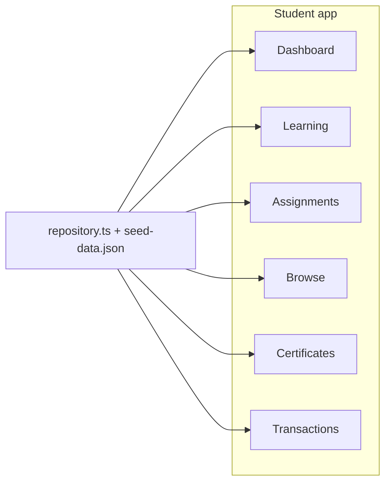

# PRD — Area Student (Authorized)

**Base path:** `/student/*`  
**Navigasi:** [`navigation.ts`](../../src/lib/navigation.ts) (`studentNavigation`)

**Standar dokumentasi:** setiap file memuat referensi [envelope API](../api/response-envelope.md), endpoint backend yang relevan dari [route map](../api/route-map.md), dan contoh respons lengkap.

| #   | Fitur          | Dokumen                                    | Rute utama                                                     |
| --- | -------------- | ------------------------------------------ | -------------------------------------------------------------- |
| 1   | Dashboard      | [01-dashboard.md](./01-dashboard.md)       | `/student/dashboard`                                           |
| 2   | My Learning    | [02-learning.md](./02-learning.md)         | `/student/learning`, `/student/learning/[courseUid]`           |
| 3   | Assignments    | [03-assignments.md](./03-assignments.md)   | `/student/assignments`, `/student/assignments/[assignmentUid]` |
| 4   | Browse courses | [05-browse.md](./05-browse.md)             | `/student/browse`                                              |
| 5   | Certificates   | [06-certificates.md](./06-certificates.md) | `/student/certificates`                                        |
| 6   | Transactions   | [07-transactions.md](./07-transactions.md) | `/student/transactions`                                        |

## Autentikasi

Semua halaman memakai JWT: `Authorization: Bearer <token>` (lihat [middleware](../../../backend/internal/handler/middleware/middleware.go)).

