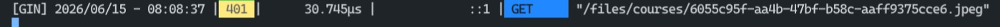
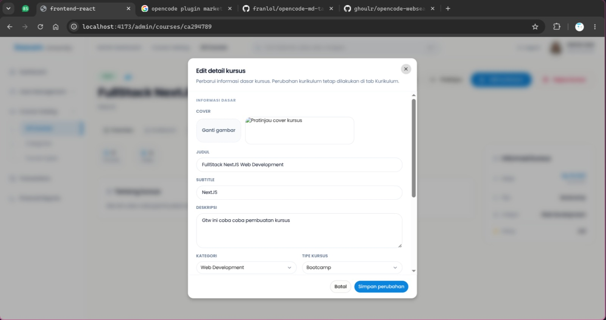
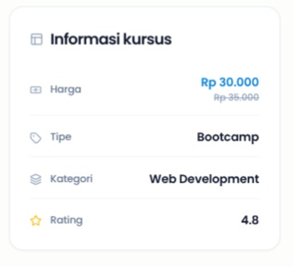
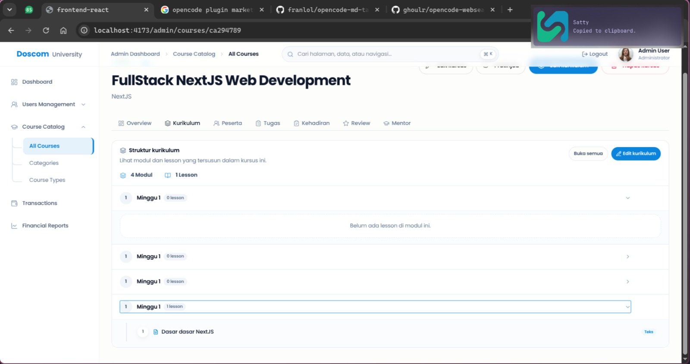
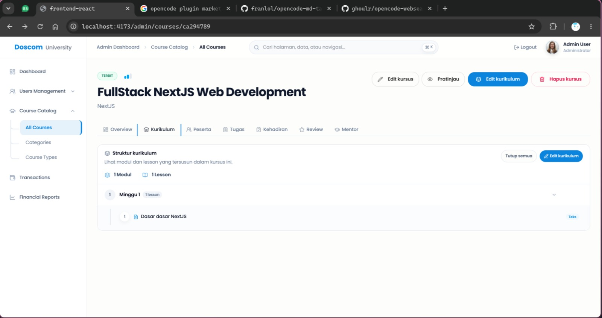
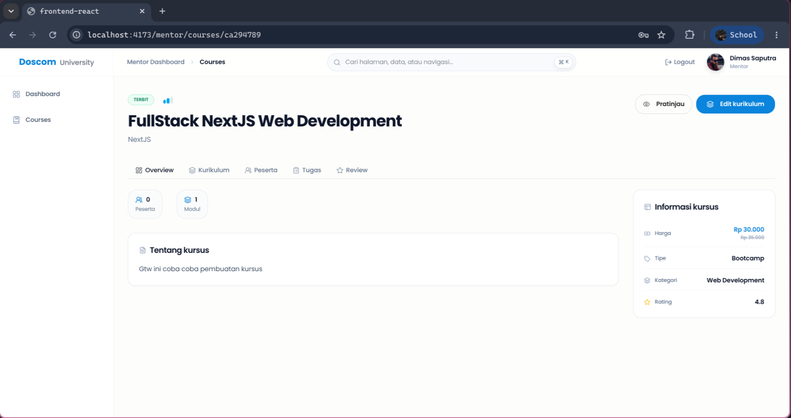
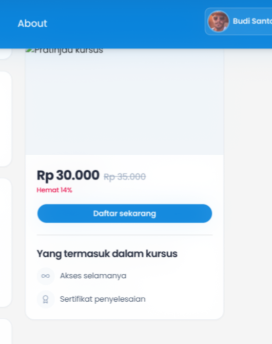
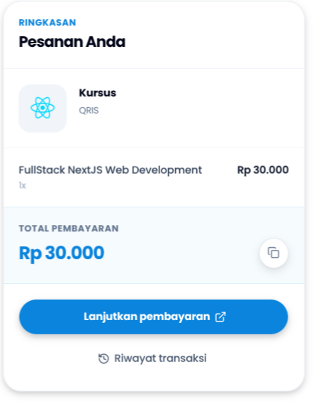

# Bug Report — Course Feature (QA Session)

> **Catatan QA:** Dokumen ini berisi temuan bug dari sesi QA untuk fitur Course pada tiga role: **Admin**, **Mentor**, dan **Student**. Kata-kata di bawah ini merupakan komentar dari QA yang telah disusun ulang agar lebih jelas dan profesional.

---

## Role: Admin

### 1. Course Image Tidak Terload (401 Unauthorized)

> **Komentar QA:** *Gambar pada course tidak terload karena backendnya memberikan response seperti pada gambar.*

**Screenshots:**

| Backend Log 401 | Pratinjau cover tidak terload |
|---|---|
|  |  |

**Deskripsi Bug:**
Saat membuka dialog *Edit detail kursus*, gambar cover tidak muncul (menampilkan teks alternatif). Dari log backend, terlihat bahwa request `GET /files/courses/...` mengembalikan status `401 Unauthorized`.

**Analisis Teknis:**
- URL gambar (`cover_url`) kemungkinan menggunakan path relatif atau absolut ke backend tanpa menyertakan token autentikasi.
- Tag `` standar tidak mengirimkan header `Authorization`, sehingga endpoint file yang dilindungi Bearer token menolak request.
- Issue ini juga berdampak pada semua halaman yang menampilkan gambar course (admin, mentor, student, dan halaman pembayaran).

**Panduan Fix (Frontend):**

1. **Buat komponen `AuthenticatedImage`** yang mengambil gambar melalui Axios dengan header `Authorization`, lalu membuat Blob URL:

```tsx
// frontend/src/components/shared/AuthenticatedImage.tsx
import { useEffect, useState } from 'react'
import { api } from '@/services/axios'

export function AuthenticatedImage({
  src,
  alt,
  className,
  fallback,
}: {
  src: string | null | undefined
  alt: string
  className?: string
  fallback?: React.ReactNode
}) {
  const [blobUrl, setBlobUrl] = useState<string | null>(null)
  const [loading, setLoading] = useState(true)

  useEffect(() => {
    if (!src) {
      setLoading(false)
      return
    }

    let objectUrl: string | null = null
    api
      .get(src, { responseType: 'blob' })
      .then((res) => {
        objectUrl = URL.createObjectURL(res.data)
        setBlobUrl(objectUrl)
      })
      .catch(() => {
        setBlobUrl(null)
      })
      .finally(() => setLoading(false))

    return () => {
      if (objectUrl) URL.revokeObjectURL(objectUrl)
    }
  }, [src])

  if (loading) {
    return <div className={`bg-slate-100 animate-pulse ${className}`} />
  }

  if (!blobUrl) {
    return fallback ? (
      <>{fallback}</>
    ) : (
      <div className={`bg-slate-100 ${className}`} />
    )
  }

  return 
}
```

2. **Ganti semua tag `` yang memuat `cover_url`/`thumbnail_url` dari API** dengan komponen di atas. File-file yang wajib diubah:
   - `frontend/src/components/shared/CardCourse.tsx` (baris 93–99)
   - `frontend/src/components/shared/CardMentor.tsx`
   - `frontend/src/components/shared/JoinedCourseCard.tsx`
   - `frontend/src/components/courses/DetailCourse.tsx` (baris 70, 105)
   - `frontend/src/components/courses/detail/CourseDetailMobileSummary.tsx`
   - `frontend/src/components/student/transactions/payment-detail/PaymentSummaryCard.tsx` (baris 32–42)
   - `frontend/src/components/student/TransactionsSection.tsx` (baris 95–105)

3. **Alternatif cepat (jika backend mendukung):** ubah endpoint file agar tidak memerlukan autentikasi untuk gambar public, atau tambahkan query parameter token (`?token=...`) ke URL gambar.

---

### 2. Kursus Baru Sudah Memiliki Rating

> **Komentar QA:** *Kursus baru kenapa udah ada ratingnya? Benarkan.*

**Screenshots:**

| Review tab — Total 0, Rating 0.0 | Informasi kursus — Rating 4.8 |
|---|---|
|  |  |

**Deskripsi Bug:**
Pada panel *Informasi kursus*, kursus yang baru dibuat (belum memiliki review) menampilkan rating **4.8**. Namun di tab *Review* terlihat **0.0** yang lebih masuk akal untuk kursus baru.

**Analisis Teknis:**
- Di `frontend/src/components/shared/CardCourse.tsx` baris 119–120, kondisi menampilkan rating adalah:
  ```tsx
  data.rating !== undefined && data.total_reviews !== undefined
  ```
  Kondisi ini tetap menampilkan rating meskipun `total_reviews === 0`.
- Di beberapa halaman detail, rating langsung diteruskan tanpa pengecekan jumlah review.

**Panduan Fix (Frontend):**

Ubah kondisi render rating agar hanya muncul ketika ada minimal 1 review:

```tsx
// frontend/src/components/shared/CardCourse.tsx
{data.rating !== undefined && data.total_reviews !== undefined && data.total_reviews > 0 && (
  <Rating rating={data.rating} totalReviews={data.total_reviews} />
)}
```

Lakukan hal yang sama di komponen-komponen berikut:
- `frontend/src/components/courses/DetailCourse.tsx` — baris 74 (props `rating` ke `CourseDetailMobileSummary`)
- `frontend/src/components/courses/detail/CourseDetailSidebar.tsx` — jika ada tampilan rating
- `frontend/src/components/courses/detail/CourseDetailMobileSummary.tsx`

**Catatan:** Jika data dari backend memang mengembalikan `rating: 4.8` untuk kursus baru, perlu dikonfirmasi ke backend apakah rating default memang sengaja di-set, atau ini adalah data seeding yang tidak sesuai.

---

### 3. Modul Duplikat Saat Dibuat

> **Komentar QA:** *Baru buat satu modul kenapa tiba tiba menjadi 4? Akan tetapi ketika sudah dihapus langsung benar.*

**Screenshots:**

| 4 modul duplikat | Setelah dihapus — 1 modul |
|---|---|
|  |  |

**Deskripsi Bug:**
Setelah membuat satu modul baru di kurikulum, daftar modul menampilkan **4 modul** dengan nama yang sama ("Minggu 1"). Setelah menghapus salah satu modul, jumlah modul kembali ke angka yang benar (1 modul).

**Analisis Teknis:**
- Di `frontend/src/hooks/use-course-edit-controller.ts` baris 204–209, saat inisialisasi state dari `sourceModules`, data dari API langsung di-mapping tanpa deduplikasi.
- Jika API mengembalikan data duplikat (karena race condition, optimistic update, atau cache QueryClient yang tidak invalid dengan benar), state lokal akan menampilkan duplikat.
- Saat modul dihapus, state di-rebuild dari sumber yang bersih sehingga kembali normal.

**Panduan Fix (Frontend):**

1. **Deduplikasi data saat inisialisasi state:**

```tsx
// frontend/src/hooks/use-course-edit-controller.ts
useEffect(() => {
  if (isInitialized || !courseData || typeof courseData !== 'object') return;

  // ...

  const uniqueModules = sourceModules.filter(
    (m, i, arr) => arr.findIndex((t) => t.uid === m.uid) === i
  );

  const nextModules = uniqueModules.map((module, index) =>
    toModuleShell(module, index + 1)
  );

  setModules(nextModules);
  // ...
}, [isInitialized, sourceModules, initialModuleId, courseData, hasCourseModules]);
```

2. **Pastikan invalidasi cache setelah create module:**
Setelah `createPersistedModule` (baris 828), pastikan `queryClient.invalidateQueries` dijalankan untuk `moduleKeys.all` dan `courseKeys.detail` agar cache tidak menyebabkan data lama tergabung dengan data baru.

3. **Cek juga di `mergeModuleLessonsFromApi`** (baris 240) untuk memastikan merge tidak menambahkan duplikat lesson/module.

---

### 4. Mentor yang Ditampilkan Hanya Satu

> **Komentar QA:** *Untuk mentor yang ditampilkan jangan satu mentor saja ketika pada course memiliki lebih dari 1 mentor.*

**Screenshots:**

| Card kursus hanya menampilkan 1 mentor |
|---|
|  |

**Deskripsi Bug:**
Di card kursus, bagian bawah hanya menampilkan satu mentor (Dimas Saputra) meskipun course tersebut memiliki lebih dari satu mentor.

**Analisis Teknis:**
- Di `frontend/src/lib/course-detail/course-profile.ts` baris 25–26, fungsi `resolveCourseProfile` hanya mengambil mentor pertama menggunakan `.find()` dan mengembalikan satu profil:
  ```ts
  const mentor = source.mentors?.find((item) => isUsableProfile(item))
  ```
- Komponen `CardCourse` menggunakan `resolveCourseProfile` yang hanya mengembalikan satu objek.

**Panduan Fix (Frontend):**

1. **Perbarui `course-profile.ts` untuk mendukung multiple mentors:**

```ts
// frontend/src/lib/course-detail/course-profile.ts
export function resolveCourseProfiles(source: CourseProfileSource): CourseProfile[] {
  const mentorProfiles = source.mentors?.filter(isUsableProfile) ?? []
  if (mentorProfiles.length > 0) {
    return mentorProfiles.map((m) => ({
      uid: m.uid,
      name: m.name.trim(),
      avatar_url: m.avatar_url,
      role: m.role,
      description: m.description,
    }))
  }

  if (isUsableProfile(source.created_by)) {
    return [{
      uid: source.created_by.uid,
      name: source.created_by.name.trim(),
      avatar_url: source.created_by.avatar_url,
      role: source.created_by.role,
    }]
  }

  return []
}
```

2. **Modifikasi `CardCourse.tsx` untuk menampilkan multiple mentors:**
   - Jika mentor hanya 1, tampilkan seperti sekarang.
   - Jika mentor > 1, tampilkan avatar grup atau nama "Mentor A + N lainnya".

3. **Modifikasi `DetailCourse.tsx` / `CourseInstructorCard.tsx`** agar menerima array mentors dan merender list.

---

## Role: Mentor

### 1. Sidebar Tidak Aktif di Halaman Kelola Kursus

> **Komentar QA:** *Benarkan sidebar, dikarenakan pada saat masuk ke dalam seperti kelola kursus sidebar course tidak aktif. Buat sidebar aktif jika masih dalam lingkup halaman tersebut.*

**Screenshots:**

| Sidebar "Courses" tidak aktif saat berada di `/mentor/courses/...` |
|---|
|  |

**Deskripsi Bug:**
Saat mentor berada di halaman detail kursus (contoh: `/mentor/courses/ca294789`), item menu **Courses** di sidebar tidak menampilkan state aktif (tidak ada highlight).

**Analisis Teknis:**
- Di `frontend/src/components/shared/Sidebar.tsx` baris 91, penentuan aktif untuk `SidebarNavItem` menggunakan exact match:
  ```tsx
  const isActive = pathname === item.path
  ```
  Padahal `item.path` untuk menu Courses adalah `/mentor/courses`, sedangkan pathname saat ini adalah `/mentor/courses/ca294789`.
- Untuk `SidebarSubItem` sudah benar karena menggunakan `isActivePath` (prefix match).

**Panduan Fix (Frontend):**

Ubah `SidebarNavItem` agar menggunakan `isActivePath` (prefix match) agar parent menu aktif saat berada di child page:

```tsx
// frontend/src/components/shared/Sidebar.tsx
function SidebarNavItem({ item }: { item: NavItem }) {
  const { pathname } = useLocation()
  const { setOpenMobile } = useSidebar()
  const isActive = isActivePath(pathname, item.path) // <-- ganti dari exact match
  // ...
}
```

**Catatan:** Pastikan item parent yang tidak memiliki children (seperti Dashboard) juga tetap berfungsi dengan baik setelah perubahan ini.

---

### 2. Issue Gambar Sama Seperti Poin 1 pada Admin

> **Komentar QA:** *Issue gambar sama seperti Poin 1 pada admin (gambar tidak terload).*

**Panduan Fix:**
Lihat panduan fix lengkap pada **Admin Poin 1** — *Course Image Tidak Terload*. Terapkan komponen `AuthenticatedImage` di semua halaman mentor yang menampilkan gambar course, termasuk:
- `frontend/src/components/shared/CardMentor.tsx`
- `frontend/src/components/shared/ManageCourse.tsx` (list card mentor)

---

## Role: Student

### 1. Ubah Kata "Enroll" Menjadi "Daftar"

> **Komentar QA:** *Ubah kata enroll menjadi Daftar.*

**Screenshots:**

| Tombol "Enroll" pada card kursus |
|---|
|  |

**Deskripsi Bug:**
Tombol aksi pada card kursus menampilkan teks **"Enroll"** yang merupakan bahasa Inggris. Sebaiknya diubah ke bahasa Indonesia agar konsisten dengan UI lainnya.

**Panduan Fix (Frontend):**

```tsx
// frontend/src/components/shared/CardCourse.tsx
const actionLabel = isEnrolled ? 'Mulai' : 'Daftar'
```

Ganti baris 87 dari `'Enroll'` menjadi `'Daftar'`. Tidak ada file lain yang menggunakan kata "Enroll" di UI utama (kecuali variable name, yang bisa tetap).

---

### 2. Card dengan Navbar Tidak Ada Jarak

> **Komentar QA:** *Card dengan navbar tidak ada jaraknya, buat ada jaraknya.*

**Screenshots:**

| Card kursus menyentuh navbar |
|---|
|  |

**Deskripsi Bug:**
Pada halaman *Katalog Kursus*, card kursus tampak terlalu mepet dengan area navbar/breadcrumb, tidak ada jarak (padding/margin) yang cukup.

**Analisis Teknis:**
- Di `frontend/src/components/student/BrowseCourseSection.tsx` baris 59, section utama tidak memiliki `padding-top` tambahan.
- Layout global (`AppSidebarProvider` / `AppNavbarProvider`) di `frontend/src/components/shared/Sidebar.tsx` sudah memberikan `py-6` pada content area, namun tampaknya di halaman ini masih kurang.

**Panduan Fix (Frontend):**

1. **Tambahkan jarak di section utama:**

```tsx
// frontend/src/components/student/BrowseCourseSection.tsx
<section className="flex w-full flex-col gap-10 pt-4">
```

Atau jika ingin lebih spesifik:
```tsx
<div className="flex flex-col justify-between gap-6 border-b border-slate-100 pb-6 pt-2">
```

2. **Cek layout global:**
Pastikan di `frontend/src/components/shared/Sidebar.tsx` baris 237, `contentClassName` default tidak overridden menjadi tanpa padding di page student.

---

### 3. Issue Gambar Sama Seperti Poin 1 pada Admin

> **Komentar QA:** *Issue gambar sama seperti Poin 1 pada admin (gambar tidak terload), pada halaman pembayaran juga tidak terload gambarnya.*

**Panduan Fix:**
Lihat panduan fix lengkap pada **Admin Poin 1**. Terapkan komponen `AuthenticatedImage` di:
- `frontend/src/components/student/BrowseCourseSection.tsx` — card kursus
- `frontend/src/components/courses/DetailCourse.tsx` — halaman detail kursus (hero + sidebar)
- `frontend/src/components/student/transactions/payment-detail/PaymentSummaryCard.tsx` — gambar kursus di ringkasan pembayaran
- `frontend/src/components/student/TransactionsSection.tsx` — thumbnail di tabel riwayat transaksi

---

### 4. Logo React Muncul di Halaman Pembayaran

> **Komentar QA:** *Pada saat di halaman pembayaran apa apaan ini untuk logo react-nya? BENARKAN!!!*

**Screenshots:**

| Logo React muncul di card ringkasan pembayaran |
|---|
|  |

**Deskripsi Bug:**
Di card *Ringkasan Pesanan Anda*, ketika gambar kursus tidak tersedia, fallback yang ditampilkan adalah **logo React** (`<ReactIcon />`). Ini tidak sesuai untuk konteks produksi dan membingungkan pengguna.

**Analisis Teknis:**
- Di `frontend/src/components/student/transactions/payment-detail/PaymentSummaryCard.tsx` baris 40, fallback untuk gambar kosong adalah:
  ```tsx
  <ReactIcon className="size-8 text-slate-400" />
  ```
- Logo React juga digunakan di `frontend/src/components/shared/CardCourse.tsx` (baris 97) dan `frontend/src/components/student/TransactionsSection.tsx` (baris 104) sebagai fallback.

**Panduan Fix (Frontend):**

1. **Ganti fallback dengan ikon yang sesuai konteks kursus:**

```tsx
// frontend/src/components/student/transactions/payment-detail/PaymentSummaryCard.tsx
import { BookOpen } from 'lucide-react'

<div className="flex size-16 shrink-0 items-center justify-center overflow-hidden rounded-2xl bg-slate-100">
  {invoice.courseImageUrl ? (
    
  ) : (
    <BookOpen className="size-8 text-slate-400" />
  )}
</div>
```

2. **Ganti juga fallback di file lain:**
- `frontend/src/components/shared/CardCourse.tsx` — ganti `ReactIcon` fallback dengan `BookOpen` atau placeholder ilustrasi kursus
- `frontend/src/components/student/TransactionsSection.tsx` — ganti `ReactIcon` fallback dengan `BookOpen`

**Catatan:** Jika `courseImageUrl` seharusnya selalu ada tetapi tidak terload karena issue 401, perbaiki issue 401 terlebih dahulu. Fallback ini seharusnya jarang muncul di production.

---

### 5. Riwayat Transaksi Tidak Menampilkan Status Pending

> **Komentar QA:** *Saat aku menekan riwayat transaksi tidak ada transaksi yang pending, akan tetapi tidak tau kenapa tiba tiba muncul.*

**Deskripsi Bug:**
Di halaman *Riwayat Transaksi*, saat memilih filter **"Menunggu"**, tidak ada transaksi yang muncul meskipun seharusnya ada transaksi pending. Transaksi pending terkadang muncul secara tidak terduga (mungkin setelah refresh atau perubahan status).

**Analisis Teknis:**
- Di `frontend/src/lib/transactions/filter-transactions.ts` baris 16, filter dilakukan dengan exact match string:
  ```tsx
  const matchesStatus = statusFilter === 'ALL' || transaction.payment_status === statusFilter
  ```
- Jika backend mengembalikan nilai `payment_status` dengan kapitalisasi berbeda (misal: `PENDING`, `Pending`, atau field lain seperti `status`), maka filter akan gagal.
- Di `frontend/src/components/student/TransactionsSection.tsx`, opsi filter yang tersedia adalah:
  ```tsx
  { value: 'pending', label: 'Menunggu' }
  ```
  yang menggunakan huruf kecil.

**Panduan Fix (Frontend):**

1. **Normalisasi string status saat filtering:**

```tsx
// frontend/src/lib/transactions/filter-transactions.ts
const matchesStatus =
  statusFilter === 'ALL' ||
  transaction.payment_status?.toLowerCase() === statusFilter.toLowerCase()
```

2. **Pastikan mapping status di backend dan frontend konsisten.** Jika backend mengembalikan nilai berbeda (misal `unpaid`, `awaiting_payment`), tambahkan mapping di frontend:

```tsx
const STATUS_MAP: Record<string, TransactionStatusFilter> = {
  pending: 'pending',
  unpaid: 'pending',
  awaiting_payment: 'pending',
  success: 'success',
  paid: 'success',
  failed: 'failed',
  expired: 'failed',
}
```

3. **Cek juga data source:**
Di `frontend/src/hooks/use-student-transactions-view-model.ts`, data diambil dari `profile?.transaction_history`. Pastikan endpoint API yang mengembalikan data user juga mengembalikan field `transaction_history` yang lengkap dan ter-update.

---

## Ringkasan File untuk Fix

| File | Bug yang Diperbaiki |
|------|---------------------|
| `frontend/src/components/shared/AuthenticatedImage.tsx` | **(NEW)** Image 401 fix — reusable component |
| `frontend/src/components/shared/CardCourse.tsx` | Image loading, rating 0, "Enroll" → "Daftar", mentor display, React fallback |
| `frontend/src/components/shared/CardMentor.tsx` | Image loading, mentor display |
| `frontend/src/components/shared/Sidebar.tsx` | Sidebar active state mentor/admin |
| `frontend/src/lib/course-detail/course-profile.ts` | Multiple mentor support |
| `frontend/src/components/courses/DetailCourse.tsx` | Image loading, rating display, multiple mentors |
| `frontend/src/components/student/BrowseCourseSection.tsx` | Card spacing (padding top) |
| `frontend/src/components/student/transactions/payment-detail/PaymentSummaryCard.tsx` | Image loading, React icon fallback |
| `frontend/src/components/student/TransactionsSection.tsx` | Image loading, React icon fallback |
| `frontend/src/lib/transactions/filter-transactions.ts` | Pending transaction filter normalization |
| `frontend/src/hooks/use-course-edit-controller.ts` | Module duplication deduplication |

---

## Catatan Implementasi

1. **Prioritas Tertinggi:** Perbaikan gambar (401) karena berdampak pada 3 role (admin, mentor, student) dan multiple halaman.
2. **Perbaikan Tercepat:** Ubah "Enroll" → "Daftar" dan ganti `ReactIcon` fallback (hanya 1 baris per file).
3. **Perbaikan yang Memerlukan Koordinasi Backend:** Jika `rating` untuk kursus baru memang dikirim dari backend sebagai `4.8`, konfirmasi apakah ini data seeding atau bug di backend.
4. **Setelah fix, jalankan regression testing** pada flow: Admin create course → Mentor kelola kursus → Student enroll & bayar → Lihat riwayat transaksi.
