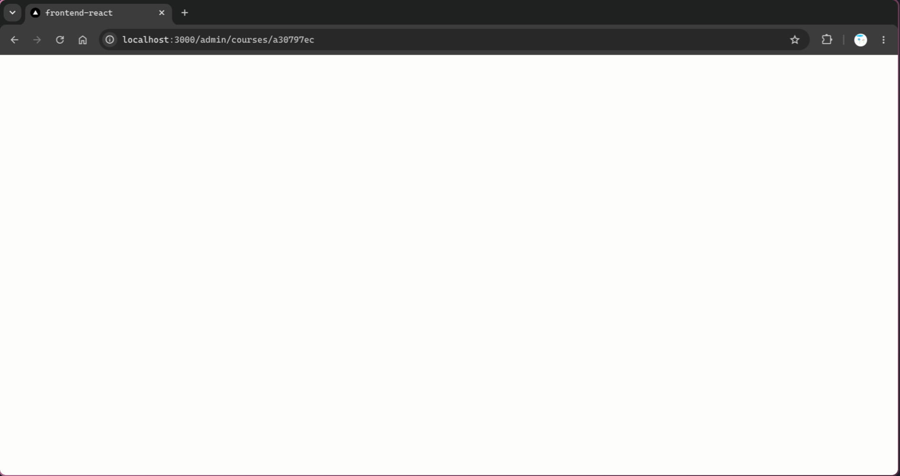

# Bug Report — Course Feature (QA Session)

> **Catatan QA:** Dokumen ini berisi temuan bug dari sesi QA untuk fitur Course pada role **Admin**. Kata-kata di bawah ini merupakan komentar dari QA yang telah disusun ulang agar lebih jelas dan profesional.

---

## Role: Admin

### 1. Halaman Kelola Kursus Blank Putih pada Course Baru

> **Komentar QA:** *Sebagai admin pada course saat melakukan kelola kursus menampilkan halaman blank putih (hanya pada course yang baru saja dibuat, bukan yang ada di seeder).*

**Screenshots:**

| Halaman `/admin/courses/{uid}` blank putih |
|---|
|  |

**Deskripsi Bug:**
Saat admin membuka halaman kelola kursus (`/admin/courses/{uid}`) untuk **course yang baru saja dibuat**, layar hanya menampilkan halaman putih kosong (blank). Tidak ada header, tab, atau konten sama sekali. Course yang berasal dari seeder tetap tampil normal.

Bug ini juga berdampak pada navigasi browser: setelah halaman kelola course baru mengalami blank putih, menekan tombol **Prev/Back** pada browser tidak mengembalikan tampilan ke halaman sebelumnya dengan normal. Halaman lain yang seharusnya ditampilkan ikut blank atau tidak ter-render dengan benar. Halaman baru bisa tampil kembali hanya setelah dilakukan **reload manual**.

**Analisis Teknis:**
- Blank putih umumnya disebabkan oleh **runtime error** yang tidak tertangkap error boundary, sehingga React meng-unmount seluruh tree halaman.
- Perbedaan utama antara course baru dan course seeder ada pada kelengkapan data turunan (modules, mentors, reviews) dan kemungkinan nilai field dasar.
- Beberapa titik rentan yang perlu dicek:
  1. **`CourseLevelSignal`** (`frontend/src/components/shared/CourseLevel.tsx`) mengakses `levelSignal[level]` tanpa fallback. Jika backend mengembalikan `level` di luar `PEMULA | MENENGAH | LANJUTAN` (misal: string kosong, lowercase, atau null), `signal` menjadi `undefined` dan `signal.activeBars` menyebabkan crash.
  2. **`courseDetailToFormValues`** (`frontend/src/lib/course-form/mappers.ts`) langsung mengakses `course.category.uid` dan `course.course_type.uid`. Jika preload `Category` atau `ClassType` gagal saat create course, field ini bisa null dan memicu error saat `EditCourseDialog` di-render (dialog selalu di-mount meski belum dibuka).
  3. **`useCourseDetailManageView`** (`frontend/src/hooks/course-detail/use-course-detail-manage-view.ts`) mengembalikan `null` jika `course` tidak ada. Namun guard di `AdminCourseDetailPage` sudah menangani kasus ini, sehingga kemungkinan kecil menjadi penyebab blank.
  4. `what_you_learn`, `mentors`, atau `created_by` pada course baru bisa memiliki shape berbeda dengan course seeder jika backend tidak konsisten saat membuat response.
  5. **Navigasi back browser memperburuk dampak crash** karena tidak ada error boundary. Saat halaman detail course baru crash, React unmount tree halaman. Meskipun user menekan tombol Prev, state aplikasi atau cache React Query bisa tetap dalam kondisi korup, sehingga halaman tujuan history (misal: `/admin/courses`) juga tidak ter-render dengan benar.
  6. **Race condition saat redirect setelah create course**: jika admin langsung diarahkan ke `/admin/courses/{uid}` setelah create, query detail course mungkin masih dalam proses sementara data course baru belum sepenuhnya tersedia. Jika komponen tidak menangani loading/empty state dengan benar, halaman bisa blank.
  7. **Kondisi memerlukan reload manual** mengindikasikan ada state global yang korup (misal: QueryClient cache entry, location state, atau provider state) akibat crash. Tanpa reload, React tidak bisa recover meskipun URL sudah berubah ke halaman lain.

> **Verifikasi Backend (perlu dicek ulang):**
> - Pastikan endpoint `GET /courses/:uid` setelah create course mem-preload `Category`, `ClassType`, `Mentors`, dan `CreatedBy` dengan benar (lihat `backend/internal/service/course.go` baris 333).
> - Pastikan `level` yang dikembalikan selalu salah satu dari `PEMULA`, `MENENGAH`, atau `LANJUTAN`.
> - Pastikan `moduleDetailResponse` tidak mengembalikan `null` meskipun course tidak memiliki module (saat ini sudah mengembalikan slice kosong, aman).

**Panduan Fix (Frontend):**

1. **Tambahkan defensive rendering pada `CourseLevelSignal`:**

```tsx
// frontend/src/components/shared/CourseLevel.tsx
const levelSignal: Partial<Record<string, { activeBars: number; color: string }>> = {
  PEMULA: { activeBars: 1, color: 'bg-emerald-500' },
  MENENGAH: { activeBars: 2, color: 'bg-sky-500' },
  LANJUTAN: { activeBars: 3, color: 'bg-violet-500' },
}

export const CourseLevelSignal = ({ level }: { level?: string }) => {
  const signal = levelSignal[level ?? '']
  if (!signal) {
    return <span className="text-xs text-slate-400">-</span>
  }

  return (
    <span className="inline-flex items-end gap-2 rounded-full px-2.5 py-1 text-xs font-semibold text-slate-500">
      <span className="flex h-4 items-end gap-0.5" aria-hidden>
        {[1, 2, 3].map((bar) => (
          <span
            key={bar}
            className={`w-1.5 rounded-full ${bar <= signal.activeBars ? signal.color : 'bg-slate-200'}`}
            style={{ height: `${bar * 4 + 4}px` }}
          />
        ))}
      </span>
    </span>
  )
}
```

2. **Tambahkan guard pada `courseDetailToFormValues`:**

```ts
// frontend/src/lib/course-form/mappers.ts
export function courseDetailToFormValues(course: ICourseDetailItem): CourseFormValues {
  return {
    title: course.title ?? '',
    subtitle: course.subtitle ?? '',
    description: course.description ?? '',
    categoryUid: course.category?.uid ?? '',
    courseTypeUid: course.course_type?.uid ?? '',
    level: normalizeApiLevel(course.level),
    price: course.price ?? 0,
    strikePrice: course.price_strike > 0 ? course.price_strike : '',
    whatYouLearn: Array.isArray(course.what_you_learn) ? course.what_you_learn : [],
    slot: course.slot > 0 ? course.slot : '',
    coverFile: null,
    coverPreviewUrl: course.cover_url || course.thumbnail_url || undefined,
  }
}
```

3. **Tambahkan Error Boundary sementara untuk menangkap lokasi error:**

```tsx
// Di sekitar <DetailCourse view={view} /> di AdminCourseDetailPage
// atau sebagai komponen wrapper sementara saat debugging
<ErrorBoundary fallback={({ error }) => <pre>{error.message}</pre>}>
  <DetailCourse view={view} />
</ErrorBoundary>
```

4. **Tambahkan logging sementara di `AdminCourseDetailPage`:**

```tsx
// frontend/src/pages/admin/DetailCourse.tsx
console.log('courseDetail', courseDetail.data)
console.log('moduleCourse', moduleCourse.data)
console.log('userCourse', userCourse.data)
```

Lakukan create course baru, buka halaman kelola, dan periksa nilai mana yang null/undefined atau menyebabkan error di console browser.

5. **Pastikan redirect setelah create course tidak memicu race condition:**

Cek di komponen/page create course, apakah redirect ke halaman detail dilakukan setelah `createCourse` mutation sukses dan cache detail course sudah di-invalidate/di-prefetch:

```tsx
// Contoh penanganan setelah create course
const navigate = useNavigate()
const queryClient = useQueryClient()

const onCreateCourse = async (values: CourseFormValues) => {
  const created = await createCourse.mutateAsync(values)
  if (!created?.uid) return

  // Opsional: prefetch detail agar data siap saat redirect
  await queryClient.prefetchQuery({
    queryKey: courseKeys.detail(created.uid),
    queryFn: () => fetchCourseByUid(created.uid),
  })

  navigate(ROUTES.admin.detailCourseAdmin(created.uid))
}
```

6. **Pertimbangkan error boundary global untuk mencegah blank total:**

```tsx
// frontend/src/components/shared/ErrorBoundary.tsx
import { Component, type ErrorInfo, type ReactNode } from 'react'

export class ErrorBoundary extends Component<
  { children: ReactNode; fallback?: ReactNode },
  { hasError: boolean }
> {
  constructor(props: { children: ReactNode; fallback?: ReactNode }) {
    super(props)
    this.state = { hasError: false }
  }

  static getDerivedStateFromError() {
    return { hasError: true }
  }

  componentDidCatch(error: Error, errorInfo: ErrorInfo) {
    console.error('ErrorBoundary caught:', error, errorInfo)
  }

  render() {
    if (this.state.hasError) {
      return this.props.fallback ?? <div>Terjadi kesalahan. Silakan muat ulang halaman.</div>
    }
    return this.props.children
  }
}
```

### File yang Perlu Diubah

| File | Perubahan |
|------|-----------|
| `frontend/src/components/shared/CourseLevel.tsx` | Tambahkan fallback jika `level` tidak valid |
| `frontend/src/lib/course-form/mappers.ts` | Guard `category?.uid`, `course_type?.uid`, dan field lain yang bisa null |
| `frontend/src/pages/admin/DetailCourse.tsx` | (Opsional/sementara) tambahkan logging/error boundary untuk debugging |
| `frontend/src/components/shared/course-form/CourseFormDialog.tsx` | Pastikan `categories` dan `courseTypes` selalu dianggap array (sudah aman saat ini) |
| `frontend/src/App.tsx` atau layout root | Tambahkan Error Boundary global agar crash tidak merusak navigasi back/forward |
| `frontend/src/components/shared/ErrorBoundary.tsx` | **(NEW)** Komponen error boundary reusable |
| `frontend/src/hooks/use-course-mutations.ts` atau hook create course | Prefetch/invalidate detail course sebelum redirect ke halaman kelola |
| `backend/internal/service/course_response.go` | Pastikan `categoryResponse` dan `courseTypeResponse` tidak perlu null karena sudah di-preload; tetap pertahankan defensive check |

---

## Ringkasan File untuk Fix

| File | Bug yang Diperbaiki |
|------|---------------------|
| `frontend/src/components/shared/CourseLevel.tsx` | Crash karena level tidak valid → blank putih |
| `frontend/src/lib/course-form/mappers.ts` | Crash karena `category`/`course_type` null pada course baru |
| `frontend/src/pages/admin/DetailCourse.tsx` | (Opsional) Logging/error boundary saat debugging |
| `frontend/src/components/shared/ErrorBoundary.tsx` | **(NEW)** Menangkap error agar tidak merusak state global dan navigasi browser |
| `frontend/src/App.tsx` | Bungkus route dengan ErrorBoundary global |
| Hook create course | Hindari race condition saat redirect ke halaman detail course baru |

---

## Catatan Implementasi

1. **Prioritas Tertinggi:** Identifikasi root cause pasti dengan logging/error boundary, karena blank putih bisa berasal dari beberapa titik crash.
2. **Perbaikan Tercepat:** Tambahkan fallback pada `CourseLevelSignal` dan guard di `courseDetailToFormValues` — dua perubahan kecil yang mencegah crash akibat data tidak lengkap.
3. **Verifikasi Backend:** Periksa kembali apakah create course selalu mem-preload relasi `Category` dan `ClassType` agar response detail tidak null.
4. **Setelah fix, jalankan regression testing:** Create course baru → Buka `/admin/courses/{uid}` → pastikan halaman kelola tampil normal dengan tab Overview, Kurikulum, Peserta, Tugas, Kehadiran, Review, dan Mentor.
5. **Tambahkan skenario testing tombol Prev browser:** Setelah halaman detail course baru tampil normal, tekan tombol Back/Prev, lalu Forward lagi. Pastikan tidak ada blank putih dan tidak perlu reload manual.
