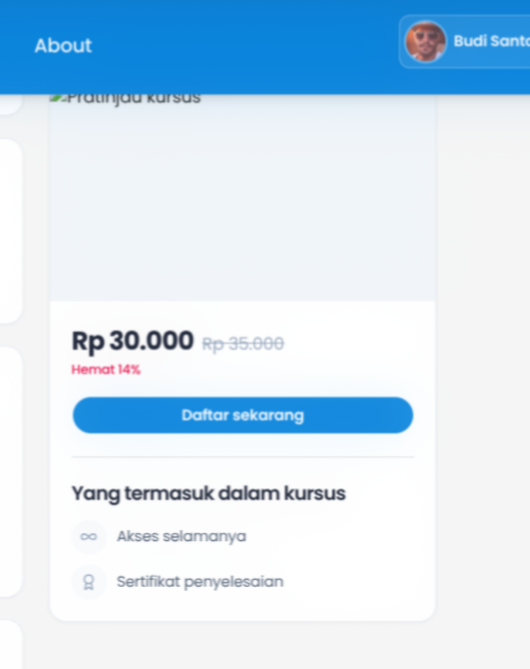
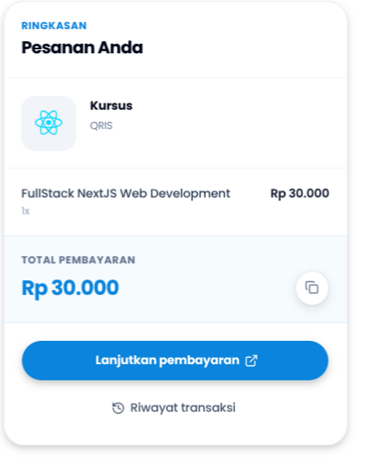
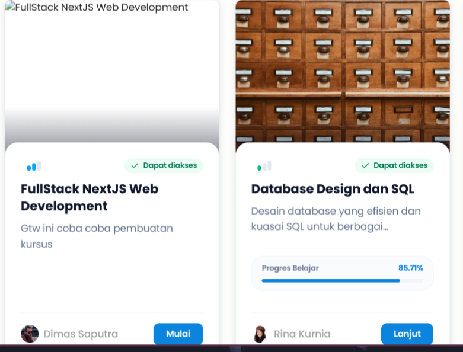
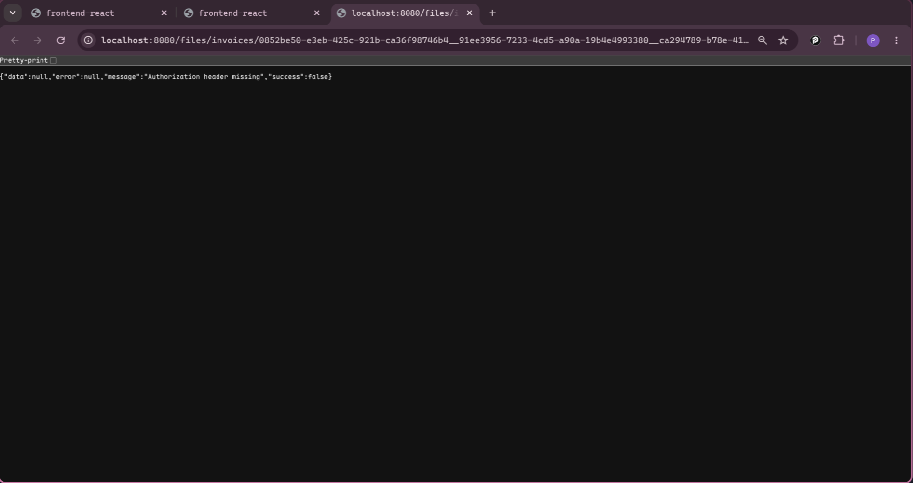

# Bug Report — Course Feature (QA Session)

> **Catatan QA:** Dokumen ini berisi temuan bug dari sesi QA untuk fitur Course pada tiga role: **Admin**, **Mentor**, dan **Student**. Kata-kata di bawah ini merupakan komentar dari QA yang telah disusun ulang agar lebih jelas dan profesional.

---

## Role: Admin

### 1. Course Image Tidak Terload (401 Unauthorized)

> **Komentar QA:** *Gambar pada course tidak terload karena backendnya memberikan response seperti pada gambar.*

**Screenshots:**

| Backend Log 401 | Pratinjau cover tidak terload |
|---|---|
|  |  |

**Deskripsi Bug:**
Saat membuka dialog *Edit detail kursus*, gambar cover tidak muncul (menampilkan teks alternatif). Dari log backend, terlihat bahwa request `GET /files/courses/...` mengembalikan status `401 Unauthorized`.

**Analisis Teknis:**
- URL gambar (`cover_url`) kemungkinan menggunakan path relatif atau absolut ke backend tanpa menyertakan token autentikasi.
- Tag `` standar tidak mengirimkan header `Authorization`, sehingga endpoint file yang dilindungi Bearer token menolak request.
- Issue ini juga berdampak pada semua halaman yang menampilkan gambar course (admin, mentor, student, dan halaman pembayaran).

> **Verifikasi Backend (sudah dicek & aman):** Endpoint `/files/{bucket}/{object}` memang memerlukan Bearer token (`backend/internal/handler/middleware/middleware.go`). Response 401 adalah perilaku yang benar karena browser `` / `window.open()` tidak bisa mengirim header `Authorization`. Tidak ada bug di auth backend. Fix utama tetap di frontend (gunakan `AuthenticatedImage` atau blob download).

**Panduan Fix (Frontend):**

1. **Buat komponen `AuthenticatedImage`** yang mengambil gambar melalui Axios dengan header `Authorization`, lalu membuat Blob URL:

```tsx
// frontend/src/components/shared/AuthenticatedImage.tsx
import { useEffect, useState } from 'react'
import { api } from '@/services/axios'

export function AuthenticatedImage({
  src,
  alt,
  className,
  fallback,
}: {
  src: string | null | undefined
  alt: string
  className?: string
  fallback?: React.ReactNode
}) {
  const [blobUrl, setBlobUrl] = useState<string | null>(null)
  const [loading, setLoading] = useState(true)

  useEffect(() => {
    if (!src) {
      setLoading(false)
      return
    }

    let objectUrl: string | null = null
    api
      .get(src, { responseType: 'blob' })
      .then((res) => {
        objectUrl = URL.createObjectURL(res.data)
        setBlobUrl(objectUrl)
      })
      .catch(() => {
        setBlobUrl(null)
      })
      .finally(() => setLoading(false))

    return () => {
      if (objectUrl) URL.revokeObjectURL(objectUrl)
    }
  }, [src])

  if (loading) {
    return <div className={`bg-slate-100 animate-pulse ${className}`} />
  }

  if (!blobUrl) {
    return fallback ? (
      <>{fallback}</>
    ) : (
      <div className={`bg-slate-100 ${className}`} />
    )
  }

  return 
}
```

2. **Ganti semua tag `` yang memuat `cover_url`/`thumbnail_url` dari API** dengan komponen di atas. File-file yang wajib diubah:
   - `frontend/src/components/shared/CardCourse.tsx` (baris 93–99)
   - `frontend/src/components/shared/CardMentor.tsx`
   - `frontend/src/components/shared/JoinedCourseCard.tsx`
   - `frontend/src/components/courses/DetailCourse.tsx` (baris 70, 105)
   - `frontend/src/components/courses/detail/CourseDetailMobileSummary.tsx`
   - `frontend/src/components/student/transactions/payment-detail/PaymentSummaryCard.tsx` (baris 32–42)
   - `frontend/src/components/student/TransactionsSection.tsx` (baris 95–105)

3. **Alternatif cepat (jika backend mendukung):** ubah endpoint file agar tidak memerlukan autentikasi untuk gambar public, atau tambahkan query parameter token (`?token=...`) ke URL gambar.

---

### 2. Kursus Baru Sudah Memiliki Rating

> **Komentar QA:** *Kursus baru kenapa udah ada ratingnya? Benarkan.*

**Screenshots:**

| Review tab — Total 0, Rating 0.0 | Informasi kursus — Rating 4.8 |
|---|---|
|  |  |

**Deskripsi Bug:**
Pada panel *Informasi kursus*, kursus yang baru dibuat (belum memiliki review) menampilkan rating **4.8**. Namun di tab *Review* terlihat **0.0** yang lebih masuk akal untuk kursus baru.

**Analisis Teknis:**
- Di `frontend/src/components/shared/CardCourse.tsx` baris 119–120, kondisi menampilkan rating adalah:
  ```tsx
  data.rating !== undefined && data.total_reviews !== undefined
  ```
  Kondisi ini tetap menampilkan rating meskipun `total_reviews === 0`.
- Di beberapa halaman detail, rating langsung diteruskan tanpa pengecekan jumlah review.

**Panduan Fix (Frontend):**

Ubah kondisi render rating agar hanya muncul ketika ada minimal 1 review:

```tsx
// frontend/src/components/shared/CardCourse.tsx
{data.rating !== undefined && data.total_reviews !== undefined && data.total_reviews > 0 && (
  <Rating rating={data.rating} totalReviews={data.total_reviews} />
)}
```

Lakukan hal yang sama di komponen-komponen berikut:
- `frontend/src/components/courses/DetailCourse.tsx` — baris 74 (props `rating` ke `CourseDetailMobileSummary`)
- `frontend/src/components/courses/detail/CourseDetailSidebar.tsx` — jika ada tampilan rating
- `frontend/src/components/courses/detail/CourseDetailMobileSummary.tsx`

**Catatan:** Backend telah dicek dan **tidak mengembalikan rating default 4.8**. Untuk kursus tanpa review, backend mengembalikan `rating: 0` dan `total_reviews: 0` (`backend/internal/service/course_review_response.go:76-78`). Hardcoded `4.8` berasal dari fallback di frontend.

> **Verifikasi Backend (sudah dicek & aman):** Tidak ada default rating maupun data seeding yang memberikan rating 4.8 pada kursus baru. Backend sudah benar.

---

### 3. Modul Duplikat Saat Dibuat

> **Komentar QA:** *Baru buat satu modul kenapa tiba tiba menjadi 4? Akan tetapi ketika sudah dihapus langsung benar.*

**Screenshots:**

| 4 modul duplikat | Setelah dihapus — 1 modul |
|---|---|
|  |  |

**Deskripsi Bug:**
Setelah membuat satu modul baru di kurikulum, daftar modul menampilkan **4 modul** dengan nama yang sama ("Minggu 1"). Setelah menghapus salah satu modul, jumlah modul kembali ke angka yang benar (1 modul).

**Analisis Teknis:**
- Di `frontend/src/hooks/use-course-edit-controller.ts` baris 204–209, saat inisialisasi state dari `sourceModules`, data dari API langsung di-mapping tanpa deduplikasi.
- Jika API mengembalikan data duplikat (karena race condition, optimistic update, atau cache QueryClient yang tidak invalid dengan benar), state lokal akan menampilkan duplikat.
- Saat modul dihapus, state di-rebuild dari sumber yang bersih sehingga kembali normal.

> **Verifikasi Backend (sudah dicek & aman):** Backend `POST /modules` hanya insert **satu row** module per request, dan endpoint module tidak mengembalikan data duplikat. Tidak ada bug di API/backend yang menyebabkan 4 modul muncul. Root cause ada di frontend state/cache.

**Panduan Fix (Frontend):**

1. **Deduplikasi data saat inisialisasi state:**

```tsx
// frontend/src/hooks/use-course-edit-controller.ts
useEffect(() => {
  if (isInitialized || !courseData || typeof courseData !== 'object') return;

  // ...

  const uniqueModules = sourceModules.filter(
    (m, i, arr) => arr.findIndex((t) => t.uid === m.uid) === i
  );

  const nextModules = uniqueModules.map((module, index) =>
    toModuleShell(module, index + 1)
  );

  setModules(nextModules);
  // ...
}, [isInitialized, sourceModules, initialModuleId, courseData, hasCourseModules]);
```

2. **Pastikan invalidasi cache setelah create module:**
Setelah `createPersistedModule` (baris 828), pastikan `queryClient.invalidateQueries` dijalankan untuk `moduleKeys.all` dan `courseKeys.detail` agar cache tidak menyebabkan data lama tergabung dengan data baru.

3. **Cek juga di `mergeModuleLessonsFromApi`** (baris 240) untuk memastikan merge tidak menambahkan duplikat lesson/module.

---

### 4. Mentor yang Ditampilkan Hanya Satu

> **Komentar QA:** *Untuk mentor yang ditampilkan jangan satu mentor saja ketika pada course memiliki lebih dari 1 mentor.*

**Screenshots:**

| Card kursus hanya menampilkan 1 mentor |
|---|
|  |

**Deskripsi Bug:**
Di card kursus, bagian bawah hanya menampilkan satu mentor (Dimas Saputra) meskipun course tersebut memiliki lebih dari satu mentor.

**Analisis Teknis:**
- Di `frontend/src/lib/course-detail/course-profile.ts` baris 25–26, fungsi `resolveCourseProfile` hanya mengambil mentor pertama menggunakan `.find()` dan mengembalikan satu profil:
  ```ts
  const mentor = source.mentors?.find((item) => isUsableProfile(item))
  ```
- Komponen `CardCourse` menggunakan `resolveCourseProfile` yang hanya mengembalikan satu objek.

**Panduan Fix (Frontend):**

1. **Perbarui `course-profile.ts` untuk mendukung multiple mentors:**

```ts
// frontend/src/lib/course-detail/course-profile.ts
export function resolveCourseProfiles(source: CourseProfileSource): CourseProfile[] {
  const mentorProfiles = source.mentors?.filter(isUsableProfile) ?? []
  if (mentorProfiles.length > 0) {
    return mentorProfiles.map((m) => ({
      uid: m.uid,
      name: m.name.trim(),
      avatar_url: m.avatar_url,
      role: m.role,
      description: m.description,
    }))
  }

  if (isUsableProfile(source.created_by)) {
    return [{
      uid: source.created_by.uid,
      name: source.created_by.name.trim(),
      avatar_url: source.created_by.avatar_url,
      role: source.created_by.role,
    }]
  }

  return []
}
```

2. **Modifikasi `CardCourse.tsx` untuk menampilkan multiple mentors:**
   - Jika mentor hanya 1, tampilkan seperti sekarang.
   - Jika mentor > 1, tampilkan avatar grup atau nama "Mentor A + N lainnya".

3. **Modifikasi `DetailCourse.tsx` / `CourseInstructorCard.tsx`** agar menerima array mentors dan merender list.

---

## Role: Mentor

### 1. Sidebar Tidak Aktif di Halaman Kelola Kursus

> **Komentar QA:** *Benarkan sidebar, dikarenakan pada saat masuk ke dalam seperti kelola kursus sidebar course tidak aktif. Buat sidebar aktif jika masih dalam lingkup halaman tersebut.*

**Screenshots:**

| Sidebar "Courses" tidak aktif saat berada di `/mentor/courses/...` |
|---|
|  |

**Deskripsi Bug:**
Saat mentor berada di halaman detail kursus (contoh: `/mentor/courses/ca294789`), item menu **Courses** di sidebar tidak menampilkan state aktif (tidak ada highlight).

**Analisis Teknis:**
- Di `frontend/src/components/shared/Sidebar.tsx` baris 91, penentuan aktif untuk `SidebarNavItem` menggunakan exact match:
  ```tsx
  const isActive = pathname === item.path
  ```
  Padahal `item.path` untuk menu Courses adalah `/mentor/courses`, sedangkan pathname saat ini adalah `/mentor/courses/ca294789`.
- Untuk `SidebarSubItem` sudah benar karena menggunakan `isActivePath` (prefix match).

**Panduan Fix (Frontend):**

Ubah `SidebarNavItem` agar menggunakan `isActivePath` (prefix match) agar parent menu aktif saat berada di child page:

```tsx
// frontend/src/components/shared/Sidebar.tsx
function SidebarNavItem({ item }: { item: NavItem }) {
  const { pathname } = useLocation()
  const { setOpenMobile } = useSidebar()
  const isActive = isActivePath(pathname, item.path) // <-- ganti dari exact match
  // ...
}
```

**Catatan:** Pastikan item parent yang tidak memiliki children (seperti Dashboard) juga tetap berfungsi dengan baik setelah perubahan ini.

---

### 2. Issue Gambar Sama Seperti Poin 1 pada Admin

> **Komentar QA:** *Issue gambar sama seperti Poin 1 pada admin (gambar tidak terload).*

**Panduan Fix:**
Lihat panduan fix lengkap pada **Admin Poin 1** — *Course Image Tidak Terload*. Terapkan komponen `AuthenticatedImage` di semua halaman mentor yang menampilkan gambar course, termasuk:
- `frontend/src/components/shared/CardMentor.tsx`
- `frontend/src/components/shared/ManageCourse.tsx` (list card mentor)

---

## Role: Student

### 1. Ubah Kata "Enroll" Menjadi "Daftar"

> **Komentar QA:** *Ubah kata enroll menjadi Daftar.*

**Screenshots:**

| Tombol "Enroll" pada card kursus |
|---|
|  |

**Deskripsi Bug:**
Tombol aksi pada card kursus menampilkan teks **"Enroll"** yang merupakan bahasa Inggris. Sebaiknya diubah ke bahasa Indonesia agar konsisten dengan UI lainnya.

**Panduan Fix (Frontend):**

```tsx
// frontend/src/components/shared/CardCourse.tsx
const actionLabel = isEnrolled ? 'Mulai' : 'Daftar'
```

Ganti baris 87 dari `'Enroll'` menjadi `'Daftar'`. Tidak ada file lain yang menggunakan kata "Enroll" di UI utama (kecuali variable name, yang bisa tetap).

---

### 2. Card dengan Navbar Tidak Ada Jarak

> **Komentar QA:** *Card dengan navbar tidak ada jaraknya, buat ada jaraknya.*

**Screenshots:**

| Card kursus menyentuh navbar |
|---|
|  |

**Deskripsi Bug:**
Pada halaman *Katalog Kursus*, card kursus tampak terlalu mepet dengan area navbar/breadcrumb, tidak ada jarak (padding/margin) yang cukup.

**Analisis Teknis:**
- Di `frontend/src/components/student/BrowseCourseSection.tsx` baris 59, section utama tidak memiliki `padding-top` tambahan.
- Layout global (`AppSidebarProvider` / `AppNavbarProvider`) di `frontend/src/components/shared/Sidebar.tsx` sudah memberikan `py-6` pada content area, namun tampaknya di halaman ini masih kurang.

**Panduan Fix (Frontend):**

1. **Tambahkan jarak di section utama:**

```tsx
// frontend/src/components/student/BrowseCourseSection.tsx
<section className="flex w-full flex-col gap-10 pt-4">
```

Atau jika ingin lebih spesifik:
```tsx
<div className="flex flex-col justify-between gap-6 border-b border-slate-100 pb-6 pt-2">
```

2. **Cek layout global:**
Pastikan di `frontend/src/components/shared/Sidebar.tsx` baris 237, `contentClassName` default tidak overridden menjadi tanpa padding di page student.

---

### 3. Issue Gambar Sama Seperti Poin 1 pada Admin

> **Komentar QA:** *Issue gambar sama seperti Poin 1 pada admin (gambar tidak terload), pada halaman pembayaran juga tidak terload gambarnya.*

**Panduan Fix:**
Lihat panduan fix lengkap pada **Admin Poin 1**. Terapkan komponen `AuthenticatedImage` di:
- `frontend/src/components/student/BrowseCourseSection.tsx` — card kursus
- `frontend/src/components/courses/DetailCourse.tsx` — halaman detail kursus (hero + sidebar)
- `frontend/src/components/student/transactions/payment-detail/PaymentSummaryCard.tsx` — gambar kursus di ringkasan pembayaran
- `frontend/src/components/student/TransactionsSection.tsx` — thumbnail di tabel riwayat transaksi

---

### 4. Logo React Muncul di Halaman Pembayaran

> **Komentar QA:** *Pada saat di halaman pembayaran apa apaan ini untuk logo react-nya? BENARKAN!!!*

**Screenshots:**

| Logo React muncul di card ringkasan pembayaran |
|---|
|  |

**Deskripsi Bug:**
Di card *Ringkasan Pesanan Anda*, ketika gambar kursus tidak tersedia, fallback yang ditampilkan adalah **logo React** (`<ReactIcon />`). Ini tidak sesuai untuk konteks produksi dan membingungkan pengguna.

**Analisis Teknis:**
- Di `frontend/src/components/student/transactions/payment-detail/PaymentSummaryCard.tsx` baris 40, fallback untuk gambar kosong adalah:
  ```tsx
  <ReactIcon className="size-8 text-slate-400" />
  ```
- Logo React juga digunakan di `frontend/src/components/shared/CardCourse.tsx` (baris 97) dan `frontend/src/components/student/TransactionsSection.tsx` (baris 104) sebagai fallback.

**Panduan Fix (Frontend):**

1. **Ganti fallback dengan ikon yang sesuai konteks kursus:**

```tsx
// frontend/src/components/student/transactions/payment-detail/PaymentSummaryCard.tsx
import { BookOpen } from 'lucide-react'

<div className="flex size-16 shrink-0 items-center justify-center overflow-hidden rounded-2xl bg-slate-100">
  {invoice.courseImageUrl ? (
    
  ) : (
    <BookOpen className="size-8 text-slate-400" />
  )}
</div>
```

2. **Ganti juga fallback di file lain:**
- `frontend/src/components/shared/CardCourse.tsx` — ganti `ReactIcon` fallback dengan `BookOpen` atau placeholder ilustrasi kursus
- `frontend/src/components/student/TransactionsSection.tsx` — ganti `ReactIcon` fallback dengan `BookOpen`

**Catatan:** Jika `courseImageUrl` seharusnya selalu ada tetapi tidak terload karena issue 401, perbaiki issue 401 terlebih dahulu. Fallback ini seharusnya jarang muncul di production.

---

### 6. Redirect Setelah Pembayaran Salah

> **Komentar QA:** *Ketika berhasil membayar dan kembali ke website, bukan kembali ke `http://localhost:4173/student/transactions/payment?reference=DEV-T37673377846MOCZH&merchant_ref=0852be50`, akan tetapi kembali ke `http://localhost:4173/student/transactions`.*

**Deskripsi Bug:**
Setelah student menyelesaikan pembayaran di payment gateway (Tripay) dan menekan tombol kembali ke website, browser redirect ke halaman **Riwayat Transaksi** (`/student/transactions`) secara general. Seharusnya redirect ke **halaman detail pembayaran** yang spesifik (`/student/transactions/payment?reference=...&merchant_ref=...`) agar user bisa langsung melihat status pembayaran yang baru saja dilakukan.

**Analisis Teknis:**
- Saat ini redirect URL setelah pembayaran kemungkinan diatur dari backend (Tripay callback / merchant return URL) atau hardcoded di frontend.
- Di `frontend/src/lib/routes.ts` baris 74–83, terdapat route `transactionPayment` yang menerima `reference` dan `merchantRef` sebagai query parameter.
- Jika return URL dari payment gateway tidak menyertakan query parameter `reference` dan `merchant_ref`, atau jika frontend tidak memproses parameter tersebut saat user kembali dari gateway, maka user akan diarahkan ke halaman list transaksi.

> **Verifikasi Backend (SUDAH DI-FIX):** Default `return_url` sebelumnya mengarah ke backend `/payment/success` yang tidak ada route-nya. Sekarang backend (`backend/internal/service/payment.go`) menggunakan `FRONTEND_BASE_URL/student/transactions/payment?merchant_ref={merchantRef}` sebagai default, dan selalu memastikan `merchant_ref` ada di query param. Reference Tripay baru diketahui setelah response Tripay, jadi default URL membawa `merchant_ref` yang sudah cukup untuk lookup detail pembayaran.

**Panduan Fix (Frontend + Backend):**

#### A. Pastikan return URL dari payment gateway menyertakan reference

```ts
// Saat membuat request pembayaran ke backend (atau ke Tripay)
const returnUrl = `${window.location.origin}${ROUTES.student.transactionPaymentPath}?reference=${reference}&merchant_ref=${merchantRef}`;
```

#### B. Pastikan frontend routing menangani return URL dengan benar

```tsx
// Di root router atau halaman payment detail
// Pastikan ada route untuk /student/transactions/payment
// yang membaca query parameter dan menampilkan detail

import { useSearchParams } from 'react-router-dom';

function TransactionPaymentPage() {
  const [searchParams] = useSearchParams();
  const reference = searchParams.get('reference');
  const merchantRef = searchParams.get('merchant_ref');

  if (!reference || !merchantRef) {
    // Redirect ke halaman list jika parameter tidak lengkap
    return <Navigate to={ROUTES.student.transactions} replace />;
  }

  // Fetch payment detail berdasarkan reference & merchantRef
  // ...
}
```

#### C. Pastikan `TransactionPaymentDetailView` bisa menerima query parameter

```tsx
// frontend/src/components/student/transactions/TransactionPaymentDetailView.tsx
// atau komponen yang merender detail pembayaran

export function TransactionPaymentDetailView() {
  const [searchParams] = useSearchParams();
  const reference = searchParams.get('reference');
  const merchantRef = searchParams.get('merchant_ref');

  // Gunakan reference & merchantRef untuk fetch data
  const { data, isLoading } = usePaymentDetail({ reference, merchantRef });

  // ...
}
```

#### D. Backend: Pastikan callback/return URL menyertakan parameter

```ts
// Di backend (service pembayaran), saat membuat request ke Tripay
const payload = {
  // ...
  return_url: `${FRONTEND_URL}/student/transactions/payment?reference=${reference}&merchant_ref=${merchantRef}`,
  // ...
};
```

### File yang Perlu Diubah

| File | Perubahan |
|------|-----------|
| `frontend/src/services/payment.ts` atau hook pembayaran | Pastikan return URL memiliki query parameter lengkap |
| `frontend/src/lib/routes.ts` | (Opsional) Tambahkan route handler untuk redirect dengan query params |
| `frontend/src/components/student/transactions/TransactionPaymentDetailView.tsx` | Pastikan membaca query params dari URL |
| Backend service payment (Go/Node) | Pastikan `return_url` ke Tripay menyertakan `reference` dan `merchant_ref` |

---

### 5. Riwayat Transaksi Tidak Menampilkan Status Pending

> **Komentar QA:** *Saat aku menekan riwayat transaksi tidak ada transaksi yang pending, akan tetapi tidak tau kenapa tiba tiba muncul.*

**Deskripsi Bug:**
Di halaman *Riwayat Transaksi*, saat memilih filter **"Menunggu"**, tidak ada transaksi yang muncul meskipun seharusnya ada transaksi pending. Transaksi pending terkadang muncul secara tidak terduga (mungkin setelah refresh atau perubahan status).

**Analisis Teknis:**
- Di `frontend/src/lib/transactions/filter-transactions.ts` baris 16, filter dilakukan dengan exact match string:
  ```tsx
  const matchesStatus = statusFilter === 'ALL' || transaction.payment_status === statusFilter
  ```
- Jika backend mengembalikan nilai `payment_status` dengan kapitalisasi berbeda (misal: `PENDING`, `Pending`, atau field lain seperti `status`), maka filter akan gagal.
- Di `frontend/src/components/student/TransactionsSection.tsx`, opsi filter yang tersedia adalah:
  ```tsx
  { value: 'pending', label: 'Menunggu' }
  ```
  yang menggunakan huruf kecil.

**Panduan Fix (Frontend):**

1. **Normalisasi string status saat filtering:**

```tsx
// frontend/src/lib/transactions/filter-transactions.ts
const matchesStatus =
  statusFilter === 'ALL' ||
  transaction.payment_status?.toLowerCase() === statusFilter.toLowerCase()
```

2. **Pastikan mapping status di backend dan frontend konsisten.** Jika backend mengembalikan nilai berbeda (misal `unpaid`, `awaiting_payment`), tambahkan mapping di frontend:

```tsx
const STATUS_MAP: Record<string, TransactionStatusFilter> = {
  pending: 'pending',
  unpaid: 'pending',
  awaiting_payment: 'pending',
  success: 'success',
  paid: 'success',
  failed: 'failed',
  expired: 'failed',
}
```

3. **Cek juga data source:**
Di `frontend/src/hooks/use-student-transactions-view-model.ts`, data diambil dari `profile?.transaction_history`. Pastikan endpoint API yang mengembalikan data user juga mengembalikan field `transaction_history` yang lengkap dan ter-update.

> **Verifikasi Backend (sudah dicek & aman):** Backend mengembalikan `payment_status: "pending"` (lowercase), yang cocok dengan filter frontend `'pending'`. Payment record dengan status pending juga langsung dibuat saat `/payment/create` (`backend/internal/service/payment.go:302-314`). Endpoint `GET /user/data` mengembalikan seluruh `transaction_history` termasuk yang pending. Jika transaksi pending tidak muncul, kemungkinan cache `profile`/user-data di frontend belum di-refresh setelah create payment.

---

### 8. Halaman Tugas Student Kosong — Assignments Tidak Muncul

> **Komentar QA:** *Pada halaman tugas student tidak ada data tugas-nya, padahal pada saat sebagai admin dan mentor untuk data tugas/assignment-nya ada.*

**Screenshot:**

| Card student — hanya ada progress, tanpa info tugas |
|---|
|  |

**Deskripsi Bug:**
Pada halaman **Tugas Student** (`/student/assignments`), daftar tugas yang seharusnya muncul menjadi **kosong** (menampilkan empty state "Belum ada tugas yang bisa ditampilkan"). Padahal untuk kursus yang sama, ketika diakses sebagai **Admin** atau **Mentor**, data tugas/assignment tersedia dan tampil dengan normal.

**Analisis Teknis:**
- Halaman student assignments menggunakan `useStudentAssignmentItems` (`frontend/src/hooks/student-assignments/use-student-assignment-items.ts`) yang memanggil API `fetchStudentMyAssignments`.
- Data dari API di-map melalui `mapStudentMyAssignmentsResponse` (`frontend/src/lib/student-assignments/map-student-my-assignments.ts`).
- Jika backend mengembalikan `assignments: []` (array kosong), maka frontend akan menampilkan empty state.
- Admin/Mentor melihat assignments dari endpoint berbeda (course-level assignments) yang kemungkinan mengembalikan data, sedangkan endpoint student (`/api/v1/students/my-assignments`) mengembalikan data kosong.
- Kemungkinan root cause:
  1. **Backend** tidak mengembalikan assignments untuk student yang ter-enroll meskipun course memiliki assignments.
  2. **Data mapping** di frontend gagal karena struktur response dari backend tidak sesuai dengan yang diharapkan (`IStudentMyAssignmentsResponse`).
  3. **Enrolment status** student mungkin tidak dianggap "active" oleh backend sehingga assignments tidak ditampilkan.

**Panduan Fix (Frontend + Backend):**

#### A. Debug response dari backend

```ts
// Tambahkan temporary logging di useStudentAssignmentItems.ts
export function useStudentAssignmentItems(profile: IUserData | null | undefined) {
  const query = useStudentMyAssignments({ per_page: 100 })

  console.log('API response:', query.data) // <-- debug

  const items = useMemo(() => {
    if (!profile || !query.data) return []
    return mapStudentMyAssignmentsResponse(query.data, { ... })
  }, [profile, query.data])

  console.log('Mapped items:', items) // <-- debug

  return { items, isLoading: query.isLoading, isError: query.isError }
}
```

#### B. Pastikan backend endpoint mengembalikan assignments

```ts
// GET /api/v1/students/my-assignments
// Response seharusnya mengandung:
{
  "assignments": [
    {
      "course_uid": "ca294789",
      "course_title": "FullStack NextJS Web Development",
      "assignment": {
        "uid": "...",
        "title": "Tugas Praktikum",
        "task_type": "text",
        "status": "TERBIT",
        "deadline_at": "2026-06-20T23:59:00Z",
        "lesson_uid": "...",
        "lesson_title": "Dasar dasar NextJS",
        "module_title": "Minggu 1",
        "lesson_order_index": 0,
        "meeting_number": 1,
        "auto_close_after_deadline": false,
        "allow_resubmit": true,
        "max_resubmit_count": 2,
        "allow_file_submission": true,
        "allow_plain_text_submission": true,
        "allow_rich_text_submission": true,
        "require_file_description": false
      },
      "latest_submission": {
        "uid": "...",
        "submitted_at": "2026-06-15T10:00:00Z",
        "attempt_count": 1,
        "score_percent": 85,
        "graded_at": null
      }
    }
  ]
}
```

#### C. Pastikan mapping frontend handle response dengan benar

```ts
// frontend/src/lib/student-assignments/map-student-my-assignments.ts
function mapListItem(
  item: IStudentMyAssignmentListItem,
  student: Pick<IUserData, 'uid' | 'name' | 'avatar_url'>,
): StudentAssignmentSectionItem | null {
  const assignmentRaw = item.assignment
  if (!assignmentRaw || typeof assignmentRaw !== 'object') {
    console.warn('Missing assignment data in item:', item) // <-- debug
    return null
  }

  // ...
}
```

#### D. Pastikan student enrollment status "active"

Jika backend hanya mengembalikan assignments untuk student dengan enrollment status "active" atau "completed", pastikan student yang login sudah ter-enroll dengan status yang benar.

> **Verifikasi Backend (sudah dicek & aman):** Endpoint `GET /students/me/assignments` (`backend/internal/service/course_assignments.go:254-399`) mengembalikan response dengan shape yang sesuai dengan mapper frontend (`course_uid`, `course_title`, `assignment`, `latest_submission`). Backend hanya menampilkan assignment dengan status `TERBIT` untuk student yang ter-enroll (pending/active/completed). Ini adalah intended behavior. Jika admin/mentor melihat assignment tapi student tidak, kemungkinan assignment-nya masih status `DRAFT`.

### File yang Perlu Diubah

| File | Perubahan |
|------|-----------|
| Backend API `/students/my-assignments` | Pastikan mengembalikan assignments untuk student yang ter-enroll |
| `frontend/src/hooks/student-assignments/use-student-assignment-items.ts` | Tambahkan debug log untuk memverifikasi data dari API |
| `frontend/src/lib/student-assignments/map-student-my-assignments.ts` | Pastikan mapping tidak mengembalikan null karena field yang tidak sesuai |
| `frontend/src/services/student-assignments.ts` | Pastikan error handling tidak menelan response yang sebenarnya berisi data |

---

### 9. Sidebar Module dan Lessons Tidak Bisa Di-scroll (Student Learning)

> **Komentar QA:** *Sebagai student aku tidak bisa melakukan scroll pada sidebar module dan lessons saat di `/student/learning/course/1825f8a7`.*

**Screenshot:**

| Sidebar module/lesson tidak bisa di-scroll |
|---|
|  |

**Deskripsi Bug:**
Pada halaman **belajar kursus** (`/student/learning/course/{uid}`), sidebar di sebelah kanan yang menampilkan **Daftar Modul** dan daftar **lessons** tidak bisa di-scroll meskipun jumlah modul/lesson melebihi tinggi viewport. Hal ini membuat student tidak bisa mengakses modul atau lesson yang berada di bawah layar.

**Analisis Teknis:**
- Di `frontend/src/components/courses/module-viewer/LessonSidebar.tsx` baris 67–83, komponen `<aside>` yang membungkus sidebar tidak memiliki `display: flex` atau `overflow-hidden`:
  ```tsx
  <aside className={cn('fixed right-0 top-16 z-30 hidden h-[calc(100dvh-4rem)] w-[348px] border-l ...')}>
    <LessonSidebarPanel {...panelProps} />
  </aside>
  ```
- Di `frontend/src/components/courses/module-viewer/LessonSidebarPanel.tsx` baris 39, konten panel menggunakan `flex h-full min-h-0 flex-col`, dan daftar modul (baris 57) sudah memiliki `overflow-y-auto`:
  ```tsx
  <div className="min-h-0 flex-1 overflow-y-auto px-2 py-2 ...">
  ```
- Namun karena parent `<aside>` tidak memiliki `flex flex-col overflow-hidden`, konten `h-full` di dalam panel tidak mengisi tinggi yang benar. `overflow-y-auto` pada daftar modul tidak berfungsi karena kontainer fleksibel tidak memiliki batas tinggi yang jelas.

**Panduan Fix (Frontend):**

#### A. Tambahkan `flex flex-col overflow-hidden` ke `<aside>`

```tsx
// frontend/src/components/courses/module-viewer/LessonSidebar.tsx
<aside
  className={cn(
    'fixed right-0 top-16 z-30 hidden h-[calc(100dvh-4rem)] w-[348px] border-l transition-transform duration-200 ease-out lg:block',
    'flex flex-col overflow-hidden', // <-- tambahkan ini
    isDark ? 'border-zinc-800 bg-zinc-900 text-zinc-100' : 'border-slate-200 bg-white text-slate-950',
    !isOpen && 'translate-x-full',
  )}>
  {isOpen && (
    <button ...>...</button>
  )}
  <LessonSidebarPanel {...panelProps} />
</aside>
```

#### B. Pastikan juga untuk mobile Sheet (opsional)

```tsx
// SheetContent untuk mobile (baris 96–104) sudah menggunakan flex-col, tapi tambahkan overflow-hidden juga
<SheetContent
  side="right"
  className={cn(
    'flex h-dvh w-full max-w-[348px] flex-col gap-0 border-l p-0 sm:max-w-[348px] lg:hidden',
    'overflow-hidden', // <-- tambahkan
    isDark ? 'border-zinc-800 bg-zinc-900 text-zinc-100' : 'border-slate-200 bg-white text-slate-950',
  )}>
  <LessonSidebarPanel {...panelProps} />
</SheetContent>
```

### File yang Perlu Diubah

| File | Perubahan |
|------|-----------|
| `frontend/src/components/courses/module-viewer/LessonSidebar.tsx` | Tambahkan `flex flex-col overflow-hidden` ke `<aside>` dan `<SheetContent>` |

---

### 7. Download Invoice Gagal (401 Unauthorized)

> **Komentar QA:** *Error pada saat ingin mendownload invoice, muncul error 401 atau unauthorized.*

**Screenshot:**

| Error 401 saat download invoice |
|---|
|  |

**Deskripsi Bug:**
Saat student menekan tombol **"Unduh invoice"** di halaman detail pembayaran, browser membuka tab baru yang menampilkan error JSON:
```json
{"data":null,"error":null,"message":"Authorization header missing","success":false}
```
URL yang diakses adalah `/files/invoices/...` (protected file endpoint) yang memerlukan header `Authorization` Bearer token, tetapi `window.open()` tidak mengirimkan header tersebut.

**Analisis Teknis:**
- Di `frontend/src/components/student/transactions/payment-detail/use-invoice-download.ts` baris 22:
  ```ts
  if (invoiceUrl) window.open(invoiceUrl, '_blank', 'noopener,noreferrer')
  ```
  `window.open()` membuka URL langsung di browser, tanpa menyertakan token autentikasi.
- Endpoint `/files/invoices/...` di backend dilindungi middleware autentikasi yang memeriksa header `Authorization`.
- Sama seperti bug image course (401), tag/link browser standar tidak bisa mengirim custom header.

> **Verifikasi Backend (sudah dicek & aman):** Endpoint `/files/{bucket}/{object}` memerlukan Bearer token dan mengembalikan 401 jika header `Authorization` tidak ada. Ini adalah perilaku yang benar. Fix utama tetap di frontend: download invoice via Axios blob, bukan `window.open()`.

**Panduan Fix (Frontend):**

#### A. Download via Axios dengan Blob (Rekomendasi)

Ganti `window.open()` menjadi fetch via Axios + trigger download Blob:

```tsx
// frontend/src/components/student/transactions/payment-detail/use-invoice-download.ts
import { useCallback, useState } from 'react'
import type { IResponse } from '@/lib/types/api'
import { API_ROUTES } from '@/services/api-path'
import { api } from '@/services/axios'

export function useInvoiceDownload() {
  const [isDownloading, setIsDownloading] = useState(false)

  const downloadInvoice = useCallback(
    async (enrollmentUid: string, userUid: string, courseUid: string) => {
      setIsDownloading(true)
      try {
        const response = await api.get<IResponse<{ invoice_url: string }>>(
          API_ROUTES.invoices.getInvoiceUrl({
            enrollment_id: enrollmentUid,
            user_id: userUid,
            course_id: courseUid,
          }),
        )
        const invoiceUrl = response.data.data?.invoice_url
        if (!invoiceUrl) return

        // Fetch file dengan Bearer token
        const fileRes = await api.get(invoiceUrl, {
          responseType: 'blob',
        })

        // Trigger download blob
        const blob = new Blob([fileRes.data])
        const objectUrl = URL.createObjectURL(blob)
        const link = document.createElement('a')
        link.href = objectUrl
        link.download = `invoice_${courseUid}.pdf` // atau ekstrak filename dari header
        document.body.appendChild(link)
        link.click()
        document.body.removeChild(link)
        URL.revokeObjectURL(objectUrl)
      } catch {
        // Tampilkan toast error ke user
        return
      } finally {
        setIsDownloading(false)
      }
    },
    [],
  )

  return { isDownloading, downloadInvoice }
}
```

#### B. Alternatif: Backend menyediakan endpoint download dengan token di query param

Jika backend mendukung, ubah URL invoice menjadi:
```
/files/invoices/xxx?token=<JWT_TOKEN>
```

Tapi ini kurang aman karena token terekspos di URL history.

#### C. Alternatif: Backend expose file dengan cookie-based auth

Jika backend menggunakan `withCredentials: true` (sudah aktif di Axios), ubah endpoint file agar membaca cookie session alih-alih Bearer token. Ini memungkinkan browser langsung mengakses file tanpa perlu header custom.

### File yang Perlu Diubah

| File | Perubahan |
|------|-----------|
| `frontend/src/components/student/transactions/payment-detail/use-invoice-download.ts` | Ganti `window.open()` menjadi Axios fetch + Blob download |
| Backend invoice endpoint | (Opsional) Ubah autentikasi dari Bearer token ke cookie-based agar browser bisa langsung mengakses file |

---

## Ringkasan File untuk Fix

| File | Bug yang Diperbaiki |
|------|---------------------|
| `frontend/src/components/shared/AuthenticatedImage.tsx` | **(NEW)** Image 401 fix — reusable component |
| `frontend/src/components/shared/CardCourse.tsx` | Image loading, rating 0, "Enroll" → "Daftar", mentor display, React fallback |
| `frontend/src/components/shared/CardMentor.tsx` | Image loading, mentor display |
| `frontend/src/components/shared/Sidebar.tsx` | Sidebar active state mentor/admin |
| `frontend/src/lib/course-detail/course-profile.ts` | Multiple mentor support |
| `frontend/src/components/courses/DetailCourse.tsx` | Image loading, rating display, multiple mentors |
| `frontend/src/components/student/BrowseCourseSection.tsx` | Card spacing (padding top) |
| `frontend/src/components/student/transactions/payment-detail/PaymentSummaryCard.tsx` | Image loading, React icon fallback |
| `frontend/src/components/student/TransactionsSection.tsx` | Image loading, React icon fallback |
| `frontend/src/lib/transactions/filter-transactions.ts` | Pending transaction filter normalization |
| `frontend/src/hooks/use-course-edit-controller.ts` | Module duplication deduplication |
| `frontend/src/services/payment.ts` | Return URL after payment redirect fix (frontend wajib kirim URL lengkap dengan `reference` & `merchant_ref`) |
| `backend/internal/service/payment.go` | Default `return_url` sudah di-fix ke frontend detail page, `merchant_ref` selalu disertakan |
| `frontend/src/components/student/transactions/payment-detail/use-invoice-download.ts` | Invoice download 401 — ganti `window.open()` dengan Axios Blob |
| `frontend/src/hooks/student-assignments/use-student-assignment-items.ts` | Halaman tugas student kosong — cek data & cache |
| `backend/internal/service/course_assignments.go` | Endpoint `/students/me/assignments` sudah dicek & aman |
| `frontend/src/lib/student-assignments/map-student-my-assignments.ts` | Pastikan mapping response tidak mengembalikan null |
| `frontend/src/services/student-assignments.ts` | Pastikan error handling tidak menelan response berisi data |
| `frontend/src/components/courses/module-viewer/LessonSidebar.tsx` | Sidebar module/lesson tidak bisa di-scroll — tambahkan `flex flex-col overflow-hidden` |

---

## Catatan Implementasi

1. **Prioritas Tertinggi:** Perbaikan gambar (401) karena berdampak pada 3 role (admin, mentor, student) dan multiple halaman.
2. **Perbaikan Tercepat:** Ubah "Enroll" → "Daftar" dan ganti `ReactIcon` fallback (hanya 1 baris per file).
3. **Verifikasi Backend:** Backend telah dicek untuk semua bug di dokumen ini. Hanya **redirect setelah pembayaran** yang memerlukan perubahan backend (sudah di-fix di `backend/internal/service/payment.go`). Rating 4.8, modul duplikat, pending transactions, assignments kosong, dan 401 file/invoice bukan backend issue.
4. **Perbaikan yang Memerlukan Koordinasi Backend:** ~~Jika `rating` untuk kursus baru memang dikirim dari backend sebagai `4.8`, konfirmasi apakah ini data seeding atau bug di backend.~~ **(Update: Backend sudah dicek, tidak ada rating default 4.8. Fix di frontend.)**
5. **Prioritas High juga:** Redirect setelah pembayaran — berdampak langsung pada UX student yang sudah membayar. Backend default return_url sudah diperbaiki; frontend tetap harus mengirim `return_url` lengkap dengan `reference` & `merchant_ref`.
6. **Setelah fix, jalankan regression testing** pada flow: Admin create course → Mentor kelola kursus → Student enroll & bayar → Lihat riwayat transaksi.
