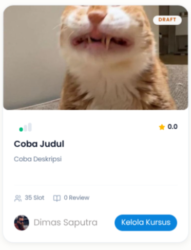
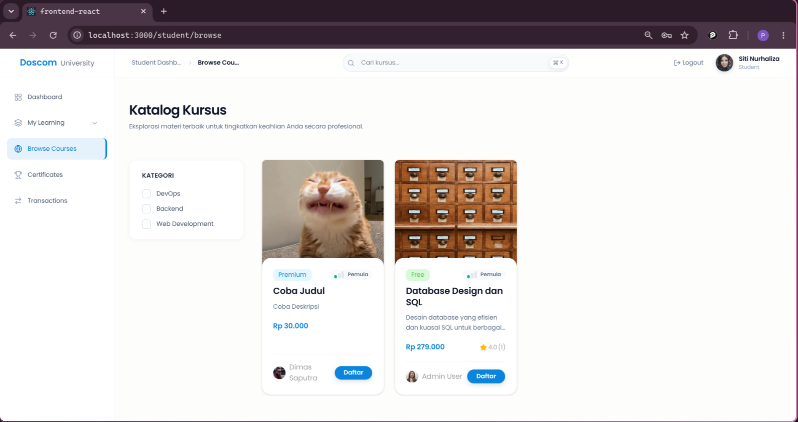
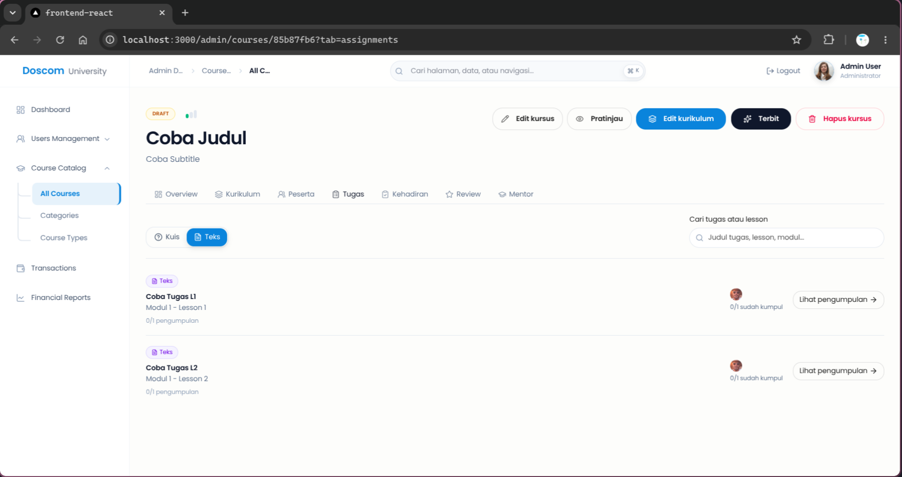
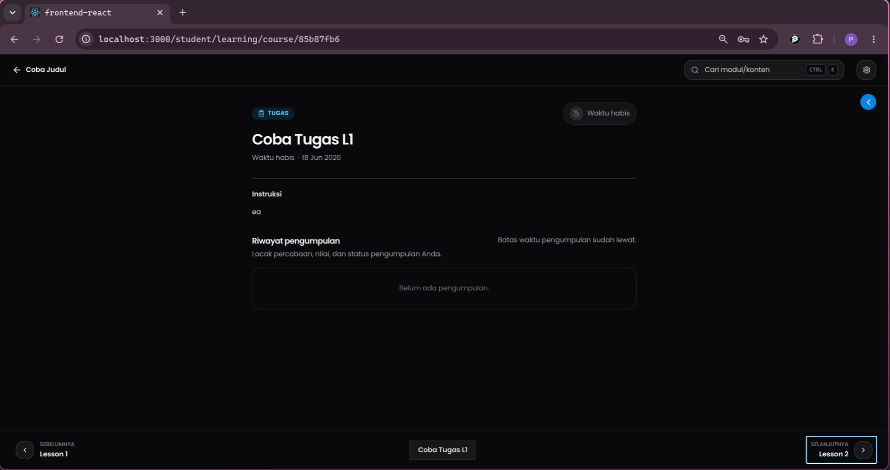
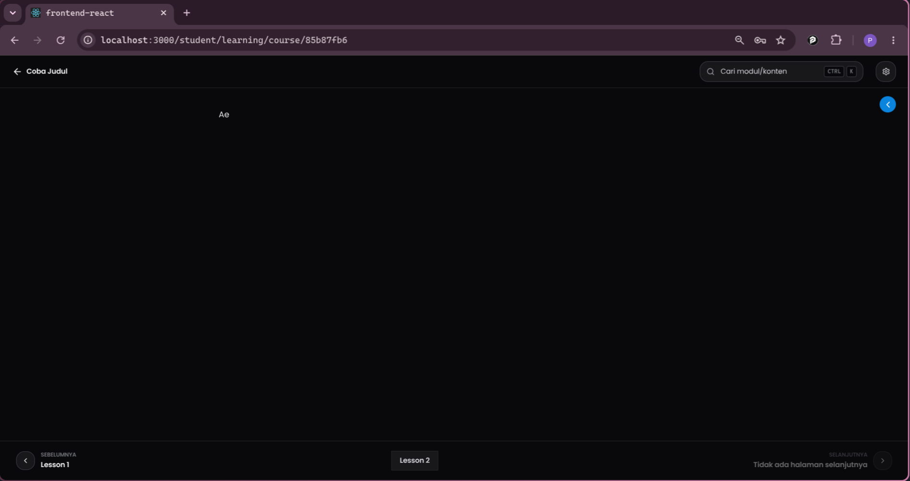
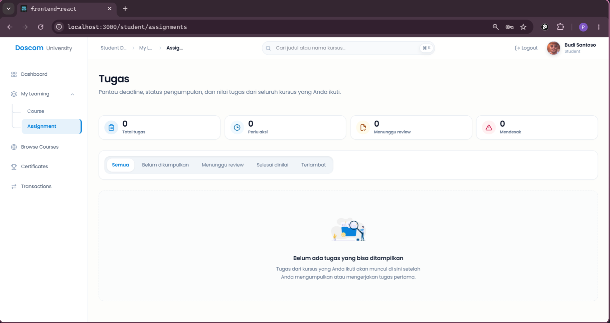

# Bug Report — Course Feature (QA Session)

> **Catatan QA:** Dokumen ini berisi temuan bug dari sesi QA untuk fitur Course pada role **Student**. Kata-kata di bawah ini merupakan komentar dari QA yang telah disusun ulang agar lebih jelas dan profesional.

---

## Role: Student

### 1. Course dengan Status DRAFT Masih Bisa Diakses Student

> **Komentar QA:** *Fatal — Course yang masih berstatus draft seharusnya tidak bisa diakses atau didaftarkan oleh student.*

**Screenshots:**

| Dashboard Admin/Mentor (Status Draft) | Dashboard Student (Bisa Mendaftar) |
|--------------------------------------|-----------------------------------|
|  |  |

**Deskripsi Bug:**
Course yang masih memiliki status "DRAFT" masih bisa diakses oleh student. Student bahkan dapat melihat course tersebut di katalog dan mendaftarnya.

**Behavior Saat Ini:**
- Admin/Mentor membuat course dengan status "DRAFT"
- Course tersebut tetap muncul di katalog student
- Student bisa klik "Daftar" pada course draft
- Course draft bisa diakses untuk pembelajaran

**Behavior yang Diharapkan:**
- Course dengan status "DRAFT" tidak boleh muncul di katalog student
- Student tidak bisa mendaftar course yang masih draft
- Hanya course dengan status "PUBLISH" yang boleh terlihat student

**Analisis Teknis:**
- Filter status publish mungkin belum diterapkan pada endpoint list course untuk student
- Perlu menambahkan condition: `WHERE status = 'PUBLISH'` pada query student
- Atau tambahkan middleware/guard untuk cek status sebelum render di frontend

---

### 2. Tugas dari Lesson 2 Tidak Tampil di Halaman Learning Course

> **Komentar QA:** *Fatal — Saat student membaca lesson pada module, tugas yang ditampilkan tidak semua. Pada gambar admin terlihat ada 2 tugas (lesson 1 dan lesson 2), namun saat student membaca materi hanya tugas dari lesson 1 yang muncul.*

**Screenshots:**

| Tab Tugas di Admin (2 Tugas) | Student di Lesson 1 | Student di Lesson 2 |
|------------------------------|---------------------|---------------------|
|  |  |  |

**Deskripsi Bug:**
Pada halaman `/student/learning/course/{id}`, hanya tugas dari lesson 1 yang ditampilkan. Tugas yang seharusnya ada di lesson 2 tidak muncul.

**Behavior Saat Ini:**
- Admin membuat 2 tugas: "Coba Tugas L1" (lesson 1) dan "Coba Tugas L2" (lesson 2)
- Saat student membaca lesson 1 → tugas L1 muncul
- Saat student membaca lesson 2 → tugas L2 TIDAK muncul (hanya text materi "Ae")

**Behavior yang Diharapkan:**
- Setiap lesson menampilkan tugas yang关联 dengan lesson tersebut
- Lesson 2 harus menampilkan tugas "Coba Tugas L2"
- Semua tugas dari semua lesson harus bisa dibaca student

**Analisis Teknis:**
- Kemungkinan query tugas hanya mengambil tugas dari lesson pertama (lesson_id pertama)
- Perlu dicek logika fetch assignment di halaman learning
- Filter assignment berdasarkan `lesson_id` yang sesuai dengan lesson yang sedang dibaca

---

### 3. Halaman Assignments Tidak Menampilkan List Tugas

> **Komentar QA:** *Fatal — Untuk halaman `/student/assignments`, list tugas dari semua course yang ada belum muncul sama sekali.*

**Screenshots:**

| Halaman Assignments |
|--------------------|
|  |

**Deskripsi Bug:**
Di halaman daftar tugas student (`/student/assignments`), tidak ada tugas yang ditampilkan sama sekali. Semua card statistik menunjukkan angka 0.

**Behavior Saat Ini:**
- Student membuka halaman `/student/assignments`
- Card "Total tugas" menunjukkan 0
- Card "Perlu aksi" menunjukkan 0
- Card "Menunggu review" menunjukkan 0
- Card "Mendesak" menunjukkan 0
- Pesan: "Belum ada tugas yang bisa ditampilkan"

**Behavior yang Diharapkan:**
- Halaman menampilkan semua tugas dari course yang telah student enroll
- Statistik sesuai dengan jumlah tugas yang ada
- Student bisa melihat dan mengerjakan tugas

**Analisis Teknis:**
- Query assignments student mungkin mengembalikan array kosong
- Perlu dicek apakah relasi antara student dan assignment sudah benar
- Filter atau join query mungkin bermasalah

---

## Ringkasan Bug

| No | Lokasi | Deskripsi | Prioritas |
|----|--------|-----------|-----------|
| 1 | Katalog Course | Course draft bisa diakses student | Fatal |
| 2 | Halaman Learning | Tugas lesson 2 tidak tampil | Fatal |
| 3 | Halaman Assignments | Daftar tugas kosong | Fatal |

---

## File yang Perlu Diperiksa

### Bug #1 - Course Draft
- Endpoint API list course untuk student
- Filter status publish pada query
- Middleware/guard di frontend

### Bug #2 - Tugas Lesson 2
- `frontend/src/pages/student/learning/...`
- Logika fetch assignment per lesson
- Mapping tugas dengan lesson_id

### Bug #3 - Halaman Assignments
- `frontend/src/pages/student/assignments/...`
- Query assignments student
- Relasi student-course-assignment

---

## Pertanyaan

### 1. Tempat Memberikan Review
- Belum jelas dimanakah letak student dapat memberikan sebuah review untuk course yang telah didaftarkan/enroll
