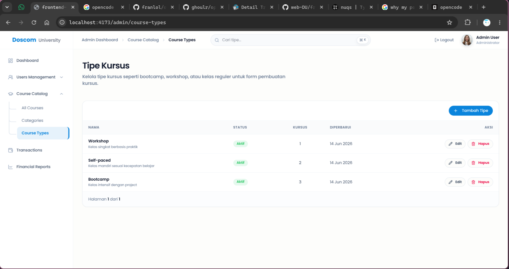

# Bug Report — QA Course Type (QA Session)

> **Catatan QA:** Dokumen ini berisi temuan bug dari sesi QA untuk halaman manajemen **Tipe Kursus** (Course Types). Kata-kata di bawah ini merupakan komentar dari QA yang telah disusun ulang agar lebih jelas dan profesional.

---

## Role: Admin

### 1. Tombol "Tambah Tipe" Berada di Dalam Tabel

> **Komentar QA:** *Apa apaan untuk table seperti ini, sejak kapan tombol tambah tipe berada di dalam table? REVISI!!!!*

**Screenshot:**

| Tombol "Tambah Tipe" berada di dalam area tabel |
|---|
|  |

**Deskripsi Bug:**
Tombol aksi **"Tambah Tipe"** saat ini berada di dalam area komponen tabel (di bagian atas tabel, dalam border yang sama). Secara UX/UI yang baik, tombol aksi utama untuk membuat data baru seharusnya berada di **luar tabel** (di atas tabel sebagai action bar independen), bukan di dalam toolbar tabel.

**Analisis Teknis:**
- Di `frontend/src/components/shared/course-master/CourseMasterManagementPanel.tsx` baris 175–201, tombol "Tambah Tipe" dilewatkan sebagai prop `toolbar` ke komponen `AdminDataTable`.
- Di `frontend/src/components/shared/AdminDataTable.tsx` baris 9, toolbar dirender di dalam `<section>` yang membungkus seluruh tabel, sehingga tombol berada dalam border tabel yang sama:
  ```tsx
  <section className="rounded-2xl border border-slate-200/80 bg-white shadow-[...]">
    {toolbar && <div className="border-b border-slate-100 px-5 py-4">{toolbar}</div>}
    {/* ... tabel ... */}
  </section>
  ```
- Hal ini membuat tampilan tabel terlihat "penuh" dan tidak sesuai dengan pola desain standar yang memisahkan action bar dari data table.

**Panduan Fix (Frontend):**

#### A. Pindahkan tombol "Tambah" keluar dari `AdminDataTable`

Ubah struktur di `CourseMasterManagementPanel.tsx` agar tombol berada di luar tabel:

```tsx
// frontend/src/components/shared/course-master/CourseMasterManagementPanel.tsx

return (
  <div className="flex flex-col gap-5">
    {/* Action Bar — di luar tabel */}
    <div className="flex flex-wrap items-center justify-between gap-3">
      <SearchForm
        value={search}
        onChange={(value) => {
          setSearch(value)
          if (value === '') {
            setCommittedSearch('')
            setPage(1)
          }
        }}
        onSubmit={() => {
          setCommittedSearch(search)
          setPage(1)
        }}
        placeholder={`Cari ${labels.singular.toLowerCase()}...`}
        submitLabel="Cari"
      />
      <Button
        type="button"
        className="rounded-xl px-4"
        onClick={() => setDialogState({ mode: 'create' })}
      >
        <Plus className="mr-2 size-4" aria-hidden />
        {labels.createButton}
      </Button>
    </div>

    {/* Tabel — tanpa tombol di dalamnya */}
    <AdminDataTable
      columns={columns}
      data={items}
      keyField={(row) => row.uid}
      page={page}
      totalPages={totalPages}
      onPageChange={setPage}
      emptyState={
        isLoading ? (
          <p className="text-sm text-slate-500">Memuat data...</p>
        ) : (
          <EmptyState
            icon={kind === 'category' ? <FolderTree className="size-5" /> : <Layers3 className="size-5" />}
            title={labels.emptyTitle}
            description={labels.emptyDescription}
            action={
              <Button type="button" className="rounded-xl" onClick={() => setDialogState({ mode: 'create' })}>
                <Plus className="mr-2 size-4" aria-hidden />
                {labels.createButton}
              </Button>
            }
          />
        )
      }
    />
    {/* ... dialog dan confirm ... */}
  </div>
)
```

#### B. Atau modifikasi `AdminDataTable` untuk mendukung header action bar

Jika ingin tetap menggunakan `toolbar` prop tapi styling-nya di luar border:

```tsx
// frontend/src/components/shared/AdminDataTable.tsx
export function AdminDataTable<T>({
  columns,
  data,
  keyField,
  toolbar,
  page,
  totalPages,
  onPageChange,
  emptyState,
  tableClassName,
  wrapperClassName,
  compact,
  onRowClick,
}: AdminDataTableProps<T>) {
  return (
    <div className="flex flex-col gap-4">
      {/* Toolbar di luar tabel */}
      {toolbar && (
        <div className="flex flex-wrap items-center gap-3 px-1">
          {toolbar}
        </div>
      )}

      <section className={cn(
        'flex flex-col overflow-hidden rounded-2xl border border-slate-200/80 bg-white shadow-[0_1px_2px_rgba(0,0,0,0.04)]',
        wrapperClassName,
      )}>
        {/* ... tabel ... */}
      </section>
    </div>
  )
}
```

### File yang Perlu Diubah

| File | Perubahan |
|------|-----------|
| `frontend/src/components/shared/course-master/CourseMasterManagementPanel.tsx` | Pindahkan tombol "Tambah" dan SearchForm ke luar `AdminDataTable` |
| `frontend/src/components/shared/AdminDataTable.tsx` | (Opsional) Modifikasi agar toolbar berada di luar border tabel |

### Catatan Implementasi

1. **Perubahan minimal:** Cukup pindahkan action bar dari prop `toolbar` menjadi sibling di atas `<AdminDataTable>` di `CourseMasterManagementPanel.tsx`.
2. **Affects other pages:** `CourseMasterManagementPanel` juga digunakan untuk **Course Categories** (`kind="category"`). Perubahan ini akan memperbaiki tampilan kedua halaman sekaligus.
3. **Konsistensi:** Cek juga halaman lain yang menggunakan `AdminDataTable` (misal: Users Management, Transactions) untuk memastikan pola yang sama tidak terjadi di tempat lain.

---

## Ringkasan File untuk Fix

| File | Bug yang Diperbaiki |
|------|---------------------|
| `frontend/src/components/shared/course-master/CourseMasterManagementPanel.tsx` | Tombol "Tambah" dan SearchForm dipindahkan ke luar tabel |
| `frontend/src/components/shared/AdminDataTable.tsx` | (Opsional) Restruktur layout agar toolbar di luar border tabel |

---

## Catatan Implementasi

1. **Prioritas:** Medium — UX issue yang tidak blocking tapi mengurangi kualitas tampilan.
2. **Scope:** Perubahan akan berdampak ke **Course Categories** dan **Course Types** karena menggunakan komponen yang sama (`CourseMasterManagementPanel`).
3. **Setelah fix, verifikasi** tampilan di kedua halaman tersebut agar konsisten.
