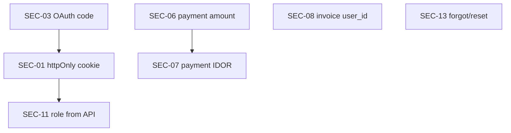

# FE Readiness — Perubahan Setelah BE Merge

Dokumen ini mencatat **perubahan frontend yang akan dilakukan** setelah backend mengimplementasikan kontrak di [be-coordination.md](./be-coordination.md).

> **Prinsip:** FE tidak mengubah BE. PR FE follow-up dibuat **per SEC** atau per sprint BE, agar reviewable.

---

## SEC-01 · httpOnly session

| File | Perubahan |
|------|-----------|
| `src/providers/auth-provider.tsx` | Hapus `Cookies.set/remove(AUTH_COOKIE_TOKEN)`; hapus `setAuthToken` js-cookie path |
| `src/services/axios.ts` | `getApiAuthToken()` return `null`; hapus Bearer dari cookie read; andalkan `withCredentials: true` |
| `src/providers/auth-provider.tsx` | Hapus `AUTH_COOKIE_USER`, `AUTH_COOKIE_ROLE`, `AUTH_COOKIE_EXPIRES_AT` cookies |

**Verifikasi:** `document.cookie` tidak menampilkan `du_access_token` setelah login.

---

## SEC-03 · OAuth code exchange

| File | Perubahan |
|------|-----------|
| `src/pages/auth/Oauth.tsx` | Baca `?code=` → `POST /auth/oauth/exchange` (service baru) |
| `src/services/auth.ts` | Tambah `exchangeOAuthCode(code: string)` |
| `src/providers/auth-provider.tsx` | Opsional: deprecate `signInWithToken` dari URL param |

**Verifikasi:** Network tab callback tanpa JWT di URL.

---

## SEC-06 · Payment amount

| File | Perubahan |
|------|-----------|
| `src/hooks/use-checkout.ts` | Hapus `amount` / `order_items[].price` dari payload (jika BE tidak require) |
| `src/lib/validator/payment.schema.ts` | `amount` optional atau dihapus dari schema |

**Verifikasi:** Tamper amount di DevTools → BE reject dengan `amount_mismatch`.

---

## SEC-07 · Payment IDOR UX

| File | Perubahan |
|------|-----------|
| `src/pages/student/TransactionPayment.tsx` | Handle error 403 → halaman "Akses ditolak" |
| `src/services/payment.ts` | Map status 403 ke pesan user-friendly |
| `src/hooks/use-payment-detail.ts` | Expose `isForbidden` dari query error |

**Verifikasi:** Student B + reference Student A → UI forbidden, bukan detail payment.

---

## SEC-08 · Invoice query

| File | Perubahan |
|------|-----------|
| `src/hooks/transactions/use-invoice-download.ts` | Hapus argumen / query `user_id` |
| `src/lib/validator/invoice.schema.ts` | Hapus `user_id` dari `getInvoiceUrlQuerySchema` |
| `src/services/invoice.ts` | Update `InvoiceUrlQuery` type |

---

## SEC-11 · Role dari API only

| File | Perubahan |
|------|-----------|
| `src/providers/auth-provider.tsx` | Hapus persist role/user di cookie; `refreshUser()` on auth change |
| `src/providers/route-guard.tsx` | Tidak berubah (sudah pakai role dari context) |

---

## SEC-13 · Forgot / reset password

| File | Perubahan |
|------|-----------|
| `src/pages/auth/ForgotPass.tsx` | `POST /auth/forgot-password` on submit |
| `src/pages/auth/ResetPass.tsx` | `POST /auth/reset-password` with `?token=` |
| `src/services/auth.ts` | `requestPasswordReset`, `resetPassword` |
| `src/lib/validator/auth/` | Schema untuk reset payload |

---

## Dependency graph

**SEC-06** dan **SEC-07** bisa di-FE-kan independen setelah BE merge masing-masing.  
**SEC-01** harus selesai sebelum **SEC-11** cleanup cookie.

---

*Cross-link: [be-coordination.md](./be-coordination.md) · [action-backlog.md](./action-backlog.md)*
